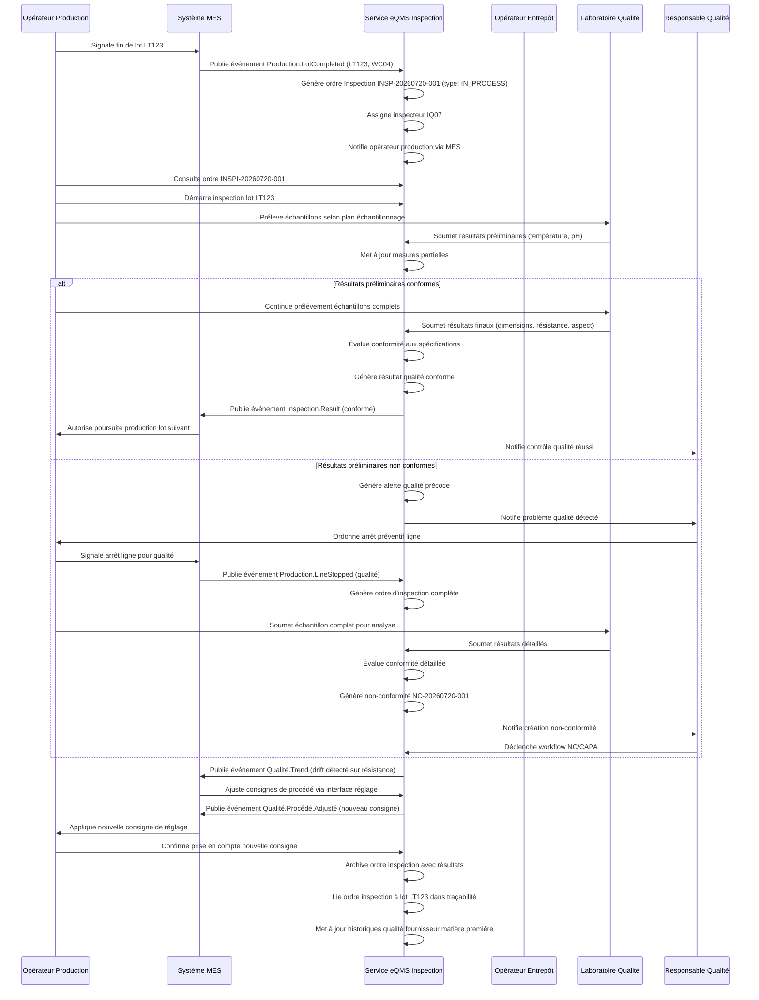

# 03-eqms-workflows-integration.md
# Workflows BPMN & Intégrations ERP - eQMS BrainOS

## Workflows BPMN

Le module eQMS implémente plusieurs workflows métier conformes aux normes BPMN 2.0 (Business Process Model and Notation). Ces workflows modélisent les processus qualité clés de l'entreprise, permettant une automatisation, un suivi et une amélioration continue.

### 1. Workflow d'inspection

Ce workflow gère le cycle de vie complet d'une opération d'inspection, depuis la planification jusqu'à la clôture et l'archivage des résultats.

```mermaid
flowchart TD
    %% Déclencheurs et initiation
    A[Déclenchement basé sur planning qualité] -->|Planifié| B[Création Ordre d'Inspection]
    C[Déclencheur événementiel] -->|Depuis MES/Production| B
    D[Demande ad hoc] -->|Qualité/Production/Maintenance| B
    
    %% Attribution et préparation
    B --> E[Attribution Inspector & Ressources]
    E --> F[Préparation Équipements & Documents]
    F --> G[Vérification Disponibilité Matériel/Lot]
    
    %% Exécution de l'inspection
    G --> H{Type d'Inspection ?}
    H -->|INCOMING| I[Contrôle Réception Fournisseur]
    H -->|IN_PROCESS| J[Contrôle en Ligne de Production]
    H -->|FINAL| K[Contrôle Produit Fini]
    H -->|SHIPPING| L[Contrôle Pré-Expédition]
    
    %% Saisie des résultats
    I --> M[Saisie Mesures & Observations]
    J --> M
    K --> M
    L --> M
    
    %% Évaluation de conformité
    M --> N{Conforme aux Spécifications ?}
    N -->|Oui| O[Enregistrement Résultat Conforme]
    N -->|Non| P[Génération Non-Conformité]
    
    %% Gestion des résultats conformes
    O --> Q[Mise à Jour Statistiques SPC]
    Q --> R[Notification Qualité Fournisseur/Client]
    R --> S[Archivage Résultats]
    S --> T[Clôture Ordre d'Inspection]
    T --> U[Fin]
    
    %% Gestion des résultats non conformes
    P --> V{Création Ordre de Quarantaine ?}
    V -->|Oui| W[Création Ordre Quarantaine]
    W --> X[Notification Quarantaine Opération Logistique]
    X --> Y[Attente Décision Qualité]
    
    V -->|Non| Z[Décision Immédiate (Retraiter/Réjecter)]
    
    AA[Revue Non-Conformité] --> AB{Gravité ?}
    AB -->|Faible/Moyenne| AC[Action Corrective Immédiate]
    AB -->|Élevée/Critique| AD[Déclenchement Processus NC Officiel]
    
    AD --> AE[Création Dossier Non-Conformité]
    AE --> AF[Analyse Causes Racines (5 Pourquoi/Ishikawa)]
    AF --> AG[Proposition Actions Correctives]
    AG --> AH[Approbation Plan d'Action]
    AH --> AI[Mise en Œuvre Actions]
    AI --> AJ[Vérification Efficacité]
    AJ --> AK{Efficace ?}
    AK -->|Oui| AL[Clôture NC & Documentation]
    AK -->|Non| AM[Revoir Analyse Causes]
    AM --> AF
    
    AL --> R
    R --> S
    
    %% Boucle de retour vers la prévention
    S --> AM[Mise à Jour FMEA & Standards]
    AM --> AN[Revue Préventive Qualité]
    AN --> AO[Fin]
    
    style A fill:#e1f5fe,stroke:#01579b
    style B fill:#e3f2fd,stroke:#0277bd
    style C fill:#e8eaf6,stroke:#283593
    style D fill:#fce4ec,stroke:#880e4f
    style H fill:#fff3e0,stroke:#ef6c00
    style M fill:#f3e5f5,stroke:#6a1b9a
    style N fill:#ffe0b2,stroke:#ef6c00
    style AE fill:#ffebee,stroke:#c62828
    style AK fill:#fff8e1,stroke:#f57f17
```

#### Points d'extension et événements clés
- **Déclencheurs** : Planning qualité, événements MES (fin d'opération, changement de lot), demandes ad hoc
- **Points de décision** : Type d'inspection, conformité aux spécifications, gravité NC, nécessité quarantaine
- **Activités manuelles** : Saisie mesures, attribution inspecteur, revue NC, décision stratégique
- **Activités automatisées** : Génération ordres, notifications, mises à jour SPC, création dossiers NC
- **Événements publiés** :
  - `Inspection.OrderCreated`
  - `Inspection.OrderStarted`
  - `Inspection.Completed`
  - `Inspection.ResultRecorded`
  - `NonConformance.Detected`
  - `NonConførmance.Quarantined`
  - `NonConformance.Closed`

### 2. Workflow de gestion des non-conformités et CAPA

Ce workflow gère le processus complet de détection, d'analyse, de résolution et de vérification des non-conformités, incluant les actions correctives et préventives.

```mermaid
flowchart TD
    %% Détection de non-conformité
    A[Détection NC] -->|Depuis Inspection/LIMS/Production/Client/Fournisseur| B[Création Dossier NC]
    B --> C[Attribution Responsable Qualité]
    C --> D[Notification Partis Prenants]
    
    %% Évaluation initiale
    D --> E{Critère d'Urgence ?}
    E -->|Oui| F[Mesure d'Urgence Immédiate]
    F --> G[Mise en Quarantaine si nécessaire]
    G --> H[Évaluation Impact Business]
    H --> I[Définition Priorité & Délai]
    
    E -->|Non| J[Continuation Processus Standard]
    J --> H
    
    %% Analyse des causes
    H --> K[Documentation Détaillée NC]
    K --> L[Collecte Preuves & Échantillons]
    L --> M[Analyse Causes Racines]
    M --> N{Méthode d'Analyse ?}
    N -->|5 Pourquoi| O[Application 5 Pourquoi]
    N -->|Diagramme Ishikawa| P[Construction Diagramme Causes/Effets]
    N -->|Analyse Pareto| Q[Analyse fréquence/impact]
    N -->|Analyse des Défauts| R[Analyse par type de défaut]
    N -->|FMEA Existante| S[Revoir FMEA associée]
    
    O --> T[Identification Cause Racine]
    P --> T
    Q --> T
    R --> T
    S --> T
    
    T --> U{Source NC ?}
    U -->|Interne| V[Analyse Processus/Équipement/opérateur]
    U -->|Fournisseur| W[Évaluation Performance Fournisseur]
    U -->|Client| X[Analyse Utilisation/Conditions d'Usage]
    
    %% Proposition et approbation d'actions
    T --> Y[Proposition Actions Correctives]
    Y --> Z[Évaluation Faisabilité & Coût]
    Z --> AA[Plan d'Action Détaillé]
    AA --> AB[Approbation Management Qualité]
    AB --> AC{Type d'Action ?}
    AC -->|Corrective| AD[Création Dossier Action Corrective]
    AC -->|Preventive| AE[Création Dossier Action Préventive]
    AC -->|Both| AF[Création Dossiers Corr. & Prev.]
    
    %% Mise en œuvre des actions
    AD --> AG[Allocation Ressources & Planning]
    AG --> AH[Exécution Actions Correctives]
    AH --> AI[Documentation Preuves Mise en Œuvre]
    AI --> AJ[Notification Parties Concernées]
    AJ --> AK[Planification Vérification Efficacité]
    
    AE --> AL[Identification Mesures Préventives]
    AL --> AM[Planification Implémentation]
    AM --> AN[Exécution Actions Préventives]
    AN --> AO[Mise à Jour Standards/Procédures]
    AO --> AP[Formation Personnel Concerné]
    AP --> AQ[Notification Parties Concernées]
    
    AF --> AR[Parallélisation Chemins Correctif & Préventif]
    AR --> AS[Exécution Actions Correctives & Préventives]
    AS --> AT[Documentation & Formation]
    AT --> AU[Planification Vérification Globale]
    
    %% Vérification de l'efficacité
    AJ --> AV[Attente Période d'Observation]
    AQ --> AV
    AU --> AV
    AV --> AW[Collecte Données Post-Implémentation]
    AW --> AX{Comparaison Avant/Après ?}
    AX -->|Données Disponibles| AY[Analyse Statistique Efficacité]
    AY --> AZ{Efficace ?}
    AZ -->|Oui| BA[Clôture Dossier & Documentation]
    AZ -->|Non| BB[Revoir Analyse Causes]
    BB --> M
    BA --> BC[Mise à Jour Base de Connaissances]
    BC --> BD[Génération Leçons Apprises]
    BD --> BE[Fin]
    
    %% Boucle d'amélioration continue
    BE --> BF[Mise à Jour FMEA & Plans de Contrôle]
    BF --> BG[Revue Qualité Périodique]
    BG --> BH[Ajustement Seuils & Fréquences]
    BH --> BI[Fin]
    
    style A fill:#ffebee,stroke:#c62828
    style B fill:#fce4ec,stroke:#880e4f
    style C fill:#f3e5f5,stroke:#6a1b9a
    style E fill:#fff3e0,stroke:#ef6c00
    style M fill:#e8f5e8,stroke:#2e7d32
    style N fill:#e3f2fd,stroke:#0277bd
    style Y fill:#e1f5fe,stroke:#01579b
    style AV fill:#fff8e1,stroke:#f57f17
    style AY fill:#f3e5f5,stroke:#6a1b9a
```



#### Points d'extension et événements clés
- **Déclencheurs** : Détection NC depuis inspection, LIMS, réclamations clients, audits fournisseurs, contrôles internes
- **Points de décision** : Urgence, méthode d'analyse, source NC, type d'action, efficacité des actions
- **Activités manuelles** : Analyse causes racines, proposition d'actions, revue exécutive, vérification efficacité
- **Activités automatisées** : Création dossiers, notifications, mise en quarantaine, attribution responsable
- **Événements publiés** :
  - `NonConformance.Created`
  - `NonConformance.Quarantined`
  - `NonConformance.Assigned`
  - `RootCauseAnalysis.Completed`
  - `CorrectiveAction.Proposed`
  - `PreventiveAction.Proposed`
  - `CAPA.Implemented`
  - `CAPA.EffectivenessVerified`
  - `NonConformance.Closed`

### 3. Workflow d'audit qualité

Ce workflow gère le processus complet de planification, d'exécution, de reporting et de suivi des audits qualité internes et externes.

```mermaid
flowchart TD
    %% Planification des audits
    A[Calendrier Audits Annuel] -->|Basé sur risques & précédents résultats| B[Génération Planning Audits]
    B --> C[Identification Auditeurs & Ressources]
    C --> D[Notification Audités & Planning Pré-audit]
    D --> E[Réunion de Lancement (Kick-off)]
    
    %% Préparation de l'audit
    E --> F[Review Documentation Pertinente]
    F --> G[Élaboration Checklist & Programme]
    G --> H[Envoi Notification Formelle d'Audit]
    H --> I[Réunion d'Ouverture avec Audité]
    
    %% Exécution de l'audit
    I --> J[Collecte Preuves & Entretiens]
    J --> K{Type de Preuve ?}
    K -->|Documentaire| L[Vérification Procédures & Enregistrements]
    K -->|Témoignage| M[Entretiens Personnel & Observation]
    K -->|Physique| N[Inspection Équipements & Installations]
    K -->|Données| O[Analyse Métriques & Rapports]
    
    L --> P[Évaluation Conformité]
    M --> P
    N --> P
    O --> P
    
    P --> Q{Conforme ?}
    Q -->|Oui| R[Enregistrement Observation Positive]
    Q -->|Non| S[Écart Identifié - Gravité & Impact]
    
    R --> T[Continuer Audit]
    S --> T
    T --> U{Tout Couvert ?}
    U -->|Non| V[Passer à Prochaine Zone/Processus]
    V --> J
    U -->|Oui| W[Réunion de Clôture Préliminaire]
    
    %% Reporting et suivi
    W --> X[Rédaction Rapport d'Audit]
    X --> Y{Écarts Significatifs ?}
    Y -->|Oui| Z[Élaboration Plan d'Action Correctif]
    Z --> AA[Réunion de Clôture Définitif]
    AA --> AB[Envoi Rapport & Plan d'Action]
    AB --> AC[Suivi Mise en Œuvre Actions]
    
    Y -->|Non| AA
    AC --> AD[Vérification Efficacité Actions]
    AD --> AE{Efficace ?}
    AE -->|Oui| AF[Clôture Audit & Archivage]
    AE -->|Non| AG[Réévaluation Plan d'Action]
    AG --> AC
    
    AF --> AH[Mise à Jour Planning Audits Futurs]
    AH --> AI[Génération Indicateur Performance Audit]
    AI --> AJ[Fin]
    
    %% Audits externes & certification
    AK[Audit Externe Demande] --> AL[Notification & Préparation]
    AL --> AM[même flux que I-A]
    AM --> AN[Réception Rapport Externe]
    AN --> AO{Conforme ?}
    AO -->|Oui| AP[Maintien Certification]
    AO -->|Non| AR[Plan d'Action Correction Obligatoire]
    AR --> AS[même flux que Z-AB]
    AS --> AT[Nouvel Audit de Vérification]
    AT --> AU{Certifié ?}
    AU -->|Oui| AV[Renouvellement Certification]
    AU -->|Non| AW[Échec Certification - Escalade]
    AW --> AX[Fin]
    
    style A fill:#e8f5e8,stroke:#2e7d32
    style B fill:#f1f8e9,stroke:#558b2f
    style C fill:#f9fbe7,stroke:#827717
    style D fill:#fffde7,stroke:#f9a825
    style E fill:#ffffe0,stroke:#fbc02d
    style F fill:#fff3e0,stroke:#ffa000
    style G fill:#ffe0b2,stroke:#ff9800
    style H fill:#ffccbc,stroke:#ff5722
    style I fill:#efebe9,stroke:#424242
    style J fill:#eceff1,stroke:#607d8b
    style K fill:#eceff1,stroke:#607d8b
    style L fill:#e3f2fd,stroke:#0277bd
    style M fill:#e8f5e8,stroke:#2e7d32
    style N fill:#fce4ec,stroke:#880e4f
    style O fill:#f3e5f5,stroke:#6a1b9a
    style P fill:#f5f5f5,stroke:#616161
    style Q fill:#ffebee,stroke:#c62828
    style X fill:#e8f5e8,stroke:#2e7d32
    style Z fill:#fff3e0,stroke:#ff9800
    style AD fill:#e3f2fd,stroke:#0277bd
    style AE fill:#fff8e1,stroke:#f57f17
    style AF fill:#e1f5fe,stroke:#01579b
    style AK fill:#e3f2fd,stroke:#0277bd
    style AL fill:#bbdefb,stroke:#2196f3
    style AN fill:#c8e6c9,stroke:#43a047
    style AO fill:#a5d6a7,stroke:#388e3c
    style AS fill:#fff9c4,stroke:#fbc02d
    style AT fill:#ffecb3,stroke:#ffa000
    style AU fill:#ffe0b2,stroke:#ff9800
    style AW fill:#ffcdd2,stroke:#e53935
    style AX fill:#f5f5f5,stroke:#616161
```

#### Points d'extension et événements clés
- **Déclencheurs** : Planning annuel, demandes d'audit externe, incidents majeurs, changements réglementaires
- **Points de décision** : Conformité observée, nécessité plan d'action, efficacité des actions correctives
- **Activités manuelles** : Entretiens, revue documentaire, rédaction rapport, réunion de clôture
- **Activités automatisées** : Génération planning, notifications, collecte preuves préliminaires, calcul scores
- **Événements publiés** :
  - `Audit.Scheduled`
  - `Audit.Started`
  - `Audit.EvidenceCollected`
  - `Audit.Finding.Identified`
  - `Audit.Report.Drafted`
  - `Audit.CorrectiveAction.Required`
  - `Audit.Completed`
  - `Audit.CertificationStatus.Changed`

## Intégrations ERP

L'eQMS s'intègre de manière bidirectionnelle avec les autres modules de l'ERP BrainOS et avec les systèmes externes courants de l'industrie manufacturière.

### Matrice d'intégration

```mermaid
graph TD
    %% Module eQMS central
    A[eQMS Core] -->|Événements/API| B[Module Production MES]
    A -->|Événements/API| C[Module Logistique & SCM]
    A -->|Événements/API| D[Module Financier & Comptabilité]
    A -->|Événements/API| E[Module Maintenance & GEST]
    A -->|Événements/API| F[Module Ressources Humaines]
    A -->|Événements/API| G[Module HSE & Environnement]
    A -->|Événements/API| H[Module R&D & Innovation]
    A -->|Événements/API| I[Module Ventes & CRM]
    A -->|Événements/API| J[Module Achats & Approvisionnements]
    A -->|Événements/API| K[Module Planification & Ordonnancement]
    
    %% Intégrations bidirectionnelles détaillées
    subgraph "Production MES (Siemens Opcenter/Rockwell)"
        B1[Ordre de Fabrication] -->|Déclenche inspection| A2[Service Inspection]
        A3[Résultat Inspection] -->|Feedback qualité| B2[Ajustement Procédé]
        B4[Données Capteurs SPC] -->|Flux temps réel| A5[Service SPC]
        A6[Gestion NC Matériel] -->|Notification| B3[Blocage Ligne]
        B7[État Équipement] -->|Input| A8[Service Maintenance Préventive Qualité]
    end
    
    subgraph "Logistique & SCM"
        C1[Réception Matières] -->|Déclenche contrôle qualité| A9[Service Inspection Entrante]
        A10[Résultat QC Fournisseur] -->|Mise à jour score| C2[Évaluation Fournisseur]
        C3[Expédition Produits] -->|Déclenche contrôle expédition| A11[Service Inspection Sortie]
        A12[Quarantaine Lot] -->|Blocage mouvement| C4[Gestion Entrepôt]
        C5[Transfert Inter-sites] -->|Suivi qualité en transit| A13[Service Traçabilité]
    end
    
    subgraph "Financier & Comptabilité"
        D1[Coût NBQ (Rebuts/Rétraitement)] -->|Allocation coûts| A14[Service Comptabilité Qualité]
        A15[Investissements Qualité] -->|Budget CAPEX| D2[Budgétisation Capital]
        D3[Dépenses Opérationnelles Qualité] -->|Intégration OPEX| D4[Comptabilité Opérationnelle]
        D5[Facturation Garanties/Rappels] -->|Revenus/Services| A16[Service Garantie Qualité]
        A17[Coût Qualité par Produit] -->|Analyse de revient| D6[Calcul Coût de Revient]
    end
    
    subgraph "Maintenance & GEST"
        E1[Maintenance Préventive Qualité] -->|Planning| A18[Service Maintenance Qualité]
        A19[Données Étalonnage] -->|Mise à jour métrologie| E2[Gestion Parc Métrologie]
        E3[Pannes Équipement Qualité] -->|Incident| A20[Service Gestion Incidents Qualité]
        A21[Indisponibilité Équipement] -->|Impact planning| E4[Planning Maintenance]
        E5[Historique Interventions] -->|Analyse fiabilité| A22[Service MTBF/MTTR Qualité]
    end
    
    subgraph "Ressources Humaines"
        F1[Compétences Qualité Requises] -->|Profil de poste| A23[Service Gestion Compétences Qualité]
        A24[Résultats Formation Qualité] -->|Mise à jour compétences| F2[Système Gestion Formation]
        F3[Évaluations Performance Qualité] -->|Input revue| F3[Processus Évaluation Annuelle]
        A25[Plan de Succession Qualité] -->|Input vivier| F4[Gestion Talents]
        F6[Disponibilité Personnel Qualité] -->|Planning| F5[Outil Planification Effectif]
    end
    
    subgraph "HSE & Environnement"
        G1[Incidents Qualité avec Impact Sécurité] -->|Notification| A26[Service Gestion Incidents HSE]
        A27[Déchets Spécifiques Qualité] -->|Traitement spécialisé| G2[Gestion Déchets Dangereux]
        G3[Émissions/Rejets Qualité] -->|Surveillance environnement| G3[Monitoring Rejets]
        A28[Consommation Ressources Qualité] -->|Bilan environnement| G4[Bilan Carbone & Ressources]
        G5[Risques Qualité/HSE Croisés] -->|Analyse intégrée| G5[Évaluation Risques Combinés]
        A29[Formation Qualité/HSE Croisée] -->|Programme commun| G6[Formation HSE]
    end
    
    subgraph "R&D & Innovation"
        H1[Spécifications Qualité NPD] -->|Input cahier des charges| A30[Service Spécifications Qualité Produit]
        A31[Résultats Tests Qualité Prototype] -->|Feedback développement| H2[Cycle Développement Produit]
        H3[Échecs Qualité en Développement] -->|Leçons apprises| A32[Base Connaissances Qualité]
        A33[Améliorations Qualité Issues R&D] -->|Mise en œuvre| H3[Gestion Améliorations Produit]
        H4[Veille Réglementaire Qualité] -->|Input veille| H5[Service Veille Technologique & Réglementaire]
    end
    
    subgraph "Ventes & CRM"
        I1[Engagements Qualité Contractuels] -->|Spécifications clients| A34[Service Gestion Exigences Client]
        A35[Résultats Qualité Lot Expédié] -->|Mise à jour score| I2[Évaluation Satisfaction Client Produit]
        I3[Réclamations Client Qualité] -->|Création dossier| A36[Service Gestion Réclamations Qualité]
        A37[Visites Clients Qualité] -->|Planification| I3[Gestion Visites & Audits Clients]
        I4[Export Données Qualité Client] -->|Reporting contractuel| I4[Service Reporting Client spécifique]
        I5[Prévision Demande Qualité] -->|Input planification commerciales| I5[Service Prévisions Ventes]
    end
    
    subgraph "Achats & Approvisionnements"
        J1[Spécifications Qualité Fournisseurs] -->|Cahier des charges| A38[Service Spécifications Qualité Fournisseur]
        A39[Résultats Qualité Lot Réception] -->|Mise à jour performance| J2[Évaluation Performance Fournisseur]
        J3[Audit Qualité Fournisseur] -->|Demande| A40[Service Gestion Audits Fournisseurs]
        A41[Non-Conformités Répétées Fournisseur] -->|Blocage approvisionnement| J3[Gestion Quota Fournisseur]
        J4[Coût Qualité Fournisseur] -->|Négociation prix| J4[Modèle Prix QuiPermis Qualité]
        J5[Qualité Transport & Logistique] -->|Critère sélection| J5[Critère Qualité Transport]
    end
    
    subgraph "Planification & Ordonnancement"
        K1[Capacité Contrôle Qualité] -->|Contraintes planning| A42[Service Planification Capacité Qualité]
        A43[Résultats Qualité Impactant Planning] -->|Réglanification urgente| K2[Ajustement Ordres de Fabrication]
        K4[Disponibilité Ressources Qualité] -->|Input planning| K3[Gestion Effectif Qualité]
        K5[Fréquence Contrôles Qualité] -->|Input définition gammes| K6[Définition Gammes & Roulements]
        K7[Planification Maintenance Qualité] -->|Input indisponibilité| K8[Planning Arrêts Techniques]
    end
    
    style A fill:#e3f2fd,stroke:#1565c0
    style B fill:#e8f5e8,stroke:#2e7d32
    style C fill:#fff3e0,stroke:#ffa000
    style D fill:#fce4ec,stroke:#880e4f
    style E fill:#f3e5f5,stroke:#6a1b9a
    style F fill:#e1f5fe,stroke:#01579b
    style G fill:#f3e5f5,stroke:#6a1b9a
    style H fill:#f8bbd0,stroke:#d81b60
    style I fill:#d1c4e9,stroke:#6a1b9a
    style J fill:#c8e6c9,stroke:#43a047
    style K fill:#e0f2f1,stroke:#00695c
```

### Diagramme de séquence - Intégration inspection-production



#### Points d'intégration détaillés

**Avec le module Production MES :**
- **Événements entrants** : 
  - `Production.OrderStarted` → Déclenche préparation inspection première pièce
  - `Production.LotCompleted` → Déclenche inspection lot fini
  - `Production.LineStopped` → Génère NC potentielle pour investigation
  - `Production.Parameter.Deviation` → Alerte qualité préventive
  - `Equipment.Maintenance.Completed` → Vérification requalification post-maintenance
- **Événements sortants** :
  - `Inspection.Result` → Feedback conformité pour libération lot
  - `Inspection.Trend` → Ajustement consignes de procédé
  - `NonConformance.Detected` → Arrêt ligne ou mise en quarantaine
  - `Quality.Capability.Degradation` → Demande de révision maintenance
  - `Calibration.Expired` → Blocage équipement jusqu'à étalonnage

**Avec le module Logistique & SCM :**
- **Événements entrants** :
  - `Logistics.Receipt.Initiated` → Déclenche inspection réception fournisseur
  - `Logistics.Shipment.Initiated` → Déclenche inspection pré-expédition
  - `Logistics.Transfer.Requested` → Vérification statut qualité lot en transit
  - `Logistics.Storage.Condition.Alert` → Vérification impact qualité stockage
- **Événements sortants** :
  - `Inspection.Receipt.Result` → Mise à jour score fournisseur, décision réception
  - `Inspection.Shipment.Result` → Autorisation expédition ou blocage
  - `Quarantine.Order` → Blocage mouvement lot spécifique
  - `Quality.Hold.Release` → Libération lot après levée de quarantaine
  - `Traceability.Query` → Fourniture historique qualité lot

**Avec le module Financier & Comptabilité :**
- **Événements entrants** :
  - `Finance.Budget.Quality.Request` → Soumission budget qualité annuel
  - `Finance.Cost.Allocation.Request` → Répartition coûts qualité par centre de profit
- **Événements sortants** :
  - `Quality.Cost.NQQ` → Coût de non-qualité par période/produit/fournisseur
  - `Quality.Investment.CAPEX` → Demande investissements équipements qualité
  - `Quality.Operating.Cost` → Coût opérationnel qualité par département
  - `Quality.Warranty.Cost` → Coût garantie et rappels clients
  - `Quality.ROI.Improvement` → Retour sur investissement améliorations qualità

**Avec le module Maintenance & GEST :**
- **Événements entrants** :
  - `Maintenance.WorkOrder.Completed` → Déclenche requalification post-maintenance
  - `Maintenance.Calibration.Due` → Génération ordre étalonnage métrologie
  - `Maintenance.Failure.Alert` → Investigation potentielle NC liée équipement
- **Événements sortants** :
  - `Quality.Maintenance.Request` → Demande intervention préventive basée tendance qualité
  - `Quality.Calibration.Required` → Demande étalonnage basé dérive mesure
  - `Quality.Equipment.Degradation` → Analyse impact équipement sur qualité
  - `Quality.SparePart.Recommendation` → Recommandation pièces critiques qualité

**Avec le module Ressources Humaines :**
- **Événements entrants** :
  - `HR.Training.Completed` → Mise à qualification personnel qualité
  - `HR.Certification.Earned` → Reconnaissance compétences qualité spécialisées
  - `HR.Performance.Review.Input` → Données performance qualité pour évaluation annuelle
- **Événements sortants** :
  - `Quality.Training.Needed` → Besoin formation basé écarts qualité observés
  - `Quality.Competency.Gap` → Lacune compétence identifiée via audits/NC
  - `Quality.Succession.Plan.Needed` → Besoin plan relève personnel clé qualité
  - `Quality.Performance.Metrics` → Métriques performance individuel/équipe qualité

**Avec le module HSE & Environnement :**
- **Événements entrants** :
  - `HSE.Incident.Occurred` → Investigation potentielle qualité liée incident
  - `HSE.Regulation.Change` → Mise à jour exigences qualité environnementales
  - `HSE.Waste.Generation` → Évaluation impact qualité gestion déchets
- **Événements sortants** :
  - `Quality.HSE.Incident.Related` → NC liée incident sécurité/environnement
  - `Quality.Env.Impact.Assessment` → Évaluation effet procédé qualité sur environnement
  - `Quality.Waste.Minimization.Opportunity` → Identifier réductions déchets via amélioration qualité
  - `Quality.Regulation.Compliance.Status` → Statut conformité exigences qualité environnementales

### API Endpoints

#### API Inspection & LIMS
```
GET    /api/quality/inspections                     # Liste inspections avec filtres
POST   /api/quality/inspections                     # Créer nouvel ordre d'inspection
GET    /api/quality/inspections/:id                 # Détails inspection spécifique
PUT    /api/quality/inspections/:id                 # Mettre à jour ordre d'inspection
DELETE /api/quality/inspections/:id                 # Annuler ordre d'inspection
POST   /api/quality/inspections/:id/start           # Démarrer inspection
POST   /api/quality/inspections/:id/complete        # Completer inspection
GET    /api/quality/inspections/:id/measurements    # Liste mesures associée
POST   /api/quality/inspections/:id/measurements    # Ajouter mesure à inspection
GET    /api/quality/lab-samples                     # Liste échantillons laboratoire
POST   /api/quality/lab-samples                     # Créer nouvel échantillon laboratoire
GET    /api/quality/lab-samples/:id                 # Détails échantillon spécifique
POST   /api/quality/lab-samples/:id/results         # Ajouter résultat d'essai
GET    /api/quality/test-methods                    # Liste méthodes d'essai
POST   /api/quality/test-methods                    # Créer nouvelle méthode d'essai
```

#### API Non-conformités & CAPA
```
GET    /api/quality/non-conformances                # Liste NC avec filtres
POST   /api/quality/non-conformances                # Créer nouvelle non-conformité
GET    /api/quality/non-conformances/:id            # Détails NC spécifique
PUT    /api/quality/non-conformances/:id            # Mettre à jour NC
POST   /api/quality/non-conformances/:id/quarantine # Mettre en quarantaine
POST   /api/quality/non-conformances/:id/release    # Lever quarantaine
GET    /api/quality/nc-causes                       # Liste causes potentielles NC
POST   /api/quality/nc-causes                       # Ajouter cause potentielle
GET    /api/quality/root-cause-analyses             # Liste analyses causes racines
POST   /api/quality/root-cause-analyses             # Créer nouvelle analyse
GET    /api/quality/capas                           # Liste CAPA avec filtres
POST   /api/quality/capas                           # Créer nouvelle CAPA
GET    /api/quality/capas/:id                       # Détails CAPA spécifique
PUT    /api/quality/capas/:id                       # Mettre à jour CAPA
POST   /api/quality/capas/:id/implement            # Marquer comme mis en œuvre
POST   /api/quality/capas/:id/verify                # Vérifier efficacité
GET    /api/quality/corrective-actions              # Liste actions correctives
POST   /api/quality/corrective-actions              # Créer nouvelle action corrective
GET    /api/quality/preventive-actions              # Liste actions préventives
POST   /api/quality/preventive-actions              # Créer nouvelle action préventive
GET    /api/quality/effectiveness-checks            # Liste vérifications efficacité
POST   /api/quality/effectiveness-checks            # Créer nouvelle vérification
```

#### API SPC & Qualité Statistique
```
GET    /api/quality/control-charts                  # Liste cartes de contrôle
POST   /api/quality/control-charts                  # Créer nouvelle carte de contrôle
GET    /api/quality/control-charts/:id              # Détails carte spécifique
PUT    /api/quality/control-charts/:id              # Mettre à jour carte de contrôle
POST   /api/quality/control-charts/:id/measurements # Ajouter mesure à carte
GET    /api/quality/measurement-series              # Liste séries de mesures
POST   /api/quality/measurement-series              # Créer nouvelle série de mesures
GET    /api/quality/process-capability              # Liste analyses capacité procédé
POST   /api/quality/process-capability              # Créer nouvelle analyse capacité
GET    /api/quality/quality- quality/western-electric-rules       # Liste règles WE configurées
POST   /api/quality/western-electric-rules         # Ajouter/modifier règle WE
```

#### API Qualité Fournisseur & Client
```
GET    /api/quality/suppliers/evaluations           # Liste évaluations fournisseurs
POST   /api/quality/suppliers/evaluations           # Créer nouvelle évaluation fournisseur
GET    /api/quality/suppliers/:id/evaluations       # Évaluations spécifique fournisseur
POST   /api/quality/suppliers/audits                # Planifier nouvel audit fournisseur
GET    /api/quality/suppliers/audits/:id            # Détails audit fournisseur spécifique
POST   /api/quality/suppliers/:id/corrective-requests # Créer demande action corrective
GET    /api/quality/complaints                      # Liste réclamations clients
POST   /api/quality/complaints                     # Créer nouvelle réclamation client
GET    /api/quality/complaints/:id                  # Détails réclamation spécifique
POST   /api/quality/complaints/:id/responses        # Ajouter réponse à réclamation
GET    /api/quality/returns                         # Liste retours clients (RMA)
POST   /api/quality/returns                         # Créer nouveau retour client
GET    /api/quality/field-reports                   # Liste rapports de terrain
POST   /api/quality/field-reports                  # Créer nouveau rapport de terrain
```

#### API Audit & Conformité
```
GET    /api/quality/audits                          # Liste audits avec filtres
POST   /api/quality/audits                          # Planifier nouvel audit
GET    /api/quality/audits/:id                      # Détails audit spécifique
PUT    /api/quality/audits/:id                      # Mettre à jour état audit
POST   /api/quality/audits/:id/findings             # Ajouter constat d'audit
GET    /api/quality/audit-findings                  # Liste constat d'audit
POST   /api/quality/audit-action-plans              # Créer plan d'action suite audit
GET    /api/quality/audit-action-plans/:id          # Détails plan d'action spécifique
POST   /api/quality/regulatory-requirements         # Créer nouvelle exigence réglementaire
GET    /api/quality/regulatory-compliance           # Liste statuts conformité réglementaire
POST   /api/quality/regulatory-compliance-assessments # Créer évaluation conformité
```

#### API Traçabilité & Télécedule Qualité
```
GET    /api/quality/traceability                    # Recherche traçabilité lot/composant
GET    /api/quality/traceability/:lotId              # Historique complet lot spécifique
GET    /api/quality/traceability/where-used/:partId  # Où est utilisé composant spécifique
GET    /api/quality/traceability/impact-analysis/:ncId # Analyse impact NC spécifique
POST   /api/quality/traceability/quarantine         # Créer ordre quarantaine via traçabilité
GET    /api/quality/quality-plans                   # Liste plans de contrôle qualité
POST   /api/quality/quality-plans                   # Créer nouveau plan de contrôle
GET    /api/quality/quality-plans/:id               # Détails plan spécifique
POST   /api/quality/quality-plans/:id/deviations    # Écarts constatés lors suivi plan
GET    /api/quality/sample-plans                    # Liste plans d'échantillonnage
POST   /api/quality/sample-plans                   # Créer nouveau plan d'échantillonnage
```

#### API Intelligence Artificielle Qualité
```
GET    /api/quality/predictions                     # Liste prédictions qualité
POST   /api/quality/predictions                     # Générer nouvelle prédiction qualité
GET    /api/quality/predictions/:id                 # Détails prédiction spécifique
POST   /api/quality/predictions/:id/validate        # Valider prédiction avec résultats réels
GET    /api/quality/anomalies                       # Liste anomalies détectées
POST   /api/quality/anomalies/:id/investigate       # Marquer comme en investigation
GET    /api/quality/recommendations                 # Liste recommandations IA qualité
POST   /api/quality/recommendations/:id/implement   # Mettre en œuvre recommandation
GET    /api/quality/knowledge-base                  # Recherche base connaissances qualité
POST   /api/quality/knowledge-base                  # Ajouter nouvel élément base connaissances
GET    /api/quality/learning-insights               # Liste apprentissages système qualité
```

### Rôles & Permissions

#### Matrice des rôles qualité
| Role | Description | Permissions Clés | Modules Accessibles |
|------|-------------|------------------|---------------------|
| **Quality Director** | Responsable stratégique qualité | - Configuration politique qualité<br>- Approbation budgétaire qualité<br>- Validation objectifs qualité<br>- Revue de direction qualité | Tous modules qualité + Reporting exécutif |
| **Quality Manager** | Gestion opérationnelle qualité quotidienne | - Gestion équipes qualité<br>- Approbation plans d'action<br>- Validation clôture NC/CAPA<br>- Suivi indicateurs qualité | Tous modules qualité (sauf config système) |
| **Quality Engineer** | Spécialiste technique qualité | - Création/modification spécifications<br>- Analyse capacités procédés<br>- Conception plans de contrôle<br>- Support investigations qualité | Inspection, SPC, Qualité produit, FMEA |
| **Quantitative Analyst** | Spécialiste statistiques qualité | - Gestion cartes de contrôle<br>- Analyse tendances qualité<br>- Modélisation prédictive<br>- Conception plans d'échantillonnage | SPC, Analyse qualité, Qualité fournisseur/client |
| **Inspector** | Personnel d'inspection et contrôle | - Exécution inspections<br>- Saisie mesures/résultats<br>- Détection écarts visibles<br>- Application consignes inspection | Inspection, LIMS (saisie uniquement) |
| **Lab Technician** | Technicien de laboratoire qualité | - Préparation échantillons<br>- Exécution essais selon méthodes<br>- Saisie résultats essais<br>- Étalonnage équipements laboratoire | LIMS (toutes fonctions) |
| **Auditor Quality** | Auditeur qualité interne | - Planification/exécution audits<br>- Rédaction constat d'audit<br>- Suivi plans d'action audit<br>- Formation auditeurs internes | Audit, Conformité, Qualité documentaire |
| **Supplier Quality Engineer** | Spécialiste qualité fournisseur | - Évaluation performance fournisseur<br>- Conduite audits fournisseurs<br>- Gestion actions correctives fournisseur<br>- Gestion portail fournisseur qualité | Qualité fournisseur, Audits, documentaire |
| **Customer Quality Engineer** | Spécialiste qualité client | - Gestion réclamations clients<br>- Analyse satisfaction client<br>- Conduite audits clients sites<br>- Gestion programme voix client | Qualité client, Service après-vente, documentaire |
| **Document Control Specialist** | Responsable gestion documentaire | - Gestion cycle de vie documents qualité<br>- Contrôle versions et révisions<br>- Gestion formation documentaire<br>- Archivage sécurisé preuves électroniques | Qualité documentaire, Formation, Audit |
| **Calibration Technician** | Technicien métrologie qualité | - Exécution étalonnages équipements<br>- Gestion héritons métrologiques<br>- Vérification traçabilité étalons<br>- Maintenance laboratoire métrologie | Maintenance qualité, équipement métrologique |
| **Continuous Improvement Specialist** | Spécialiste amélioration continue | - Facilitation événements Kaizen<br>- Gestion système suggestions qualité<br>- Analyse pertes qualité (OEE)<br>- Conduite projets amélioration qualité | Amélioration continue, Qualité produit, FMEA |
| **Regulatory Compliance Officer** | Responsable conformité réglementaire | - Veille exigences réglementaires<br>- Gestion dossiers conformité<br>- Préparation audits réglementaires<br>- Liaison autorités de contrôle | Conformité, Audit, Qualité produit |
| **Quality Systems Administrator** | Administrateur système qualité | - Configuration paramètres qualité<br>- Gestion utilisateurs/roles qualité<br>- Maintenance intégrations systèmes<br>- Sauvegarde/restauration données qualité | Tous modules qualité (admin système) |
| **Quality Data Analyst** | Analyste données qualité | - Conception requêtes reporting qualité<br>- Création tableaux de bord qualité<br>- Analyse données historiques qualité<br>- Support décisions qualité basé données | Reporting, Analyse qualité, BI intégration |

#### Hiérarchie des permissions par opération
| Opération | Quality Director | Quality Manager | Quality Engineer | Inspector | Lab Technician | Auditor | etc... |
|-----------|------------------|-----------------|------------------|-----------|----------------|---------|---------|
| **Créer inspection** | ✓ | ✓ | ✓ | ✗ | ✗ | ✗ | Base sur responsabilités spécifiques |
| **Modifier inspection** | ✓ | ✓ | ✓ | ✓ (propre) | ✗ | ✗ | Inspector: propre inspection seulement |
| **Compléter inspection** | ✓ | ✓ | ✓ | ✓ | ✓ (LIMS uniquement) | ✗ | Lab tech: saisie résultats uniquement |
| **Créer NC** | ✓ | ✓ | ✓ | ✓ (détection) | ✓ (détection LIMS) | ✗ | Détection autorisée per rôle fonctionnel |
| **Modifier NC** | ✓ | ✓ | ✓ | ✗ | ✗ | ✗ | Seulement gestion qualité dédiée |
| **Clôture NC** | ✓ | ✓ | ✗ | ✗ | ✗ | ✗ | Seulement management qualité |
| **Créer CAPA** | ✓ | ✓ | ✓ | ✗ | ✗ | ✗ | Nécessite analyse préalable |
| **Approuver CAPA** | ✓ | ✓ | ✗ | ✗ | ✗ | ✗ | Approbation management requis |
| **Vérifier CAPA** | ✓ | ✓ | ✓ | ✗ | ✗ | ✗ | Peut proposer mais pas valider seul |
| **Clôture CAPA** | ✓ | ✓ | ✗ | ✗ | ✗ | ✗ | Seulement management qualité |
| **Créer contrôle statistique** | ✓ | ✓ | ✓ | ✗ | ✗ | ✗ | Nécessite expertise statistique |
| **Modifier spécifications** | ✓ | ✓ | ✓ (délégué) | ✗ | ✗ | ✗ | Délégation possible autorité technique |
| **Exécuter audit** | ✓ | ✓ | ✗ | ✗ | ✗ | ✓ | Seulement auditeurs qualité formés |
| **Clôture audit** | ✓ | ✓ | ✗ | ✗ | ✗ | ✓ | Requiert revue management qualité |
| **Configurer système** | ✓ | ✗ (lecture seule) | ✗ | ✗ | ✗ | ✗ | Administration système réservée |
| **Exporter données** | ✓ | ✓ | ✓ | ✗ (lecture seule) | ✗ (lecture seule) | ✗ (lecture seule) | Sensibilité données qualité |

### Architecture NestJS de l'eQMS

```mermaid
graph TD
    %% Structure principale de l'application NestJS
    A[Application NestJS eQMS] -->|Module racine| B[AppModule]
    
    %% Modules fonctionnels principaux
    B --> C[InspectionModule]
    B --> D[LIMSModule]
    B --> E[SPCModule]
    B --> F[NCModule]
    B --> G[CAPAModule]
    B --> H[RiskModule]
    B --> I[SupplierQualityModule]
    B --> J[CustomerQualityModule]
    B --> K[AuditModule]
    B --> L[ComplianceModule]
    B --> M[TraceabilityModule]
    B --> N[AIQualityModule]
    B --> O[DocumentationModule]
    B --> P[TrainingModule]
    B --> Q[ReportingModule]
    B --> R[IntegrationModule]
    B --> S[AuthModule]
    B --> T[NotificationModule]
    B --> U[ConfigurationModule]
    
    %% Structure détaillée d'un module typique (ex: InspectionModule)
    C --> C1[InspectionController]
    C --> C2[InspectionService]
    C --> C3[InspectionFactoryService]
    C --> C4[InspectionResolverService]
    C --> C5[InspectionValidator]
    C --> C6[InspectionSubscriber] %% Gestion événements
    C --> C7[InspectionPublisher] %% Publication événements
    C --> C8[InspectionDTOs] %% Data Transfer Objects
    C --> C9[InspectionEntities] %% Entités TypeORM
    C --> C10[InspectionRepositories] %% Repositories personnalisés
    C --> C11[InspectionGuard] %% Guards d'autorisation
    C --> C12[InspectionInterceptor] %% Intercepteurs kravés
    
    %% Modules partagés et infrastructres
    B --> V[SharedModule]
    V --> V1[SharedDTOs] %% DTOs communs (Pagination, Filtres, etc.)
    V --> V2[SharedEntities] %% Entités de base communes
    V --> V3[SharedServices] %% Services transversaux (Logging, Config, etc.)
    V --> V4[SharedGuards] %% Guards d'autorisation communs
    V --> V5[SharedPipes] %% Pipes de transformation communs
    V --> V6[SharedInterfaces] %% Interfaces communes
    V --> V7[SharedEnums] %% Enums communs réutilisés
    V --> V8[SharedExceptions] %% Exceptions personnalisées communes
    V --> V9[SharedUtils] %% Utilitaires fonctions communes
    
    %% Infrastructure technique
    B --> W[DatabaseModule]
    W --> W1[TypeOrmConfig] %% Configuration TypeORM
    W --> W2[DatabaseService] %% Service gestion connexion DB
    W --> W3[MigrationService] %% Service gestion migrations
    W --> W4[RepositoryFactory] %% Factory repositories personnalisés
    
    B --> X[EventsModule]
    X --> X1[EventPublisher] %% Publication événements métier
    X --> X2[EventSubscriber] %% Abonnement événements métier
    X --> X3[EventHandler] %% Gestionnaires événements spécifiques
    X --> X4[DeadLetterQueue] %% Gestion événements non traités
    
    B --> Y[NotificationModule]
    Y --> Y1[EmailService] %% Envoi emails notifications
    Y --> Y2[SMSService] %% Envoi SMS notifications
    Y --> Y3[PushNotificationService] %% Notifications push applicatives
    Y --> Y4[InAppNotificationService] %% Notifications dans application
    Y --> Y5[NotificationTemplateService] %% Gestion modèles notifications
    
    B --> Z[ReportingModule]
    Z --> Z1[ReportController] %% Endpoints reporting
    Z --> Z2[ReportService] %% Génération rapports
    Z --> Z3[ReportTemplateService] %% Modèles rapports (PDF, Excel, etc.)
    Z --> Z4[ScheduledReportService] %% Rapports programmés
    Z --> Z5[ExportService] %% Export données divers formats
    Z --> Z6[BIIntegrationService] %% Intégration outils BI (PowerBI, Tableau)
    
    %% Sécurité et authentification
    B --> AA[AuthModule]
    AA --> AA1[AuthController] %% Endpoints authentification
    AA --> AA2[AuthService] %% Gestion authentification (JWT, OIDC, etc.)
    AA --> AA3[JwtStrategy] %% Stratégie validation JWT
    AA --> AA4[RolesGuard] %% Guard vérification rôles
    AA --> AA5[PermissionsGuard] %% Guard vérification permissions
    AA --> AA6[AclService] %% Service gestion listes contrôle accès
    AA --> AA7[SessionService] %% Gestion sessions utilisateur
    
    %% Intégrations externes
    B --> AB[IntegrationModule]
    AB --> AB1[MESIntegrationService] %% Intégration systèmes MES
    AB --> AB2[ERPIntegrationService] %% Intégration ERP (SAP, Oracle, etc.)
    AB --> AB3[LIMSIntegrationService] %% Intégration équipements laboratoire
    AB --> AB4[SCADAIntegrationService] %% Intégration systèmes SCADA/DCS
    AB --> AB5[IoTIntegrationService] %% Intégration capteurs IoT
    AB --> AB6[WebhookService] %% Gestion webhooks entrants/sortants
    AB --> AB7[FileTransferService] %% Transfer fichiers (SFTP, FTP, etc.)
    
    %% Workflow et orchestration
    B --> AC[WorkflowModule]
    AC --> AC1[WorkflowEngine] %% Moteur orchestration workflows BPMN
    AC --> AC2[TaskService] %% Gestion tâches humaines dans workflow
    AC --> AC3[DecisionService] %% Prise de décision automatique dans workflow
    AC --> AC4[TimerService] %% Gestion délais et timeouts workflow
    AC --> AC5[EscalationService] %% Gestion escalades et rappels
    AC --> AC6[CompensationService] %% Gestion compensations workflow
    
    %% Intelligence artificielle et analytique
    B --> AD[AnalyticsModule]
    AD --> AD1[MLService] %% Service modèles machine learning
    AD --> AD2[PredictionService] %% Service prédictions qualité
    AD --> AD3[AnomalyDetectionService] %% Service détection anomalies
    AD --> AD4[RecommendationService] %% Service recommandations IA
    AD --> AD5[FeatureEngineeringService] %% Service ingénierie caractéristiques
    AD --> AD6[ModelTrainingService] %% Service entraînement modèles
    AD --> AD7[ModelEvaluationService] %% Service évaluation performances modèles
    AD --> AD8[DataPreprocessingService] %% Service prétraitement données
    
    %% Connexions et dépendances entre modules
    C -.->|Utilise| V
    C -.->|Publie| X
    C -.->|Utilise| Y
    C -.->|Utilise| Z
    C -.->|Utilise| AA
    C -.->|Utilise| AB
    C -.->|Utilise| AC
    E -.->|Utilise| AD
    F -.->|Utilise| V
    F -.->|Publie| X
    K -.->|Utilise| V
    K -.->|Publie| X
    L -.->|Utilise| V
    L -.->|Publie| X
    M -.->|Utilise| V
    M -.->|Publie| X
    N -.->|Utilise| V
    N -.->|Utilise| X
    N -.->|Utilise| AD
    
    style B fill:#e3f2fd,stroke:#1565c0
    style C fill:#bbdefb,stroke:#2196f3
    style V fill:#e8f5e8,stroke:#2e7d32
    style W fill:#fff3e0,stroke:#ffa000
    style X fill:#fce4ec,stroke:#880e4f
    style Y fill:#f3e5f5,stroke:#6a1b9a
    style Z fill:#e1f5fe,stroke:#01579b
    style AA fill:#f8bbd0,stroke:#d81b60
    style AB fill:#d1c4e9,stroke:#6a1b9a
    style AC fill:#c8e6c9,stroke:#43a047
    style AD fill:#e0f2f1,stroke:#00695c
    
    %% Légende des couleurs
    style B fill:#e3f2fd,stroke:#1565c0,color:#0d47a1
    style C fill:#bbdefb,stroke:#2196f3,color:#0b3d91
    style V fill:#e8f5e8,stroke:#2e7d32,color:#1b5e20
    style W fill:#fff3e0,stroke:#ffa000,color:#ff6f00
    style X fill:#fce4ec,stroke:#880e4f,color:#4a148c
    style Y fill:#f3e5f5,stroke:#6a1b9a,color:#4a0032
    style Z fill:#e1f5fe,stroke:#01579b,color:#01326f
    style AA fill:#f8bbd0,stroke:#d81b60,color:#880e4f
    style AB fill:#d1c4e9,stroke:#6a1b9a,color:#4a0032
    style AC fill:#c8e6c9,stroke:#43a047,color:#1b5e20
    style AD fill:#e0f2f1,stroke:#00695c,color:#004d40
```

#### Communication inter-modules
- **Events-driven architecture** : Utilisation d'événements métier pour découplage fort entre modules
- **Shared Kernel** : Module partagé contenant DTOs, entités de base, exceptions comuniues
- **Anti-Corruption Layer** : Services d'intégration qui traduisent entre domaines métier différents
- **Saga Pattern** : Pour transactions distribuées couvrant plusieurs services (ex: création commande qualité → réservation lot → génération inspection)
- **CQRS** : Séparation lecture/écriture pour optimiser performances selon cas d'utilisation
- **Event Sourcing** : Pour certains domaines critiques (traçabilité, historique qualité, audit trail)

### Points d'intégration spécifiques avec autres piliers ERP

#### Avec Production/MES (Piliers PROD, PLAN)
- **Flux qualité → production** : Ajustement consignes basé tendances SPC, libération lots basé résultats inspection
- **Flux production → qualité** : Déclenchement inspections basé événements fin de lot/opération, notification arrêts ligne
- **Données partagées** : Numéros de lot, ordres de production, équipements de travail, gammes de fabrication
- **Transactions distribuées** : 
  - Création ordre fabrication → vérification disponibilité matière première qualité → création ordres réception si nécessaire
  - Fin lot production → déclenchement inspection lot → décision libération lot → mise à jour stock disponible

#### Avec Logistique/SCM (Pilier LOGI)
- **Flux qualité → logistique** : Blocage/déblocage lots en quarantaine, autorisation/expiration expéditions basé résultats inspection
- **Flux logistique → qualité** : Déclenchement inspections réception/expédition, notification transferts inter-sites, alertes conditions stockage
- **Données partagées** : Numéros de lot, références marchandises, emplacements stock, températures/humidité stockage
- **Transactions distribuées** : 
  - Réception fournisseur → déclenchement inspection qualité → décision acceptation/rejet → mise à jour stock disponible ou mise en quarantaine
  - Pré-expédition produit fini → déclenchement inspection qualité → décision autorisation blocage → génération documents export

#### Avec Finance/Comptabilité (Pilier FIN)
- **Flux qualité → finance** : Allocation coûts qualité (prévention, appréciation, non-qualité), budget investissements qualité, coûts de garantie/rappels
- **Flux finance → qualité** : Allocation budgétaire qualité département/projet, approbation dépenses qualité, financement améliorations continues
- **Données partagées** : Centres de coût, projets, ordres d'achat/vente, facturations liées qualité
- **Transactions distribuées** : 
  - Demande investissement équipement qualité → approval budget financier → bon de commande → suivi réception/installation → mise en service équipement
  - Clôture projet amélioration qualité → calcul ROI réelle → écriture résultat comptable → mise à tableau de bord performance

#### Avec Maintenance/GEST (Pilier MAINT)
- **Flux qualité → maintenance** : Demandes maintenance préventive basé tendance qualité, requalifications post-maintenance, étalonnages basé dérive mesures
- **Flux maintenance → qualité** : Notification fin maintenance, historique pannes équipements, données disponibilité capacités production
- **Données partagées** : Identifiants équipements, historiques interventions, calendriers maintenance, bibliothèques procédures
- **Transactions distribuées** : 
  - Détection tendance dégradation qualité liée équipement → demande intervention maintenance → exécution travaux → vérification requalification → retour service équipement
  - Fin maintenance équipement critique → déclenchement requalification qualité → résultat requalification → décision remise service équipement

#### Avec Ressources Humaines (Pilier RH)
- **Flux qualité → RH** : Besoins formation qualité basé écarts observés, évaluations performance qualité personnel, plans succession personnel clé qualité
- **Flux RH → qualité** : Mise à qualification personnel suite formation, disponibilité personnel qualité pour affectation, historiques compétences/formations
- **Données partagées** : Identifiants personnel, qualifications, historiques formations, disponibilité planning, coûts salariaux
- **Transactions distribuées** : 
  - Identification écarts qualité liés compétence → analyse besoin formation → inscription formation personnel → exécution formation → vérification acquisition compétence → retour poste de travail
  - Planification effectif qualité → validation disponibilité personnel → affectation poste qualité → suivi charge travail → ajustement planification selon besoins

#### Avec HSE/Environnement (Pilier HSE)
- **Flux qualité → HSE** : Évaluation impact procédé qualité sur environnement, identification liens incidents qualité/sécurité, gestion déchets spécifiques qualité
- **Flux HSE → qualité** : Mise à jour exigences qualité environnementales, restrictions substances dangereuses, procédés gestion déchets spéciaux
- **Données partagées** : Identifiants substances, limites émissions/rejets, procédures gestion déchets, historiques incidents HSE
- **Transactions distribuées** : 
  - Déviation qualité liée substance réglementée → investigation source → évaluation impact environnemental → décision traitement confinement -> archivage preuves conformité
  - Changement règlementation environnementale → mise à jour spécifications qualité → notification fournisseurs/clients → validation conformité lots en stock → plan de mise en œuvre modifications

#### Avec R&D/Innovation (Pilier R&D)
- **Flux qualité → R&D** : Spécifications qualité pour nouveau produit, feedback résultats tests prototypes, leçons apprises échecs qualité développement
- **Flux R&D → qualité** : Améliorations qualité issues innovation, veille réglementaire qualité, nouvelles méthodes d'essai/contrôle
- **Données partagées** : Spécifications produits, résultats essais prototypes, historiques changements formulations, procédés fabrication innovation
- **Transactions distribuées** : 
  - Développement nouveau formulation → définition spécifications qualité → support validation lots expérimental → feedback performance → ajustement spécifications → passage production pilote
  - Amélioration procédé issue R&D → évaluation impact qualité → mise à jour spécifications/standards → formation personnel → déploiement pilote suivi → généralisation procédé amélioré

#### Avec Ventes/CRM (Pilier VENTE)
- **Flux qualité → ventes** : Engagements qualité contractuels, résultats qualité lots expedités, gestion réclamations clients, données satisfaction client
- **Flux ventes → qualité** : Nouvelles exigences qualité client, prévision demande qualité clients spécifiques, feedback marché qualité perçue
- **Données partagées** : Contrats clients, spécifications commande, historique réclamations, données satisfaction/Net Promoter Score
- **Transactions distribuées** : 
  - Négociation nouveau contrat client → définition exigences qualité → validation capacité respecter spécifications → communication exigences production/achat → suivi conformité lot produit
  - Réclamation client qualité → création dossier qualité → investigation racine → proposition solution client → suivi implémentation → clôture réclamation retour client
  - Changement exigences qualité client → analyse écarts conformité → plan mise en œuvre → communication fournisseurs internal/external → validation capacité respecter nouvelles exigences

#### Avec Achats/Approvisionnements (Pilier ACHAT)
- **Flux qualité → achats** : Spécifications qualité matières premières, évaluation performance fournisseurs, gestion audits fournisseurs, analyse coût qualité fournisseur
- **Flux achats → qualité** : Nouvelles spécifications qualité matière première, qualification nouveaux fournisseurs, changements conditions qualité livraison, données performance transport/logistique
- **Données partagées** : Fournisseurs, spécifications achats, historiques performance qualité, résultats audits, certificats conformité fournisseur
- **Transactions distribuées** : 
  - Qualification nouveau fournisseur → élaboration cahier des charges qualité → envoi demandes prix → échantillonnage qualification → échantillons reçus → déclenchement inspections qualité → décision qualification/rejet → mise à liste fournisseurs approuvés
  - Détection tendance qualité fournisseur détériorée → analyse performance → notification fournisseur → plan amélioration qualité → suivi implémentation → réévaluation performance → décision maintien/élimination/suspension
  - Changement spécifications qualité matière première → notification fournisseurs concernés → délai mise en conformité → inspection lots en transit/reception → décision traitement selon statut conformité

#### Avec Planification/Ordonnancement (Pilier PLAN)
- **Flux qualité → planification** : Capacités ressources qualité pour planning, impacts résultats qualité sur planning ordonnancement, disponibilités équipements qualité
- **Flux planification → qualité** : Nouvelles gammes produits/processus, changements fréquences contrôles qualité, indisponibilités ressources qualité (maintenance/formation)
- **Données partagées** : Calendriers production, ordres de fabrication, gammes de fabrication, calendriers maintenance, effectifs qualité disponibles
- **Transactions distribuées** : 
  - Changement gamme produit → analyse impact qualité → définition nouvelles spécifications/contrôles → communication planning/ordonnancement → ajustement gammes/fréquences/ressources → validation capacité respecter nouvelles exigences
  - Indisponibilité équipement qualité critique → analyse impact capacité contrôle → recherche ressources alternatives → ajustement planning contrôle → notification équipes affecté → replanification travaux maintenance
  - Changement fréquence contrôle qualité demandé → analyse impact capacité/productivité → négociation avec production/logistique → mise en œuvre nouveau planning → suivi conformité nouvel planning → ajustement selon résultats observés

## Prochaines étapes pour les workflows et intégrations

1. **Modélisation BPMN détaillée** : Création des diagrammes BPMN 2.0 complets pour tous les workflows qualité
2. **Implémentation moteur de workflow** : Sélection et configuration d'un moteur BPMN (ex: Camunda, Activiti, ou solution custom NestJS)
3. **Définition des contrats d'événements** : Spécification exhaustive des événements métier publiés/suscrits
4. **Développement adaptateurs d'intégration** : Création des services d'intégration pour chaque module ERP BrainOS
5. **Mise en place du bus d'événements** : Configuration Apache Kafka ou solution équivalente pour événements métier
6. **Tests d'intégration bout-en-bout** : Validation des flux complète entre modules qualité et autres piliers ERP
7. **Documentation des API d'intégration** : Guide détaillé pour développeurs externes souhaitant s'intégrer à l'eQMS
8. **Formation équipes d'intégration** : Ateliers sur les patterns d'intégration, les bonnes pratiques, les outils disponibles
9. **Mise en place de monitoring d'intégration** : Tableaux de bord santé intégrations, suivi débit/latence événements, alertes échecs
10. **Plan de gouvernance des intégrations** : Comité d'architecture intégrations, processus changement contrats, gestion versions API