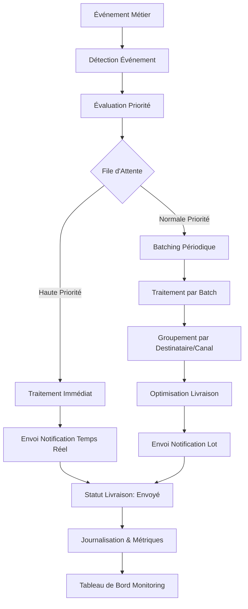

# 05-eqms-notifications.md

# Système de Notification eQMS

Ce document détaille le système de notification du module eQMS incluant 135 templates de notification organisés par catégories fonctionnelles, les conditions de déclenchement, et la stratégie de traitement par batch.

## Sommaire des 94 notifications

| Catégorie | Nombre | Description |
|-----------|--------|-------------|
| Foundation | 5 | Notifications système et de configuration générales |
| Planning | 8 | Planification qualité, fréquences d'échantillonnage |
| Inspection | 12 | Workflow d'inspection, résultats, décisions |
| LIMS | 8 | Gestion échantillons labouratoire, résultats d'analyse |
| SPC | 10 | Cartes de contrôle, détection hors-contrôle, capacité de procédé |
| NC | 12 | Détection, analyse, décision, suivi des non-conformités |
| CAPA | 10 | Création, implémentation, vérification d'efficacité des actions |
| Risk & FMEA | 6 | Évaluation des risques, mise à jour FMEA, actions de réduction |
| Supplier | 6 | Performance fournisseur, non-conformités fournisseur, audits |
| Customer | 8 | Réclamations clients, satisfaction, retours terrain |
| Audit | 6 | Planification, réalisation, suivi des actions d'audit |
| Compliance | 6 | Évaluations de conformité, certificats, changements réglementaires |
| Traceability | 6 | Traçabilité lot, analyse d'impact, alertes de propagation |
| AI | 6 | Prédictions de qualité, détection d'anomalies, recommandations |
| Calibration | 4 | Échéances d'étalonnage, résultats, certificats |
| Qualification | 4 | Protocoles IQ/OQ/PQ, statut de qualification, rapports |
| Validation | 4 | Protocoles de validation, résultats, rapports de validation |
| Change Control | 6 | Demandes de changement, évaluations, mise en œuvre |
| Analytics & Reports | 4 | Génération de rapports, alertes KPI, export de données |
| System | 4 | Alertes système critiques (disponibilité, performance, sécurité) |
| **Total** | **94** |  |

## NotificationTemplates TypeScript

```typescript
// src/quality/notification/notification-templates.ts

export interface NotificationTemplate {
  id: string;
  category: NotificationCategory;
  subject: string;
  body: string;
  recipients: string[]; // Roles or specific users
  priority: NotificationPriority;
  channels: NotificationChannel[]; // email, sms, in-app, push
  templateVariables: string[]; // Variables à remplacer dans le template
}

export enum NotificationCategory {
  FOUNDATION = 'FOUNDATION',
  PLANNING = 'PLANNING',
  INSPECTION = 'INSPECTION',
  LIMS = 'LIMS',
  SPC = 'SPC',
  NC = 'NC',
  CAPA = 'CAPA',
  RISK_FMEA = 'RISK_FMEA',
  SUPPLIER = 'SUPPLIER',
  CUSTOMER = 'CUSTOMER',
  AUDIT = 'AUDIT',
  COMPLIANCE = 'COMPLIANCE',
  TRACEABILITY = 'TRACEABILITY',
  AI = 'AI',
  CALIBRATION = 'CALIBRATION',
  QUALIFICATION = 'QUALIFICATION',
  VALIDATION = 'VALIDATION',
  CHANGE_CONTROL = 'CHANGE_CONTROL',
  ANALYTICS_REPORTS = 'ANALYTICS_REPORTS',
  SYSTEM = 'SYSTEM'
}

export enum NotificationPriority {
  LOW = 'LOW',
  MEDIUM = 'MEDIUM',
  HIGH = 'HIGH',
  CRITICAL = 'CRITICAL'
}

export enum NotificationChannel {
  EMAIL = 'EMAIL',
  SMS = 'SMS',
  IN_APP = 'IN_APP',
  PUSH = 'PUSH',
  WEBHOOK = 'WEBHOOK'
}

/**
 * Templates de notification Foundation (5)
 */
export const FOUNDATION_TEMPLATES: NotificationTemplate[] = [
  {
    id: 'FOUNDATION-001',
    category: NotificationCategory.FOUNDATION,
    subject: 'Configuration Qualité Modifiée',
    body: 'La configuration qualité {{configType}} a été modifiée par {{userName}}. Valeur précédente: {{oldValue}}, nouvelle valeur: {{newValue}}. Date: {{timestamp}}',
    recipients: ['QUALITY_MANAGER', 'QUALITY_ENGINEER'],
    priority: NotificationPriority.MEDIUM,
    channels: [NotificationChannel.EMAIL, NotificationChannel.IN_APP],
    templateVariables: ['configType', 'userName', 'oldValue', 'newValue', 'timestamp']
  },
  {
    id: 'FOUNDATION-002',
    category: NotificationCategory.FOUNDATION,
    subject: 'Nouveau Document Qualité Disponible',
    body: 'Un nouveau document qualité est disponible: {{documentTitle}} (révision {{revisionNumber}}). Document type: {{documentType}}. Accessible via le portail documentaire.',
    recipients: ['QUALITY_MANAGER', 'QUALITY_ENGINEER', 'PRODUCTION_SUPERVISOR'],
    priority: NotificationPriority.LOW,
    channels: [NotificationChannel.EMAIL, NotificationChannel.IN_APP],
    templateVariables: ['documentTitle', 'revisionNumber', 'documentType']
  },
  {
    id: 'FOUNDATION-003',
    category: NotificationCategory.FOUNDATION,
    subject: 'Document Qualité Arrivant à Échéance de Révision',
    body: 'Le document Qualité "{{documentTitle}}" (révision {{revisionNumber}}) arrive à échéance de révision le {{reviewDate}}. Veuillez lancer le processus de révision.',
    recipients: ['QUALITY_MANAGER', 'DOCUMENT_CONTROL'],
    priority: NotificationPriority.HIGH,
    channels: [NotificationChannel.EMAIL, NotificationChannel.IN_APP],
    templateVariables: ['documentTitle', 'revisionNumber', 'reviewDate']
  },
  {
    id: 'FOUNDATION-004',
    category: NotificationCategory.FOUNDATION,
    subject: 'Nouveau Profil Utilisateur Créé',
    body: 'Un nouveau profil utilisateur a été créé: {{userName}} ({{userEmail}}). Rôle: {{userRole}}. Département: {{department}}.',
    recipients: ['SECURITY_ADMIN', 'QUALITY_MANAGER'],
    priority: NotificationPriority.LOW,
    channels: [NotificationChannel.EMAIL],
    templateVariables: ['userName', 'userEmail', 'userRole', 'department']
  },
  {
    id: 'FOUNDATION-005',
    category: NotificationCategory.FOUNDATION,
    subject: 'Échec d\'Authentification Multiple Détecté',
    body: 'Tentatives d\'authentification échouées détectées pour l\'utilisateur {{userEmail}} depuis l\'adresse IP {{ipAddress}}. Compte verrouillé pendant {{lockoutDuration}} minutes.',
    recipients: ['SECURITY_ADMIN'],
    priority: NotificationPriority.CRITICAL,
    channels: [NotificationChannel.EMAIL, NotificationChannel.SMS],
    templateVariables: ['userEmail', 'ipAddress', 'lockoutDuration']
  }
];

/**
 * Templates de notification Planning (8)
 */
export const PLANNING_TEMPLATES: NotificationTemplate[] = [
  {
    id: 'PLANNING-001',
    category: NotificationCategory.PLANNING,
    subject: 'Nouveau Plan de Qualité Créé',
    body: 'Un nouveau plan de qualité a été créé: "{{planName}}" pour le produit {{productCode}}. Version: {{version}}. Date d\'effet: {{effectiveDate}}.',
    recipients: ['QUALITY_ENGINEER', 'PRODUCTION_PLANNER'],
    priority: NotificationPriority.MEDIUM,
    channels: [NotificationChannel.EMAIL, NotificationChannel.IN_APP],
    templateVariables: ['planName', 'productCode', 'version', 'effectiveDate']
  },
  {
    id: 'PLANNING-002',
    category: NotificationCategory.PLANNING,
    subject: 'Plan de Qualité Arrivant à Échéance de Révision',
    body: 'Le plan de qualité "{{planName}}" (version {{version}}) arrive à échéance de révision le {reviewDate}. Veuillez lancer le processus de révision.',
    recipients: ['QUALITY_ENGINEER', 'QUALITY_MANAGER'],
    priority: NotificationPriority.HIGH,
    channels: [NotificationChannel.EMAIL, NotificationChannel.IN_APP],
    templateVariables: ['planName', 'version', 'reviewDate']
  },
  {
    id: 'PLANNING-003',
    category: NotificationCategory.PLANNING,
    subject: 'Nouveau Point de Contrôle Qualité Défini',
    body: 'Un nouveau point de contrôle qualité a été défini: "{controlPointName}" pour l\'opération {operationName} à l\'étape {processStep}. Spécification: {specification}.',
    recipients: ['QUALITY_ENGINEER', 'PROCESS_ENGINEER'],
    priority: NotificationPriority.LOW,
    channels: [NotificationChannel.EMAIL, NotificationChannel.IN_APP],
    templateVariables: ['controlPointName', 'operationName', 'processStep', 'specification']
  },
  {
    id: 'PLANNING-004',
    category: NotificationCategory.PLANNING,
    subject: 'Fréquence d\'Échantillonnage Modifiée',
    body: 'La fréquence d\'échantillonnage pour {characteristicName} a été modifiée de {oldFrequency} à {newFrequency}. Échantillonnage basé sur: {samplingBasis}.',
    recipients: ['QUALITY_ENGINEER', 'PROCESS_ENGINEER'],
    priority: NotificationPriority.MEDIUM,
    channels: [NotificationChannel.EMAIL, NotificationChannel.IN_APP],
    templateVariables: ['characteristicName', 'oldFrequency', 'newFrequency', 'samplingBasis']
  },
  {
    id: 'PLANNING-005',
    category: NotificationCategory.PLANNING,
    subject: 'Nouveau Planning de Contrôle Généré',
    body: 'Un nouveau planning de contrôle a été généré pour la période du {startDate} au {endDate}. {numberOfInspections} inspections planifiées.',
    recipients: ['QUALITY_SUPERVISOR', 'SHIFT_LEADER'],
    priority: NotificationProtocol.MEDIUM,
    channels: [NotificationChannel.EMAIL, NotificationChannel.IN_APP],
    templateVariables: ['startDate', 'endDate', 'numberOfInspections']
  },
  {
    id: 'PLANNING-006',
    category: NotificationCategory.PLANNING,
    subject: 'Inspection Planifiée dans les Prochaines 24 Heures',
    body: 'Rappel: Inspection planifiée dans les prochaines 24 heures. Type: {inspectionType}. Lot: {lotNumber}. Opération: {operationName}. Responsable: {assignedInspector}.',
    recipients: ['INSPECTOR_ASSIGNED'],
    priority: NotificationPriority.HIGH,
    channels: [NotificationChannel.EMAIL, NotificationChannel.SMS, NotificationChannel.IN_APP],
    templateVariables: ['inspectionType', 'lotNumber', 'operationName', 'assignedInspector']
  },
  {
    id: 'PLANNING-007',
    category: NotificationCategory.PLANNING,
    subject: 'Écart de Planification Détecté',
    body: 'Écart de planification détecté pour {lotNumber}: Prévu à {scheduledTime}, réel à {actualTime}. Écart: {timeDelta} minutes.',
    recipients: ['QUALITY_SUPERVISOR', 'PRODUCTION_SUPERVISOR'],
    priority: NotificationPriority.MEDIUM,
    channels: [NotificationChannel.EMAIL, NotificationChannel.IN_APP],
    templateVariables: ['lotNumber', 'scheduledTime', 'actualTime', 'timeDelta']
  },
  {
    id: 'PLANNING-008',
    category: NotificationCategory.PLANNING,
    subject: 'Ressource Qualité Allouée',
    body: 'Ressource qualité allouée: {resourceName} ({resourceType}) assignée à {activityDescription} pour la période {startTime} à {endTime}.',
    recipients: ['RESOURCE_ASSIGNED'],
    priority: NotificationPriority.LOW,
    channels: [NotificationChannel.EMAIL, NotificationChannel.IN_APP],
    templateVariables: ['resourceName', 'resourceType', 'activityDescription', 'startTime', 'endTime']
  }
];

/**
 * Templates de notification Inspection (12)
 */
export const INSPECTION_TEMPLATES: NotificationTemplate[] = [
  {
    id: 'INSPECTION-001',
    category: NotificationCategory.INSPECTION,
    subject: 'Nouvelle Inspection Programmée',
    body: 'Nouvelle inspection programmée: {inspectionType} pour le lot {lotNumber}. Date prévue: {scheduledDate}. Responsable: {assignedInspector}.',
    recipients: ['QUALITY_SUPERVISOR', 'INSPECTOR_ASSIGNED'],
    priority: NotificationPriority.MEDIUM,
    channels: [NotificationChannel.EMAIL, NotificationChannel.IN_APP],
    templateVariables: ['inspectionType', 'lotNumber', 'scheduledDate', 'assignedInspector']
  },
  {
    id: 'INSPECTION-002',
    category: NotificationCategory.INSPECTION,
    subject: 'Inspection en Cours de Réalisation',
    body: 'L\'inspection {inspectionType} pour le lot {lotNumber} est maintenant en cours de réalisation. Débuté à {startTime} par {inspectorName}.',
    recipients: ['PRODUCTION_SUPERVISOR', 'WAREHOUSE_MANAGER'],
    priority: NotificationPriority.LOW,
    channels: [NotificationChannel.IN_APP],
    templateVariables: ['inspectionType', 'lotNumber', 'startTime', 'inspectorName']
  },
  {
    id: 'INSPECTION-003',
    category: NotificationCategory.INSPECTION,
    subject: 'Inspection Terminée - Résultats Disponibles',
    body: 'L\'inspection {inspectionType} pour le lot {lotNumber} est terminée. Résultat global: {overallResult}. Détails disponibles dans le système.',
    recipients: ['QUALITY_SUPERVISOR', 'PRODUCTION_PLANNER', 'WAREHOUSE_MANAGER'],
    priority: NotificationPriority.MEDIUM,
    channels: [NotificationChannel.EMAIL, NotificationChannel.IN_APP],
    templateVariables: ['inspectionType', 'lotNumber', 'overallResult']
  },
  {
    id: 'INSPECTION-004',
    category: NotificationCategory.INSPECTION,
    subject: 'Inspection Requérant une Attention Immédiate',
    body: 'ATTENTION: L\'inspection {inspectionType} pour le lot {lotNumber} a détecté des résultats hors spécification nécessitant une intervention immédiate. Voir détails: {nonConformanceDetails}.',
    recipients: ['QUALITY_MANAGER', 'PRODUCTION_MANAGER', 'SHIFT_LEADER'],
    priority: NotificationPriority.CRITICAL,
    channels: [NotificationChannel.EMAIL, NotificationChannel.SMS, NotificationChannel.IN_APP],
    templateVariables: ['inspectionType', 'lotNumber', 'nonConformanceDetails']
  },
  {
    id: 'INSPECTION-005',
    category: NotificationCategory.INSPECTION,
    subject: 'Mesure Hors Spécification Détectée',
    body: 'Lors de l\'inspection {inspectionType} du lot {lotNumber}, la mesure {measurementName} a donné {measuredValue} (LSI: {LSI}, LSP: {LSP}). Écart: {deviation}.',
    recipients: ['QUALITY_ENGINEER', 'PROCESS_ENGINEER'],
    priority: NotificationPriority.HIGH,
    channels: [NotificationChannel.EMAIL, NotificationChannel.IN_APP],
    templateVariables: ['inspectionType', 'lotNumber', 'measurementName', 'measuredValue', 'LSI', 'LSP', 'deviation']
  },
  {
    id: 'INSPECTION-006',
    category: NotificationCategory.INSPECTION,
    subject: 'Lot Mis en Quarantaine Suite à Inspection',
    body: 'Le lot {lotNumber} a été mis en quarantaine suite à l\'inspection {inspectionType}. Raison: {quarantineReason}. Action requise: {requiredAction}.',
    recipients: ['WAREHOUSE_MANAGER', 'LOGISTICS_COORDINATOR', 'QUALITY_MANAGER'],
    priority: NotificationPriority.HIGH,
    channels: [NotificationChannel.EMAIL, NotificationChannel.SMS, NotificationChannel.IN_APP],
    templateVariables: ['lotNumber', 'inspectionType', 'quarantineReason', 'requiredAction']
  },
  {
    id: 'INSPECTION-007',
    category: NotificationCategory.INSPECTION,
    subject: 'Lot Libéré Après Inspection',
    body: 'Le lot {lotNumber} a été libéré suite à l\'inspection {inspectionType}. Résultat: {inspectionResult}. Prêt pour l\'étape suivante: {nextProcessStep}.',
    recipients: ['PRODUCTION_PLANNER', 'LOGISTICS_COORDINATOR', 'WAREHOUSE_MANAGER'],
    priority: NotificationPriority.MEDIUM,
    channels: [NotificationChannel.EMAIL, NotificationChannel.IN_APP],
    templateVariables: ['lotNumber', 'inspectionType', 'inspectionResult', 'nextProcessStep']
  },
  {
    id: 'INSPECTION-008',
    category: NotificationCategory.INSPECTION,
    subject: 'Inspection En Retard de {delayHours} Heures',
    body: 'L\'inspection {inspectionType} prévue pour le lot {lotNumber} est en retard de {delayHours} heures. Nouvel horaire prévu: {newScheduledTime}.',
    recipients: ['QUALITY_SUPERVISOR', 'PRODUCTION_SUPERVISOR'],
    priority: NotificationPriority.MEDIUM,
    channels: [NotificationChannel.EMAIL, NotificationChannel.IN_APP],
    templateVariables: ['inspectionType', 'lotNumber', 'delayHours', 'newScheduledTime']
  },
  {
    id: 'INSPECTION-009',
    category: NotificationCategory.INSPECTION,
    subject: 'Inspection Annulée ou Reportée',
    body: 'L\'inspection {inspectionType} pour le lot {lotNumber} a été {actionReason}. Nouvelle date prévue: {newDate} si applicable.',
    recipients: ['QUALITY_SUPERVISOR', 'INSPECTOR_ASSIGNED'],
    priority: NotificationPriority.LOW,
    channels: [NotificationChannel.EMAIL, NotificationChannel.IN_APP],
    templateVariables: ['inspectionType', 'lotNumber', 'actionReason', 'newDate']
  },
  {
    id: 'INSPECTION-010',
    category: NotificationCategory.INSPECTION,
    subject: 'Inspection Externalisée - Demande de Service',
    body: 'Demande d\'inspection externalisée créée pour le lot {lotNumber}. Type: {inspectionType}. Prestataire: {serviceProvider}. Date limite: {deadlineDate}.',
    recipients: ['QUALITY_MANAGER', 'PROCUREMENT_OFFICER'],
    priority: NotificationPriority.MEDIUM,
    channels: [NotificationChannel.EMAIL],
    templateVariables: ['lotNumber', 'inspectionType', 'serviceProvider', 'deadlineDate']
  },
  {
    id: 'INSPECTION-011',
    category: NotificationCategory.INSPECTION,
    subject: 'Résultat d\'Inspection Externalisée Reçu',
    body: 'Résultat d\'inspection externalisée reçu pour le lot {lotNumber}. Type: {inspectionType}. Résultat: {inspectionResult}. Rapport disponible: {reportLink}.',
    recipients: ['QUALITY_MANAGER', 'PRODUCTION_PLANNER'],
    priority: NotificationPriority.MEDIUM,
    channels: [NotificationChannel.EMAIL, NotificationChannel.IN_APP],
    templateVariables: ['lotNumber', 'inspectionType', 'inspectionResult', 'reportLink']
  },
  {
    id: 'INSPECTION-012',
    category: NotificationCategory.INSPECTION,
    subject: 'Écart de Tendence Detecté dans les Résultats d\'Inspection',
    body: 'Écart de tendance détecté pour {characteristicName} sur les derniers {sampleSize} inspections. Tendance: {trendDirection}. Valeur moyenne: {averageValue}.',
    recipients: ['QUALITY_ENGINEER', 'PROCESS_ENGINEER'],
    priority: NotificationPriority.MEDIUM,
    channels: [NotificationChannel.EMAIL, NotificationChannel.IN_APP],
    templateVariables: ['characteristicName', 'sampleSize', 'trendDirection', 'averageValue']
  }
];

/**
 * Templates de notification LIMS (8)
 */
export const LIMS_TEMPLATES: NotificationTemplate[] = [
  {
    id: 'LIMS-001',
    category: NotificationCategory.LIMS,
    subject: 'Nouvel Échantillon Reçu au Laboratoire',
    body: 'Nouvel échantillon reçu au laboratoire: {sampleID} de type {sampleType}. Échantillonnage effectué le {samplingDate} par {samplerName}.',
    recipients: ['LAB_TECHNICIAN', 'LAB_SUPERVISOR'],
    priority: NotificationPriority.MEDIUM,
    channels: [NotificationChannel.EMAIL, NotificationChannel.IN_APP],
    templateVariables: ['sampleID', 'sampleType', 'samplingDate', 'samplerName']
  },
  {
    id: 'LIMS-002',
    category: NotificationCategory.LIMS,
    subject: 'Échantillon Assigné à un Technicien',
    body: 'L\'échantillon {sampleID} a été assigné à {technicianName} pour analyse de {analysisType}. Date limite d\'analyse: {analysisDueDate}.',
    recipients: ['LAB_TECHNICIAN_ASSIGNED'],
    priority: NotificationPriority.LOW,
    channels: [NotificationChannel.EMAIL, NotificationChannel.IN_APP],
    templateVariables: ['sampleID', 'technicianName', 'analysisType', 'analysisDueDate']
  },
  {
    id: 'LIMS-003',
    category: NotificationCategory.LIMS,
    subject: 'Analyse en Cours de Réalisation',
    body: 'L\'analyse {analysisType} de l\'échantillon {sampleID} est maintenant en cours. Débuté à {startTime} par {technicianName}.',
    recipients: ['LAB_SUPERVISOR'],
    priority: NotificationPriority.LOW,
    channels: [NotificationChannel.IN_APP],
    templateVariables: ['analysisType', 'sampleID', 'startTime', 'technicianName']
  },
  {
    id: 'LIMS-004',
    category: NotificationCategory.LIMS,
    subject: 'Résultat d\'Analyse Disponible',
    body: 'Résultat d\'analyse disponible pour l\'échantillon {sampleID}. Analyse: {analysisType}. Résultat: {resultValue} {unit}. Statut: {resultStatus}.',
    recipients: ['REQUESTER', 'QUALITY_SUPERVISOR'],
    priority: NotificationPriority.MEDIUM,
    channels: [NotificationChannel.EMAIL, NotificationChannel.IN_APP],
    templateVariables: ['sampleID', 'analysisType', 'resultValue', 'unit', 'resultStatus']
  },
  {
    id: 'LIMS-005',
    category: NotificationCategory.LIMS,
    subject: 'Résultat Hors Spécification Detecté',
    body: 'ATTENTION: Résultat hors spécification détecté pour l\'échantillon {sampleID}. Analyse: {analysisType}. Résultat: {resultValue} {unit} (LSI: {LSI}, LSP: {LSP}).',
    recipients: ['QUALITY_MANAGER', 'LAB_SUPERVISOR', 'PROCESS_ENGINEER'],
    priority: NotificationPriority.HIGH,
    channels: [NotificationChannel.EMAIL, NotificationChannel.SMS, NotificationChannel.IN_APP],
    templateVariables: ['sampleID', 'analysisType', 'resultValue', 'unit', 'LSI', 'LSP']
  },
  {
    id: 'LIMS-006',
    category: NotificationCategory.LIMS,
    subject: 'Échantillon Requérant une Nouvelle Analyse',
    body: 'L\'échantillon {sampleID} nécessite une nouvelle analyse de {analysisType} en raison de: {reason}. Nouvelle échéance: {newDueDate}.',
    recipients: ['LAB_TECHNICIAN_ASSIGNED', 'LAB_SUPERVISOR'],
    priority: NotificationPriority.MEDIUM,
    channels: [NotificationChannel.EMAIL, NotificationChannel.IN_APP],
    templateVariables: ['sampleID', 'analysisType', 'reason', 'newDueDate']
  },
  {
    id: 'LIMS-007',
    category: NotificationCategory.LIMS,
    subject: 'Échantillon Arrivant à Échéance d\'Analyse',
    body: 'L\'échantillon {sampleID} arrive à échéance d\'analyse aujourd\'hui. Analyse en attente: {analysisType}. Priorité: {priorityLevel}.',
    recipients: ['LAB_TECHNICIAN_ASSIGNED', 'LAB_SUPERVISOR'],
    priority: NotificationPriority.HIGH,
    channels: [NotificationChannel.EMAIL, NotificationChannel.SMS, NotificationChannel.IN_APP],
    templateVariables: ['sampleID', 'analysisType', 'priorityLevel']
  },
  {
    id: 'LIMS-008',
    category: NotificationCategory.LIMS,
    subject: 'Échantillon Contaminé ou Invalide Detecté',
    body: 'ATTENTION: L\'échantillon {sampleID} a été marqué comme contaminé ou invalide. Raison: {contaminationReason}. Action requise: {requiredAction}.',
    recipients: ['LAB_SUPERVISOR', 'QUALITY_MANAGER', 'SAMPLING_TEAM_LEAD'],
    priority: NotificationPriority.CRITICAL,
    channels: [NotificationChannel.EMAIL, NotificationChannel.SMS, NotificationChannel.IN_APP],
    templateVariables: ['sampleID', 'contaminationReason', 'requiredAction']
  }
];

/**
 * Templates de notification SPC (10)
 */
export const SPC_TEMPLATES: NotificationTemplate[] = [
  {
    id: 'SPC-001',
    category: NotificationCategory.SPC,
    subject: 'Nouvelle Carte de Contrôle Créée',
    body: 'Nouvelle carte de contrôle créée: {chartName} de type {chartType} pour la caractéristique {characteristicName}. Période de référence: {referencePeriod}.',
    recipients: ['QUALITY_ENGINEER', 'PROCESS_ENGINEER'],
    priority: NotificationPriority.MEDIUM,
    channels: [NotificationChannel.EMAIL, NotificationChannel.IN_APP],
    templateVariables: ['chartName', 'chartType', 'characteristicName', 'referencePeriod']
  },
  {
    id: 'SPC-002',
    category: NotificationCategory.SPC,
    subject: 'Point Hors Contrôle Detecté - Règle de Western Electric',
    body: 'ATTENTION: Point hors contrôle détecté sur la carte {chartName}. Point #{pointNumber}: {pointValue}. Règle violée: {violationRule}. Action immédiate requise.',
    recipients: ['PROCESS_OPERATOR', 'QUALITY_SUPERVISOR'],
    priority: NotificationPriority.HIGH,
    channels: [NotificationChannel.EMAIL, NotificationChannel.SMS, NotificationChannel.IN_APP],
    templateVariables: ['chartName', 'pointNumber', 'pointValue', 'violationRule']
  },
  {
    id: 'SPC-003',
    category: NotificationCategory.SPC,
    subject: 'Tendance Dégradante Detectée sur la Carte de Contrôle',
    body: 'Tendance dégradante détectée sur la carte {chartName} pour la caractéristique {characteristicName}. {consecutivePoints} points consécutifs dans la même direction.',
    recipients: ['QUALITY_ENGINEER', 'PROCESS_ENGINEER'],
    priority: NotificationPriority.MEDIUM,
    channels: [NotificationChannel.EMAIL, NotificationChannel.IN_APP],
    templateVariables: ['chartName', 'characteristicName', 'consecutivePoints']
  },
  {
    id: 'SPC-004',
    category: NotificationCategory.SPC,
    subject: 'Capacité de Procédé Calculée - Cp/Cpk en Deça du Seuil',
    body: 'La capacité de procédé pour {characteristicName} est calculée: Cp={cpValue}, Cpk={cpkValue}. Seuil minimum: {threshold}. Action d\'amélioration requise.',
    recipients: ['QUALITY_ENGINEER', 'PROCESS_ENGINEER', 'PROCESS_MANAGER'],
    priority: NotificationPriority.HIGH,
    channels: [NotificationChannel.EMAIL, NotificationChannel.IN_APP],
    templateVariables: ['characteristicName', 'cpValue', 'cpkValue', 'threshold']
  },
  {
    id: 'SPC-005',
    category: NotificationCategory.SPC,
    subject: 'Moyenne Mobile Hors Limites de Contrôle',
    body: 'La moyenne mobile (MW) pour {characteristicName} est hors limites de contrôle: {mwValue} (LCL: {lcl}, UCL: {ucl}).',
    recipients: ['QUALITY_ENGINEER', 'PROCESS_ENGINEER'],
    priority: NotificationPriority.MEDIUM,
    channels: [NotificationChannel.EMAIL, NotificationChannel.IN_APP],
    templateVariables: ['characteristicName', 'mwValue', 'lcl', 'ucl']
  },
  {
    id: 'SPC-006',
    category: NotificationCategory.SPC,
    subject: 'Écart-Type Mobil Hors Limites de Contrôle',
    body: 'L\'écart-type mobile (MR) pour {characteristicName} est hors limites de contrôle: {mrValue} (LCL: {lcl}, UCL: {ucl}).',
    recipients: ['QUALITY_ENGINEER', 'PROCESS_ENGINEER'],
    priority: NotificationPriority.MEDIUM,
    channels: [NotificationChannel.EMAIL, NotificationChannel.IN_APP],
    templateVariables: ['characteristicName', 'mrValue', 'lcl', 'ucl']
  },
  {
    id: 'SPC-007',
    category: NotificationCategory.SPC,
    subject: 'Caractéristique Hors Spécification sur Période Étendue',
    body: 'Sur la période {period}, {outOfSpecCount} mesures sur {totalMeasurements} ({percentage}%) sont hors spécification pour {characteristicName}.',
    recipients: ['QUALITY_MANAGER', 'PROCESS_MANAGER'],
    priority: NotificationPriority.HIGH,
    channels: [NotificationChannel.EMAIL, NotificationChannel.IN_APP],
    templateVariables: ['period', 'outOfSpecCount', 'totalMeasurements', 'percentage', 'characteristicName']
  },
  {
    id: 'SPC-008',
    category: NotificationCategory.SPC,
    subject: 'Mise à Jour Automatique des Limites de Contrôle',
    body: 'Les limites de contrôle ont été mises à jour automatiquement pour la carte {chartName}. Nouvelle UCL: {newUCL}, Nouvelle LCL: {newLCL}, Nouvelle Centre: {newCenterLine}.',
    recipients: ['QUALITY_ENGINEER'],
    priority: NotificationPriority.LOW,
    channels: [NotificationChannel.EMAIL, NotificationChannel.IN_APP],
    templateVariables: ['chartName', 'newUCL', 'newLCL', 'newCenterLine']
  },
  {
    id: 'SPC-009',
    category: NotificationCategory.SPC,
    subject: 'Données Manusciptess Saisies pour la Carte de Contrôle',
    body: 'Des données manuelles ont été saisies pour la carte {chartName}. Point ajouté: {dataPoint} à {timestamp}. Raison: {reasonForManualEntry}.',
    recipients: ['QUALITY_SUPERVISOR'],
    priority: NotificationPriority.LOW,
    channels: [NotificationChannel.IN_APP],
    templateVariables: ['chartName', 'dataPoint', 'timestamp', 'reasonForManualEntry']
  },
  {
    id: 'SPC-010',
    category: NotificationCategory.SPC,
    subject: 'Perte de Communication avec l\'Appareil de Mesure',
    body: 'ATTENTION: Perte de communication détectée avec l\'appareil de mesure {deviceID} pour la caractéristique {characteristicName}. Dernière donnée reçue à {lastDataTime}.',
    recipients: ['MAINTENANCE_TEAM', 'QUALITY_SUPERVISOR'],
    priority: NotificationPriority.HIGH,
    channels: [NotificationChannel.EMAIL, NotificationChannel.SMS],
    templateVariables: ['deviceID', 'characteristicName', 'lastDataTime']
  }
];

/**
 * Templates de notification NC (12)
 */
export const NC_TEMPLATES: NotificationTemplate[] = [
  {
    id: 'NC-001',
    category: NotificationCategory.NC,
    subject: 'Nouvelle Non-Conformité Enregistrée',
    body: 'Nouvelle non-conformité enregistrée: {ncID} de type {ncType} détectée le {detectionDate} lors de {detectionActivity}. Lot affecté: {affectedLot}.',
    recipients: ['QUALITY_SUPERVISOR', 'NC_COORDINATOR'],
    priority: NotificationPriority.MEDIUM,
    channels: [NotificationChannel.EMAIL, NotificationChannel.IN_APP],
    templateVariables: ['ncID', 'ncType', 'detectionDate', 'detectionActivity', 'affectedLot']
  },
  {
    id: 'NC-002',
    category: NotificationCategory.NC,
    subject: 'Non-Conformité Nécessitant une Mise en Quarantaine Immédiate',
    body: 'ATTENTION: La non-conformité {ncID} nécessite une mise en quarantaine immédiate du lot {affectedLot}. Raison: {quarantineReason}.',
    recipients: ['WAREHOUSE_MANAGER', 'QUALITY_MANAGER', 'LOGISTICS_COORDINATOR'],
    priority: NotificationPriority.CRITICAL,
    channels: [NotificationChannel.EMAIL, NotificationChannel.SMS, NotificationChannel.IN_APP],
    templateVariables: ['ncID', 'affectedLot', 'quarantineReason']
  },
  {
    id: 'NC-003',
    category: NotificationCategory.NC,
    subject: 'Non-Conformité Assignée à une Équipe d\'Enquête',
    body: 'La non-conformité {ncID} a été assignée à l\'équipe d\'enquête dirigée par {investigatorLead}. Date limite d\'analyse: {analysisDueDate}.',
    recipients: ['INVESTIGATION_TEAM'],
    priority: NotificationPriority.MEDIUM,
    channels: [NotificationChannel.EMAIL, NotificationChannel.IN_APP],
    templateVariables: ['ncID', 'investigatorLead', 'analysisDueDate']
  },
  {
    id: 'NC-004',
    category: NotificationCategory.NC,
    subject: 'Analyse des Causes Racines Initiée',
    body: 'L\'analyse des causes racines a été initiée pour la non-conformité {ncID}. Méthode utilisée: {analysisMethod}. Participants: {participantsList}.',
    recipients: ['INVESTIGATION_TEAM', 'QUALITY_ENGINEER'],
    priority: NotificationPriority.LOW,
    channels: [NotificationChannel.EMAIL, NotificationChannel.IN_APP],
    templateVariables: ['ncID', 'analysisMethod', 'participantsList']
  },
  {
    id: 'NC-005',
    category: NotificationCategory.NC,
    subject: 'Cause Racine Identifiée pour NC',
    body: 'Cause racine identifiée pour la non-conformité {ncID}: {rootCauseDescription}. Classification: {causeCategory}.',
    recipients: ['QUALITY_MANAGER', 'PROCESS_ENGINEER'],
    priority: NotificationPriority.MEDIUM,
    channels: [NotificationChannel.EMAIL, NotificationChannel.IN_APP],
    templateVariables: ['ncID', 'rootCauseDescription', 'causeCategory']
  },
  {
    id: 'NC-006',
    category: NotificationCategory.NC,
    subject: 'Décision de Disposition Prise pour NC',
    body: 'Décision de prise pour la non-conformité {ncID}: {dispositionAction}. Quantité affectée: {affectedQuantity} {unit}.',
    recipients: ['QUALITY_MANAGER', 'PRODUCTION_PLANNER', 'WAREHOUSE_MANAGER'],
    priority: NotificationPriority.MEDIUM,
    channels: [NotificationChannel.EMAIL, NotificationChannel.IN_APP],
    templateVariables: ['ncID', 'dispositionAction', 'affectedQuantity', 'unit']
  },
  {
    id: 'NC-007',
    category: NotificationCategory.NC,
    subject: 'Action Corrective Requise pour NC',
    body: 'Une action corrective est requise pour la non-conformité {ncID}. Description: {requiredAction}. Responsable: {responsibleParty}. Échéance: {dueDate}.',
    recipients: ['RESPONSIBLE_PARTY', 'QUALITY_MANAGER'],
    priority: NotificationPriority.HIGH,
    channels: [NotificationChannel.EMAIL, NotificationChannel.IN_APP],
    templateVariables: ['ncID', 'requiredAction', 'responsibleParty', 'dueDate']
  },
  {
    id: 'NC-008',
    category: NotificationCategory.NC,
    subject: 'Non-Conformité Fournisseur Detectée',
    body: 'Non-conformité fournisseur détectée: {ncID} pour le fournisseur {supplierName} (code: {supplierCode}). Lot reçu: {lotNumber}.',
    recipients: ['QUALITY_MANAGER', 'SUPPLIER_QUALITY_ENGINEER', 'PROCUREMENT_OFFICER'],
    priority: NotificationPriority.HIGH,
    channels: [NotificationChannel.EMAIL, NotificationChannel.IN_APP],
    templateVariables: ['ncID', 'supplierName', 'supplierCode', 'lotNumber']
  },
  {
    id: 'NC-009',
    category: NotificationCategory.NC,
    subject: 'Non-Conformité Client Detectée (Réclamation)',
    body: 'Non-conformité client détectée (réclamation): {ncID} pour le client {customerName} (code: {customerCode}). Lot concerné: {lotNumber}.',
    recipients: ['QUALITY_MANAGER', 'CUSTOMER_SERVICE_MANAGER', 'SALES_REPRESENTATIVE'],
    priority: NotificationPriority.HIGH,
    channels: [NotificationChannel.EMAIL, NotificationChannel.SMS],
    templateVariables: ['ncID', 'customerName', 'customerCode', 'lotNumber']
  },
  {
    id: 'NC-010',
    category: NotificationCategory.NC,
    subject: 'Non-Conformité Clôturée avec Vérification d\'Efficacité',
    body: 'La non-conformité {ncID} a été clôturée. Vérification d\'efficacité effectuée le {verificationDate} avec résultat: {effectivenessResult}.',
    recipients: ['QUALITY_MANAGER', 'ORIGINAL_REPORTER'],
    priority: NotificationPriority.LOW,
    channels: [NotificationChannel.EMAIL, NotificationChannel.IN_APP],
    templateVariables: ['ncID', 'verificationDate', 'effectivenessResult']
  },
  {
    id: 'NC-011',
    category: NotificationCategory.NC,
    subject: 'Seuil de Non-Conformités Atteint pour un Produit/Lot',
    body: 'ATTENTION: Seuil de non-conformités atteint pour le produit {productCode} / lot {lotNumber}: {ncCount} NC sur les dernières {timePeriod}.',
    recipients: ['QUALITY_MANAGER', 'PROCESS_ENGINEER', 'PRODUCTION_MANAGER'],
    priority: NotificationPriority.HIGH,
    channels: [NotificationChannel.EMAIL, NotificationChannel.SMS, NotificationChannel.IN_APP],
    templateVariables: ['productCode', 'lotNumber', 'ncCount', 'timePeriod']
  },
  {
    id: 'NC-012',
    category: NotificationCategory.NC,
    subject: 'Non-Conformité Requérant une Réévaluation du Plan de Contrôle',
    body: 'La non-conformité {ncID} suggère une réévaluation du plan de contrôle pour la caractéristique {characteristicName}. Raison: {reevaluationReason}.',
    recipients: ['QUALITY_ENGINEER', 'PROCESS_ENGINEER'],
    priority: NotificationPriority.MEDIUM,
    channels: [NotificationChannel.EMAIL, NotificationChannel.IN_APP],
    templateVariables: ['ncID', 'characteristicName', 'reevaluationReason']
  }
];

/**
 * Templates de notification CAPA (10)
 */
export const CAPA_TEMPLATES: NotificationTemplate[] = [
  {
    id: 'CAPA-001',
    category: NotificationCategory.CAPA,
    subject: 'Nouvelle Action Corrective/Preventive Créée',
    body: 'Nouvelle {capaType} créée: {capaID} liée à la non-conformité/problème {relatedIssueID}. Description: {description}. Responsable: {assignedOwner}.',
    recipients: ['QUALITY_MANAGER', 'CAPA_COORDINATOR'],
    priority: NotificationPriority.MEDIUM,
    channels: [NotificationChannel.EMAIL, NotificationChannel.IN_APP],
    templateVariables: ['capaType', 'capaID', 'relatedIssueID', 'description', 'assignedOwner']
  },
  {
    id: 'CAPA-002',
    category: NotificationCategory.CAPA,
    subject: 'Plan d\'Action CAPA Requérant une Approbation',
    body: 'Le plan d\'action pour la {capaType} {capaID} requiert votre approbation. Date limite d\'approbation: {approvalDueDate}.',
    recipients: ['APPROVER'],
    priority: NotificationPriority.MEDIUM,
    channels: [NotificationChannel.EMAIL, NotificationChannel.IN_APP],
    templateVariables: ['capaType', 'capaID', 'approvalDueDate']
  },
  {
    id: 'CAPA-003',
    category: NotificationCategory.CAPA,
    subject: 'Plan d\'Action CAPA Approuvé - Passage à la Phase d\'Implémentation',
    body: 'Le plan d\'action pour la {capaType} {capaID} a été approuvé. Vous pouvez maintenant commencer la phase d\'implémentation. Date de début prévue: {plannedStartDate}.',
    recipients: ['ASSIGNED_OWNER'],
    priority: NotificationPriority.MEDIUM,
    channels: [NotificationChannel.EMAIL, NotificationChannel.IN_APP],
    templateVariables: ['capaType', 'capaID', 'plannedStartDate']
  },
  {
    id: 'CAPA-004',
    category: NotificationCategory.CAPA,
    subject: 'Action CAPA en Retard de {delayDays} Jours',
    body: 'ATTENTION: L\'action {capaType} {capaID} est en retard de {delayDays} jours. Date d\'échéance initiale: {originalDueDate}.',
    recipients: ['ASSIGNED_OWNER', 'QUALITY_MANAGER'],
    priority: NotificationPriority.HIGH,
    channels: [NotificationChannel.EMAIL, NotificationChannel.SMS, NotificationChannel.IN_APP],
    templateVariables: ['capaType', 'capaID', 'delayDays', 'originalDueDate']
  },
  {
    id: 'CAPA-005',
    category: NotificationCategory.CAPA,
    subject: 'Action CAPA Terminée - Passage à la Vérification d\'Efficacité',
    body: 'L\'action {capaType} {capaID} a été marquée comme terminée. Passage à la phase de vérification d\'efficacité. Plan de vérification: {verificationPlan}.',
    recipients: ['QUALITY_MANAGER', 'VERIFICATION_TEAM'],
    priority: NotificationPriority.MEDIUM,
    channels: [NotificationChannel.EMAIL, NotificationChannel.IN_APP],
    templateVariables: ['capaType', 'capaID', 'verificationPlan']
  },
  {
    id: 'CAPA-006',
    category: NotificationCategory.CAPA,
    subject: 'Vérification d\'Efficacité Planifiée pour CAPA',
    body: 'La vérification d\'efficacité pour la {capaType} {capaID} est planifiée le {verificationDate}. Méthode: {verificationMethod}. Échantillonnage: {samplingPlan}.',
    recipients: ['VERIFICATION_TEAM', 'QUALITY_MANAGER'],
    priority: NotificationPriority.LOW,
    channels: [NotificationChannel.EMAIL, NotificationChannel.IN_APP],
    templateVariables: ['capaType', 'capaID', 'verificationDate', 'verificationMethod', 'samplingPlan']
  },
  {
    id: 'CAPA-007',
    category: NotificationCategory.CAPA,
    subject: 'Vérification d\'Efficacité Terminée - Résultat: {effectivenessResult}',
    body: 'La vérification d\'efficacité pour la {capaType} {capaID} est terminée. Résultat: {effectivenessResult} (efficace: {isEffective}).',
    recipients: ['QUALITY_MANAGER', 'ORIGINAL_REQUESTER'],
    priority: NotificationPriority.MEDIUM,
    channels: [NotificationChannel.EMAIL, NotificationChannel.IN_APP],
    templateVariables: ['capaType', 'capaID', 'effectivenessResult', 'isEffective']
  },
  {
    id: 'CAPA-008',
    category: NotificationCategory.CAPA,
    subject: 'CAPA Requérant une Extension de Délai',
    body: 'Demande d\'extension de délai reçue pour la {capaType} {capaID}. Nouvelle date d\'échéance proposée: {newDueDate}. Raison: {extensionReason}.',
    recipients: ['QUALITY_MANAGER', 'CAPA_COORDINATOR'],
    priority: NotificationPriority.MEDIUM,
    channels: [NotificationChannel.EMAIL, NotificationChannel.IN_APP],
    templateVariables: ['capaType', 'capaID', 'newDueDate', 'extensionReason']
  },
  {
    id: 'CAPA-009',
    category: NotificationCategory.CAPA,
    subject: 'CAPA Annulé ou Suspendu',
    body: 'La {capaType} {capaID} a été {actionTaken} en raison de: {cancellationReason}.',
    recipients: ['QUALITY_MANAGER', 'ASSIGNED_OWNER'],
    priority: NotificationPriority.LOW,
    channels: [NotificationChannel.EMAIL, NotificationChannel.IN_APP],
    templateVariables: ['capaType', 'capaID', 'actionTaken', 'cancellationReason']
  },
  {
    id: 'CAPA-010',
    category: NotificationCategory.CAPA,
    subject: 'Efficacité de CAPA inférieure au Seuil Acceptable',
    body: 'ATTENTION: L\'efficacité de la {capaType} {capaID} est inférieure au seuil acceptable ({effectivenessPercentage}% < {minimumThreshold}%). Action de suivi requise.',
    recipients: ['QUALITY_MANAGER', 'PROCESS_ENGINEER'],
    priority: NotificationPriority.HIGH,
    channels: [NotificationChannel.EMAIL, NotificationChannel.SMS, NotificationChannel.IN_APP],
    templateVariables: ['capaType', 'capaID', 'effectivenessPercentage', 'minimumThreshold']
  }
];

/**
 * Templates de notification Risk & FMEA (6)
 */
export const RISK_FMEA_TEMPLATES: NotificationTemplate[] = [
  {
    id: 'RISK_FMEA-001',
    category: NotificationCategory.RISK_FMEA,
    subject: 'Nouvelle FMEA Initiée',
    body: 'Nouvelle FMEA initiée: {fmeaID} pour le système/processus {systemName}. Responsable: {fmeaLeader}. Date de début: {startDate}.',
    recipients: ['QUALITY_ENGINEER', 'DESIGN_ENGINEER'],
    priority: NotificationPriority.MEDIUM,
    channels: [NotificationChannel.EMAIL, NotificationChannel.IN_APP],
    templateVariables: ['fmeaID', 'systemName', 'fmeaLeader', 'startDate']
  },
  {
    id: 'RISK_FMEA-002',
    category: NotificationCategory.RISK_FMEA,
    subject: 'Nouveau Mode de Défaillance Ajouté à la FMEA',
    body: 'Nouveau mode de défaillance ajouté à la FMEA {fmeaID}: {failureMode} avec effet potentiel: {potentialEffect}.',
    recipients: ['FMEA_TEAM'],
    priority: NotificationPriority.LOW,
    channels: [NotificationChannel.EMAIL, NotificationChannel.IN_APP],
    templateVariables: ['fmeaID', 'failureMode', 'potentialEffect']
  },
  {
    id: 'RISK_FMEA-003',
    category: NotificationCategory.RISK_FMEA,
    subject: 'RPN Calculé - Seuil d\'Action Atteint',
    body: 'ATTENTION: RPN calculé pour le mode de défaillance {failureMode} dans la FMEA {fmeaID}: {rpnValue} (seuil: {actionThreshold}). Action de réduction requise.',
    recipients: ['QUALITY_ENGINEER', 'PROCESS_ENGINEER'],
    priority: NotificationPriority.HIGH,
    channels: [NotificationChannel.EMAIL, NotificationChannel.SMS, NotificationChannel.IN_APP],
    templateVariables: ['failureMode', 'fmeaID', 'rpnValue', 'actionThreshold']
  },
  {
    id: 'RISK_FMEA-004',
    category: NotificationCategory.RISK_FMEA,
    subject: 'Action de Réduction de Risque Assignée',
    body: 'Action de réduction de risque assignée pour le mode de défaillance {failureMode} dans la FMEA {fmeaID}: {actionDescription}. Responsable: {actionOwner}.',
    recipients: ['ACTION_OWNER'],
    priority: NotificationPriority.MEDIUM,
    channels: [NotificationChannel.EMAIL, NotificationChannel.IN_APP],
    templateVariables: ['failureMode', 'fmeaID', 'actionDescription', 'actionOwner']
  },
  {
    id: 'RISK_FMEA-005',
    category: NotificationCategory.RISK_FMEA,
    subject: 'FMEA Arrivant à Échéance de Révision Périodique',
    body: 'La FMEA {fmeaID} pour {systemName} arrive à échéance de révision le {reviewDate}. Veuillez lancer le processus de révision.',
    recipients: ['QUALITY_MANAGER', 'FMEA_LEADER'],
    priority: NotificationPriority.MEDIUM,
    channels: [NotificationChannel.EMAIL, NotificationChannel.IN_APP],
    templateVariables: ['fmeaID', 'systemName', 'reviewDate']
  },
  {
    id: 'RISK_FMEA-006',
    category: NotificationCategory.RISK_FMEA,
    subject: 'Nouveau Facteur de Risque Identifié Hors FMEA',
    body: 'Nouveau facteur de risque identifié hors du cadre FMEA existant: {riskDescription}. Impact potentiel: {potentialImpact}. Probabilité: {probabilityLevel}.',
    recipients: ['RISK_MANAGER', 'QUALITY_MANAGER'],
    priority: NotificationPriority.MEDIUM,
    channels: [NotificationChannel.EMAIL, NotificationChannel.IN_APP],
    templateVariables: ['riskDescription', 'potentialImpact', 'probabilityLevel']
  }
];

/**
 * Templates de notification Supplier (6)
 */
export const SUPPLIER_TEMPLATES: NotificationTemplate[] = [
  {
    id: 'SUPPLIER-001',
    category: NotificationCategory.SUPPLIER,
    subject: 'Nouvelle Évaluation Fournisseur Initiale Requise',
    body: 'Nouvelle évaluation fournisseur initiale requise pour {supplierName} (code: {supplierCode}). Type de matériau: {materialType}. Date limite: {evaluationDueDate}.',
    recipients: ['SUPPLIER_QUALITY_ENGINEER', 'PROCUREMENT_OFFICER'],
    priority: NotificationPriority.MEDIUM,
    channels: [NotificationChannel.EMAIL, NotificationChannel.IN_APP],
    templateVariables: ['supplierName', 'supplierCode', 'materialType', 'evaluationDueDate']
  },
  {
    id: 'SUPPLIER-002',
    category: NotificationCategory.SUPPLIER,
    subject: 'Performance Fournisseur en Dégradation',
    body: 'ATTENTION: La performance qualité du fournisseur {supplierName} est en dégradation. Score actuel: {currentScore} (seuil: {thresholdScore}).',
    recipients: ['SUPPLIER_QUALITY_MANAGER', 'PROCUREMENT_DIRECTOR'],
    priority: NotificationPriority.HIGH,
    channels: [NotificationChannel.EMAIL, NotificationChannel.SMS],
    templateVariables: ['supplierName', 'currentScore', 'thresholdScore']
  },
  {
    id: 'SUPPLIER-003',
    category: NotificationCategory.SUPPLIER,
    subject: 'Nouveau Certificat d\'Analyse Reçu du Fournisseur',
    body: 'Nouveau certificat d\'analyse reçu du fournisseur {supplierName} pour le lot {lotNumber}. Type de matériau: {materialType}. Date de réception: {receiptDate}.',
    recipients: ['QUALITY_INSPECTOR', 'WAREHOUSE_MANAGER'],
    priority: NotificationPriority.LOW,
    channels: [NotificationChannel.EMAIL, NotificationChannel.IN_APP],
    templateVariables: ['supplierName', 'lotNumber', 'materialType', 'receiptDate']
  },
  {
    id: 'SUPPLIER-004',
    category: NotificationCategory.SUPPLIER,
    subject: 'Non-Conformité Fournisseur Detectée à la Réception',
    body: 'Non-conformité fournisseur detectée à la réception: {ncID} pour le fournisseur {supplierName} (lot: {lotNumber}). Raison: {ncReason}. Action: {requiredAction}.',
    recipients: ['QUALITY_MANAGER', 'SUPPLIER_QUALITY_ENGINEER', 'WAREHOUSE_MANAGER'],
    priority: NotificationPriority.HIGH,
    channels: [NotificationChannel.EMAIL, NotificationChannel.SMS, NotificationChannel.IN_APP],
    templateVariables: ['ncID', 'supplierName', 'lotNumber', 'ncReason', 'requiredAction']
  },
  {
    id: 'SUPPLIER-005',
    category: NotificationCategory.SUPPLIER,
    subject: 'Audit Fournisseur Programmé',
    body: 'Audit fournisseur programmé pour {supplierName} du {auditStartDate} au {auditEndDate}. Type: {auditType}. Auditeur principal: {leadAuditor}.',
    recipients: ['SUPPLIER_QUALITY_ENGINEER', 'SUPPLIER_CONTACT'],
    priority: NotificationPriority.MEDIUM,
    channels: [NotificationChannel.EMAIL, NotificationChannel.IN_APP],
    templateVariables: ['supplierName', 'auditStartDate', 'auditEndDate', 'auditType', 'leadAuditor']
  },
  {
    id: 'SUPPLIER-006',
    category: NotificationCategory.SUPPLIER,
    subject: 'Rapport d\'Audit Fournisseur Disponible',
    body: 'Rapport d\'audit disponible pour le fournisseur {supplierName}. Score global: {auditScore}. Nombre d\'observations: {observationCount} ({criticalCount} critiques).',
    recipients: ['SUPPLIER_QUALITY_MANAGER', 'PROCUREMENT_DIRECTOR'],
    priority: NotificationPriority.MEDIUM,
    channels: [NotificationChannel.EMAIL, NotificationChannel.IN_APP],
    templateVariables: ['supplierName', 'auditScore', 'observationCount', 'criticalCount']
  }
];

/**
 * Templates de notification Customer (8)
 */
export const CUSTOMER_TEMPLATES: NotificationTemplate[] = [
  {
    id: 'CUSTOMER-001',
    category: NotificationCategory.CUSTOMER,
    subject: 'Nouvelle Réclamation Client Enregistrée',
    body: 'Nouvelle réclamation client enregistrée: {complaintID} pour le client {customerName} concernant le lot {lotNumber}. Date de réception: {receiptDate}.',
    recipients: ['CUSTOMER_SERVICE_MANAGER', 'QUALITY_MANAGER'],
    priority: NotificationPriority.HIGH,
    channels: [NotificationChannel.EMAIL, NotificationChannel.SMS],
    templateVariables: ['complaintID', 'customerName', 'lotNumber', 'receiptDate']
  },
  {
    id: 'CUSTOMER-002',
    category: NotificationCategory.CUSTOMER,
    subject: 'Réclamation Client Requérant une Enquête Immédiate',
    body: 'ATTENTION: La réclamation client {complaintID} nécessite une enquête immédiate en raison de: {urgencyReason}. Impact potentiel: {potentialImpact}.',
    recipients: ['QUALITY_MANAGER', 'INVESTIGATION_LEAD', 'CUSTOMER_SERVICE_MANAGER'],
    priority: NotificationPriority.CRITICAL,
    channels: [NotificationChannel.EMAIL, NotificationChannel.SMS],
    templateVariables: ['complaintID', 'urgencyReason', 'potentialImpact']
  },
  {
    id: 'CUSTOMER-003',
    category: NotificationCategory.CUSTOMER,
    subject: 'Réclamation Client Assignée à une Équipe d\'Enquête',
    body: 'La réclamation client {complaintID} a été assignée à l\'équipe d\'enquête dirigée par {investigatorLead}. Date limite d\'analyse: {analysisDueDate}.',
    recipients: ['INVESTIGATION_TEAM'],
    priority: NotificationPriority.MEDIUM,
    channels: [NotificationChannel.EMAIL, NotificationChannel.IN_APP],
    templateVariables: ['complaintID', 'investigatorLead', 'analysisDueDate']
  },
  {
    id: 'CUSTOMER-004',
    category: NotificationCategory.CUSTOMER,
    subject: 'Réclamation Client Clôturée avec Mesure Corrective',
    body: 'La réclamation client {complaintID} a été clôturée. Mesure corrective appliquée: {correctiveAction}. Suivi client effectué le: {followUpDate}.',
    recipients: ['CUSTOMER_SERVICE_MANAGER', 'ACCOUNT_MANAGER'],
    priority: NotificationPriority.LOW,
    channels: [NotificationChannel.EMAIL, NotificationChannel.IN_APP],
    templateVariables: ['complaintID', 'correctiveAction', 'followUpDate']
  },
  {
    id: 'CUSTOMER-005',
    category: NotificationCategory.CUSTOMER,
    subject: 'Enquête de Satisfaction Client Envoyée',
    body: 'Enquête de satisfaction client envoyée à {customerName} concernant la livraison du {deliveryDate}. Date limite de réponse: {responseDeadline}.',
    recipients: ['CUSTOMER_SERVICE_REPRESENTATIVE'],
    priority: NotificationPriority.LOW,
    channels: [NotificationChannel.EMAIL],
    templateVariables: ['customerName', 'deliveryDate', 'responseDeadline']
  },
  {
    id: 'CUSTOMER-006',
    category: NotificationCategory.CUSTOMER,
    subject: 'Résultat d\'Enquête de Satisfaction Client Disponible',
    body: 'Résultat d\'enquête de satisfaction disponible pour {customerName}. Score global: {satisfactionScore}/100. NPS: {npsScore}. Commentaires: {commentsSummary}.',
    recipients: ['ACCOUNT_MANAGER', 'QUALITY_MANAGER'],
    priority: NotificationPriority.MEDIUM,
    channels: [NotificationChannel.EMAIL, NotificationChannel.IN_APP],
    templateVariables: ['customerName', 'satisfactionScore', 'npsScore', 'commentsSummary']
  },
  {
    id: 'CUSTOMER-007',
    category: NotificationCategory.CUSTOMER,
    subject: 'Produit Retourné Client Reçu en Entrepôt',
    body: 'Produit retourné client reçu en entrepôt: {returnID} pour le lot {lotNumber} du client {customerName}. Raison du retour: {returnReason}. État reçu: {receivedCondition}.',
    recipients: ['WAREHOUSE_MANAGER', 'QUALITY_INSPECTOR', 'CUSTOMER_SERVICE_MANAGER'],
    priority: NotificationPriority.MEDIUM,
    channels: [NotificationChannel.EMAIL, NotificationChannel.IN_APP],
    templateVariables: ['returnID', 'lotNumber', 'customerName', 'returnReason', 'receivedCondition']
  },
  {
    id: 'CUSTOMER-008',
    category: NotificationCategory.CUSTOMER,
    subject: 'Analyse de Produit Retourné Terminée',
    body: 'L\'analyse du produit retourné {returnID} est terminée. Résultat: {analysisResult}. Action recommandée: {recommendedAction}.',
    recipients: ['QUALITY_MANAGER', 'CUSTOMER_SERVICE_MANAGER'],
    priority: NotificationPriority.MEDIUM,
    channels: [NotificationChannel.EMAIL, NotificationChannel.IN_APP],
    templateVariables: ['returnID', 'analysisResult', 'recommendedAction']
  }
];

/**
 * Templates de notification Audit (6)
 */
export const AUDIT_TEMPLATES: NotificationTemplate[] = [
  {
    id: 'AUDIT-001',
    category: NotificationCategory.AUDIT,
    subject: 'Nouveau Audit Qualité Programmé',
    body: 'Nouveau audit qualité programmé: {auditID} de type {auditType} pour le périmètre {auditScope}. Dates: du {startDate} au {endDate}. Auditeur principal: {leadAuditor}.',
    recipients: ['AUDIT_TEAM', 'AUDITEE_REPRESENTATIVE'],
    priority: NotificationPriority.MEDIUM,
    channels: [NotificationChannel.EMAIL, NotificationChannel.IN_APP],
    templateVariables: ['auditID', 'auditType', 'auditScope', 'startDate', 'endDate', 'leadAuditor']
  },
  {
    id: 'AUDIT-002',
    category: NotificationCategory.AUDIT,
    subject: 'Plan d\'Audit Requis pour Approbation',
    body: 'Le plan d\'audit pour {auditID} nécessite votre approbation. Date limite d\'approbation: {approvalDueDate}.',
    recipients: ['APPROVER'],
    priority: NotificationPriority.MEDIUM,
    channels: [NotificationChannel.EMAIL, NotificationChannel.IN_APP],
    templateVariables: ['auditID', 'approvalDueDate']
  },
  {
    id: 'AUDIT-003',
    category: NotificationCategory.AUDIT,
    subject: 'Audit en Cours de Réalisation',
    body: 'L\'audit {auditID} est maintenant en cours de réalisation. Jour actuel: {currentDay} sur {totalDays}. Findings préliminaires: {preliminaryFindingsCount}.',
    recipients: ['AUDITEE_CONTACT', 'QUALITY_MANAGER'],
    priority: NotificationPriority.LOW,
    channels: [NotificationChannel.IN_APP],
    templateVariables: ['auditID', 'currentDay', 'totalDays', 'preliminaryFindingsCount']
  },
  {
    id: 'AUDIT-004',
    category: NotificationCategory.AUDIT,
    subject: 'Rapport d\'Audit Disponible - Action Requise',
    body: 'Le rapport d\'audit {auditID} est disponible. Nombre de constats: {findingCount} ({criticalCount} critiques, {majorCount} majeurs). Plan d\'action requis d\'ici {actionPlanDueDate}.',
    recipients: ['AUDITEE_MANAGEMENT', 'QUALITY_MANAGER'],
    priority: NotificationPriority.HIGH,
    channels: [NotificationChannel.EMAIL, NotificationChannel.IN_APP],
    templateVariables: ['auditID', 'findingCount', 'criticalCount', 'majorCount', 'actionPlanDueDate']
  },
  {
    id: 'AUDIT-005',
    category: NotificationCategory.AUDIT,
    subject: 'Écart de Plan d\'Action d\'Audit Detecté',
    body: 'ATTENTION: Écart détecté dans le plan d\'action de l\'audit {auditID}. Action {actionID} en retard de {delayDays} jours. Responsable: {responsibleParty}.',
    recipients: ['RESPONSIBLE_PARTY', 'QUALITY_MANAGER'],
    priority: NotificationPriority.HIGH,
    channels: [NotificationChannel.EMAIL, NotificationChannel.SMS, NotificationChannel.IN_APP],
    templateVariables: ['auditID', 'actionID', 'delayDays', 'responsibleParty']
  },
  {
    id: 'AUDIT-006',
    category: NotificationCategory.AUDIT,
    subject: 'Audit Clôturé avec Toutes les Actions Terminées',
    body: 'L\'audit {auditID} a été clôturé. Toutes les actions du plan d\'action ont été terminées et vérifiées. Date de clôture: {closureDate}.',
    recipients: ['AUDITEE_MANAGEMENT', 'QUALITY_MANAGER', 'LEAD_AUDITOR'],
    priority: NotificationPriority.LOW,
    channels: [NotificationChannel.EMAIL, NotificationChannel.IN_APP],
    templateVariables: ['auditID', 'closureDate']
  }
];

/**
 * Templates de notification Compliance (6)
 */
export const COMPLIANCE_TEMPLATES: NotificationTemplate[] = [
  {
    id: 'COMPLIANCE-001',
    category: NotificationCategory.COMPLIANCE,
    subject: 'Nouvelle Exigence Réglementaire Identifiée',
    body: 'Nouvelle exigence réglementaire identifiée: {regulationID} - {regulationTitle}. Date d\'effet: {effectiveDate}. Impact sur: {impactedAreas}.',
    recipients: ['COMPLIANCE_OFFICER', 'QUALITY_MANAGER'],
    priority: NotificationPriority.MEDIUM,
    channels: [NotificationChannel.EMAIL, NotificationChannel.IN_APP],
    templateVariables: ['regulationID', 'regulationTitle', 'effectiveDate', 'impactedAreas']
  },
  {
    id: 'COMPLIANCE-002',
    category: NotificationCategory.COMPLIANCE,
    subject: 'Évaluation de Conformité Requise pour Nouvelle Réglementation',
    body: 'Évaluation de conformité requise pour la nouvelle réglementation {regulationID}. Date limite d\'évaluation: {assessmentDueDate}.',
    recipients: ['COMPLIANCE_ANALYST', 'SUBJECT_MATTER_EXPERT'],
    priority: NotificationPriority.MEDIUM,
    channels: [NotificationChannel.EMAIL, NotificationChannel.IN_APP],
    templateVariables: ['regulationID', 'assessmentDueDate']
  },
  {
    id: 'COMPLIANCE-003',
    category: NotificationCategory.COMPLIANCE,
    subject: 'Écart de Conformité Detecté lors de l\'Évaluation',
    body: 'ATTENTION: Écart de conformité détecté pour la réglementation {regulationID}. Écart: {gapDescription}. Niveau de criticité: {severityLevel}.',
    recipients: ['COMPLIANCE_OFFICER', 'QUALITY_MANAGER', 'LEGAL_COUNSEL'],
    priority: NotificationPriority.HIGH,
    channels: [NotificationChannel.EMAIL, NotificationChannel.SMS, NotificationChannel.IN_APP],
    templateVariables: ['regulationID', 'gapDescription', 'severityLevel']
  },
  {
    id: 'COMPLIANCE-004',
    category: NotificationCategory.COMPLIANCE,
    subject: 'Certificat de Conformité Généré ou Mis à Jour',
    body: 'Certificat de conformité généré/mis à jour: {certificateID} pour le produit {productCode} conforme à la réglementation {regulationID}. Valide jusqu\'au: {expiryDate}.',
    recipients: ['REGULATORY_AFFAIRS', 'SALES_SUPPORT'],
    priority: NotificationPriority.LOW,
    channels: [NotificationChannel.EMAIL, NotificationChannel.IN_APP],
    templateVariables: ['certificateID', 'productCode', 'regulationID', 'expiryDate']
  },
  {
    id: 'COMPLIANCE-005',
    category: NotificationCategory.COMPLIANCE,
    subject: 'Certificat de Conformité Arrivant à Échéance',
    body: 'Le certificat de conformité {certificateID} pour le produit {productCode} arrive à échéance le {expiryDate}. Renouvellement requis.',
    recipients: ['REGULATORY_AFFAIRS', 'PRODUCT_MANAGER'],
    priority: NotificationPriority.MEDIUM,
    channels: [NotificationChannel.EMAIL, NotificationChannel.IN_APP],
    templateVariables: ['certificateID', 'productCode', 'expiryDate']
  },
  {
    id: 'COMPLIANCE-006',
    category: NotificationCategory.COMPLIANCE,
    subject: 'Changement Réglementaire Nécessitant une Mise à Jour du Produit',
    body: 'Le changement réglementaire {regulationChangeID} nécessite une mise à jour du produit {productCode}. Date limite de mise en conformité: {complianceDeadline}.',
    recipients: ['PRODUCT_MANAGER', 'REGULATORY_AFFAIRS', 'MANUFACTURING_ENGINEER'],
    priority: NotificationPriority.HIGH,
    channels: [NotificationChannel.EMAIL, NotificationChannel.SMS],
    templateVariables: ['regulationChangeID', 'productCode', 'complianceDeadline']
  }
];

/**
 * Templates de notification Traceability (6)
 */
export const TRACEABILITY_TEMPLATES: NotificationTemplate[] = [
  {
    id: 'TRACEABILITY-001',
    category: NotificationCategory.TRACEABILITY,
    subject: 'Alerte de Traçabilité - Problème Detecté sur Lot Amont',
    body: 'ATTENTION: Problème détecté sur le lot amont {upstreamLotID}. Impact potentiel sur les lots aval: {downstreamLotsList}. Action immédiate requise.',
    recipients: ['QUALITY_MANAGER', 'TRACEABILITY_OFFICER', 'PRODUCTION_PLANNER'],
    priority: NotificationPriority.CRITICAL,
    channels: [NotificationChannel.EMAIL, NotificationChannel.SMS, NotificationChannel.IN_APP],
    templateVariables: ['upstreamLotID', 'downstreamLotsList']
  },
  {
    id: 'TRACEABILITY-002',
    category: NotificationCategory.TRACEABILITY,
    subject: 'Demande de Traçabilité Complète pour Rappel Produit',
    body: 'Demande de traçabilité complète reçue pour le rappel du produit {productCode} lot {lotNumber}. Date limite de réponse: {responseDeadline}.',
    recipients: ['TRACEABILITY_TEAM', 'QUALITY_MANAGER', 'LOGISTICS_COORDINATOR'],
    priority: NotificationPriority.HIGH,
    channels: [NotificationChannel.EMAIL, NotificationChannel.IN_APP],
    templateVariables: ['productCode', 'lotNumber', 'responseDeadline']
  },
  {
    id: 'TRACEABILITY-003',
    category: NotificationCategory.TRACEABILITY,
    subject: 'Analyse d\'Impact Terminée pour Lot',
    body: 'L\'analyse d\'impact pour le lot {lotNumber} est terminée. Nombre total d\'articles affectés: {totalAffectedQuantity} {unit}. Détails disponibles dans le rapport.',
    recipients: ['QUALITY_MANAGER', 'PRODUCTION_MANAGER', 'LOGISTICS_MANAGER'],
    priority: NotificationPriority.MEDIUM,
    channels: [NotificationChannel.EMAIL, NotificationChannel.IN_APP],
    templateVariables: ['lotNumber', 'totalAffectedQuantity', 'unit']
  },
  {
    id: 'TRACEABILITY-004',
    category: NotificationCategory.TRACEABILITY,
    subject: 'Événement de Traçabilité Enregistré - Changement de Statut de Lot',
    body: 'Événement de traçabilité enregistré pour le lot {lotNumber}: changement de statut de {oldStatus} à {newStatus} à {timestamp}.',
    recipients: ['INVENTORY_MANAGER'],
    priority: NotificationPriority.LOW,
    channels: [NotificationChannel.IN_APP],
    templateVariables: ['lotNumber', 'oldStatus', 'newStatus', 'timestamp']
  },
  {
    id: 'TRACEABILITY-005',
    category: NotificationCategory.TRACEABILITY,
    subject: 'Lien de Traçabilité Créé entre Deux Entités',
    body: 'Lien de traçabilité créé de {sourceEntityType} {sourceID} vers {targetEntityType} {targetID}. Type de lien: {linkType}. Description: {linkDescription}.',
    recipients: ['DATA_STEWARD'],
    priority: NotificationPriority.LOW,
    channels: [NotificationChannel.EMAIL, NotificationChannel.IN_APP],
    templateVariables: ['sourceEntityType', 'sourceID', 'targetEntityType', 'targetID', 'linkType', 'linkDescription']
  },
  {
    id: 'TRACEABILITY-006',
    category: NotificationCategory.TRACEABILITY,
    subject: 'Seuil de Complexité de Traçabilité Atteint',
    body: 'ATTENTION: Seuil de complexité de traçabilité atteint pour la requête sur {entityType} {entityID}. Nombre de relations parcourues: {relationCount} (seuil: {threshold}).',
    recipients: ['SYSTEM_ADMINISTRATOR', 'QUALITY_MANAGER'],
    priority: NotificationPriority.MEDIUM,
    channels: [NotificationChannel.EMAIL, NotificationChannel.IN_APP],
    templateVariables: ['entityType', 'entityID', 'relationCount', 'threshold']
  }
];

/**
 * Templates de notification AI (6)
 */
export const AI_TEMPLATES: NotificationTemplate[] = [
  {
    id: 'AI-001',
    category: NotificationCategory.AI,
    subject: 'Nouvelle Prédiction de Qualité Générée',
    body: 'Nouvelle prédiction de qualité générée pour le lot {lotNumber}. Probabilité de non-conformité: {nonConformanceProbability}%. Facteurs principaux: {topFactors}.',
    recipients: ['QUALITY_ENGINEER', 'PROCESS_ENGINEER'],
    priority: NotificationPriority.MEDIUM,
    channels: [NotificationChannel.EMAIL, NotificationChannel.IN_APP],
    templateVariables: ['lotNumber', 'nonConformanceProbability', 'topFactors']
  },
  {
    id: 'AI-002',
    category: NotificationCategory.AI,
    subject: 'Prédiction de Qualité au-Seuil d\'Alerte',
    body: 'ATTENTION: Prédiction de qualité au-seuil d\'alerte pour le lot {lotNumber}. Probabilité de non-conformité: {probabilityValue}% (seuil: {alertThreshold}%).',
    recipients: ['QUALITY_MANAGER', 'PRODUCTION_SUPERVISOR'],
    priority: NotificationPriority.HIGH,
    channels: [NotificationChannel.EMAIL, NotificationChannel.SMS, NotificationChannel.IN_APP],
    templateVariables: ['lotNumber', 'probabilityValue', 'alertThreshold']
  },
  {
    id: 'AI-003',
    category: NotificationCategory.AI,
    subject: 'Anomalie de Processus Detectée par l\'IA',
    body: 'ANOMALIE DÉTECTÉE: Anomalie de processus détectée pour le lot {lotNumber} à l\'étape {processStep}. Score d\'anomalie: {anomalyScore}.',
    recipients: ['QUALITY_MANAGER', 'PROCESS_ENGINEER'],
    priority: NotificationPriority.HIGH,
    channels: [NotificationChannel.EMAIL, NotificationChannel.SMS, NotificationChannel.IN_APP],
    templateVariables: ['lotNumber', 'processStep', 'anomalyScore']
  },
  {
    id: 'AI-004',
    category: NotificationCategory.AI,
    subject: 'Recommandation d\'Ajustement de Processus Générée',
    body: 'Recommandation d\'ajustement de processus générée pour l\'étape {processStep}. Paramètre à ajuster: {parameterName}. Ajustement suggéré: {suggestedAdjustment}.',
    recipients: ['PROCESS_OPERATOR', 'PROCESS_ENGINEER'],
    priority: NotificationPriority.MEDIUM,
    channels: [NotificationChannel.EMAIL, NotificationChannel.IN_APP],
    templateVariables: ['processStep', 'parameterName', 'suggestedAdjustment']
  },
  {
    id: 'AI-005',
    category: NotificationCategory.AI,
    subject: 'Modèle de Qualité Requérant un Ré-entraînement',
    body: 'Le modèle de qualité {modelName} nécessite un ré-entraînement. Performance actuelle: {currentPerformance} (seuil: {retrainingThreshold}). Dernier entraînement: {lastTrainingDate}.',
    recipients: ['DATA_SCIENTIST', 'ML_ENGINEER'],
    priority: NotificationPriority.MEDIUM,
    channels: [NotificationChannel.EMAIL, NotificationChannel.IN_APP],
    templateVariables: ['modelName', 'currentPerformance', 'retrainingThreshold', 'lastTrainingDate']
  },
  {
    id: 'AI-006',
    category: NotificationCategory.AI,
    subject: 'Nouveau Schéma de Données Detecté - Requalification du Modèle Nécessaire',
    body: 'ATTENTION: Nouveau schéma de données détecté dans les entrées du modèle {modelName}. Requalification du modèle recommandée avant utilisation.',
    recipients: ['DATA_SCIENTIST', 'ML_ENGINEER'],
    priority: NotificationPriority.HIGH,
    channels: [NotificationChannel.EMAIL, NotificationChannel.SMS],
    templateVariables: ['modelName']
  }
];

/**
 * Templates de notification Calibration (4)
 */
export const CALIBRATION_TEMPLATES: NotificationTemplate[] = [
  {
    id: 'CALIBRATION-001',
    category: NotificationCategory.CALIBRATION,
    subject: 'Étalonnage Arrivant à Échéance dans les Prochains 7 Jours',
    body: 'L\'étalonnage de l\'équipement {equipmentID} ({equipmentName}) arrive à échéance le {dueDate}. Veuillez planifier l\'étalonnage.',
    recipients: ['CALIBRATION_TECHNICIAN', 'EQUIPMENT_OWNER'],
    priority: NotificationPriority.HIGH,
    channels: [NotificationChannel.EMAIL, NotificationChannel.SMS, NotificationChannel.IN_APP],
    templateVariables: ['equipmentID', 'equipmentName', 'dueDate']
  },
  {
    id: 'CALIBRATION-002',
    category: NotificationCategory.CALIBRATION,
    subject: 'Étalonnage Terminé avec Succès',
    body: 'L\'étalonnage de l\'équipement {equipmentID} ({equipmentName}) a été terminé avec succès le {completionDate}. Prochain étalonnage dû le: {nextDueDate}.',
    recipients: ['EQUIPMENT_OWNER', 'QUALITY_MANAGER'],
    priority: NotificationPriority.LOW,
    channels: [NotificationChannel.EMAIL, NotificationChannel.IN_APP],
    templateVariables: ['equipmentID', 'equipmentName', 'completionDate', 'nextDueDate']
  },
  {
    id: 'CALIBRATION-003',
    category: NotificationCategory.CALIBRATION,
    subject: 'Étalonnage Échoué ou Hors Tolérance',
    body: 'ATTENTION: L\'étalonnage de l\'équipement {equipmentID} ({equipmentName}) a échoué ou est hors tolérance. Résultat: {calibrationResult}. Action requise: {requiredAction}.',
    recipients: ['CALIBRATION_TECHNICIAN', 'EQUIPMENT_OWNER', 'QUALITY_MANAGER'],
    priority: NotificationPriority.HIGH,
    channels: [NotificationChannel.EMAIL, NotificationChannel.SMS, NotificationChannel.IN_APP],
    templateVariables: ['equipmentID', 'equipmentName', 'calibrationResult', 'requiredAction']
  },
  {
    id: 'CALIBRATION-004',
    category: NotificationCategory.CALIBRATION,
    subject: 'Certificat d\'Étalonnage Généré et Disponible',
    body: 'Le certificat d\'étalonnage pour l\'équipement {equipmentID} ({equipmentName}) est maintenant disponible. Référence: {certificateReference}.',
    recipients: ['EQUIPMENT_OWNER', 'QUALITY_MANAGER'],
    priority: NotificationPriority.LOW,
    channels: [NotificationChannel.EMAIL, NotificationChannel.IN_APP],
    templateVariables: ['equipmentID', 'equipmentName', 'certificateReference']
  }
];

/**
 * Templates de notification Qualification (4)
 */
export const QUALIFICATION_TEMPLATES: NotificationTemplate[] = [
  {
    id: 'QUALIFICATION-001',
    category: NotificationCategory.QUALIFICATION,
    subject: 'Nouveau Protocole de Qualification Initiée',
    body: 'Nouveau protocole de qualification initié: {protocolID} de type {protocolType} pour l\'équipement {equipmentID}. Date de début: {startDate}.',
    recipients: ['QUALIFICATION_ENGINEER', 'EQUIPMENT_OWNER'],
    priority: NotificationPriority.MEDIUM,
    channels: [NotificationChannel.EMAIL, NotificationChannel.IN_APP],
    templateVariables: ['protocolID', 'protocolType', 'equipmentID', 'startDate']
  },
  {
    id: 'QUALIFICATION-002',
    category: NotificationCategory.QUALIFICATION,
    subject: 'Phase de Qualification Terminée avec Succès',
    body: 'La phase de qualification {phaseName} pour l\'équipement {equipmentID} a été terminée avec succès. Résultat: {phaseResult}. Prochaine étape: {nextPhase}.',
    recipients: ['QUALIFICATION_ENGINEER', 'EQUIPMENT_OWNER'],
    priority: NotificationPriority.MEDIUM,
    channels: [NotificationChannel.EMAIL, NotificationChannel.IN_APP],
    templateVariables: ['phaseName', 'equipmentID', 'phaseResult', 'nextPhase']
  },
  {
    id: 'QUALIFICATION-003',
    category: NotificationCategory.QUALIFICATION,
    subject: 'Qualification Échouée ou Non Conforme',
    body: 'ATTENTION: La qualification de l\'équipement {equipmentID} a échoué ou est non conforme. Phase échouée: {failedPhase}. Raison: {failureReason}.',
    recipients: ['QUALIFICATION_ENGINEER', 'EQUIPMENT_OWNER', 'QUALITY_MANAGER'],
    priority: NotificationPriority.HIGH,
    channels: [NotificationChannel.EMAIL, NotificationChannel.SMS, NotificationChannel.IN_APP],
    templateVariables: ['equipmentID', 'failedPhase', 'failureReason']
  },
  {
    id: 'QUALIFICATION-004',
    category: NotificationCategory.QUALIFICATION,
    subject: 'Certificat de Qualification Généré et Approuvé',
    body: 'Le certificat de qualification pour l\'équipement {equipmentID} a été généré et approuvé. Référence: {certificateReference}. Valide jusqu\'au: {expiryDate}.',
    recipients: ['EQUIPMENT_OWNER', 'QUALITY_MANAGER'],
    priority: NotificationPriority.LOW,
    channels: [NotificationChannel.EMAIL, NotificationChannel.IN_APP],
    templateVariables: ['equipmentID', 'certificateReference', 'expiryDate']
  }
];

/**
 * Templates de notification Validation (4)
 */
export const VALIDATION_TEMPLATES: NotificationTemplate[] = [
  {
    id: 'VALIDATION-001',
    category: NotificationCategory.VALIDATION,
    subject: 'Nouveau Protocole de Validation Initiée',
    body: 'Nouveau protocole de validation initié: {protocolID} de type {protocolType} pour le système/processus {systemName}. Date de début: {startDate}.',
    recipients: ['VALIDATION_ENGINEER', 'SYSTEM_OWNER'],
    priority: NotificationPriority.MEDIUM,
    channels: [NotificationChannel.EMAIL, NotificationChannel.IN_APP],
    templateVariables: ['protocolID', 'protocolType', 'systemName', 'startDate']
  },
  {
    id: 'VALIDATION-002',
    category: NotificationCategory.VALIDATION,
    subject: 'Phase de Validation Terminée avec Succès',
    body: 'La phase de validation {phaseName} pour le système/processus {systemName} a été terminée avec succès. Résultat: {phaseResult}. Prochaine étape: {nextPhase}.',
    recipients: ['VALIDATION_ENGINEER', 'SYSTEM_OWNER'],
    priority: NotificationPriority.MEDIUM,
    channels: [NotificationChannel.EMAIL, NotificationChannel.IN_APP],
    templateVariables: ['phaseName', 'systemName', 'phaseResult', 'nextPhase']
  },
  {
    id: 'VALIDATION-003',
    category: NotificationCategory.VALIDATION,
    subject: 'Validation Échouée ou Non Conforme',
    body: 'ATTENTION: La validation du système/processus {systemName} a échoué ou est non conforme. Phase échouée: {failedPhase}. Raison: {failureReason}.',
    recipients: ['VALIDATION_ENGINEER', 'SYSTEM_OWNER', 'QUALITY_MANAGER'],
    priority: NotificationPriority.HIGH,
    channels: [NotificationChannel.EMAIL, NotificationChannel.SMS, NotificationChannel.IN_APP],
    templateVariables: ['systemName', 'failedPhase', 'failureReason']
  },
  {
    id: 'VALIDATION-004',
    category: NotificationCategory.VALIDATION,
    subject: 'Rapport de Validation Généré et Approuvé',
    body: 'Le rapport de validation pour le système/processus {systemName} a été généré et approuvé. Référence: {reportReference}. Conclusion: {conclusion}.',
    recipients: ['SYSTEM_OWNER', 'QUALITY_MANAGER'],
    priority: NotificationPriority.LOW,
    channels: [NotificationChannel.EMAIL, NotificationChannel.IN_APP],
    templateVariables: ['systemName', 'reportReference', 'conclusion']
  }
];

/**
 * Templates de notification Change Control (6)
 */
export const CHANGE_CONTROL_TEMPLATES: NotificationTemplate[] = [
  {
    id: 'CHANGE_CONTROL-001',
    category: NotificationCategory.CHANGE_CONTROL,
    subject: 'Nouvelle Demande de Changement Soumise',
    body: 'Nouvelle demande de changement soumise: {changeID} de type {changeType} pour le système/équipement {targetItem}. Demande par: {requestorName}.',
    recipients: ['CHANGE_CONTROL_BOARD', 'QUALITY_MANAGER'],
    priority: NotificationPriority.MEDIUM,
    channels: [NotificationChannel.EMAIL, NotificationChannel.IN_APP],
    templateVariables: ['changeID', 'changeType', 'targetItem', 'requestorName']
  },
  {
    id: 'CHANGE_CONTROL-002',
    category: NotificationCategory.CHANGE_CONTROL,
    subject: 'Demande de Changement Requérant une Évaluation d\'Impact',
    body: 'La demande de changement {changeID} nécessite une évaluation d\'impact complète. Date limite d\'évaluation: {impactAssessmentDueDate}.',
    recipients: ['IMPACT_ANALYST'],
    priority: NotificationPriority.MEDIUM,
    channels: [NotificationChannel.EMAIL, NotificationChannel.IN_APP],
    templateVariables: ['changeID', 'impactAssessmentDueDate']
  },
  {
    id: 'CHANGE_CONTROL-003',
    category: NotificationCategory.CHANGE_CONTROL,
    subject: 'Évaluation d\'Impact Terminée - Décision Requise',
    body: 'L\'évaluation d\'impact pour la demande de changement {changeID} est terminée. Recommendation: {recommendation}. Décision du CCC requise d\'ici {decisionDueDate}.',
    recipients: ['CHANGE_CONTROL_BOARD'],
    priority: NotificationPriority.MEDIUM,
    channels: [NotificationChannel.EMAIL, NotificationChannel.IN_APP],
    templateVariables: ['changeID', 'recommendation', 'decisionDueDate']
  },
  {
    id: 'CHANGE_CONTROL-004',
    category: NotificationCategory.CHANGE_CONTROL,
    subject: 'Demande de Changement Approuvée - Passage à la Mise en Œuvre',
    body: 'La demande de changement {changeID} a été approuvée. Vous pouvez maintenant commencer la phase de mise en œuvre. Date de début prévue: {plannedStartDate}.',
    recipients: ['IMPLEMENTATION_TEAM_LEAD'],
    priority: NotificationPriority.MEDIUM,
    channels: [NotificationChannel.EMAIL, NotificationChannel.IN_APP],
    templateVariables: ['changeID', 'plannedStartDate']
  },
  {
    id: 'CHANGE_CONTROL-005',
    category: NotificationCategory.CHANGE_CONTROL,
    subject: 'Mise en Œuvre du Changement en Retard de {delayDays} Jours',
    body: 'ATTENTION: La mise en œuvre du changement {changeID} est en retard de {delayDays} jours. Date d\'échéance initiale: {originalDueDate}.',
    recipients: ['IMPLEMENTATION_TEAM_LEAD', 'CHANGE_CONTROL_BOARD'],
    priority: NotificationPriority.HIGH,
    channels: [NotificationChannel.EMAIL, NotificationChannel.SMS, NotificationChannel.IN_APP],
    templateVariables: ['changeID', 'delayDays', 'originalDueDate']
  },
  {
    id: 'CHANGE_CONTROL-006',
    category: NotificationCategory.CHANGE_CONTROL,
    subject: 'Changement Mise en Œuvre et Vérifié avec Succès',
    body: 'Le changement {changeID} a été mis en œuvre et vérifié avec succès le {implementationDate}. Résultat de la vérification: {verificationResult}.',
    recipients: ['CHANGE_CONTROL_BOARD', 'REQUESTOR'],
    priority: NotificationPriority.LOW,
    channels: [NotificationChannel.EMAIL, NotificationChannel.IN_APP],
    templateVariables: ['changeID', 'implementationDate', 'verificationResult']
  }
];

/**
 * Templates de notification Analytics & Reports (4)
 */
export const ANALYTICS_REPORTS_TEMPLATES: NotificationTemplate[] = [
  {
    id: 'ANALYTICS_REPORTS-001',
    category: NotificationCategory.ANALYTICS_REPORTS,
    subject: 'Rapport Qualité Programmés Généré et Disponible',
    body: 'Le rapport qualité programmé {reportName} pour la période {period} est maintenant disponible. Format: {format}. Téléchargement: {downloadLink}.',
    recipients: ['RECIPIENT_LIST'],
    priority: NotificationPriority.LOW,
    channels: [NotificationChannel.EMAIL],
    templateVariables: ['reportName', 'period', 'format', 'downloadLink']
  },
  {
    id: 'ANALYTICS_REPORTS-002',
    category: NotificationCategory.ANALYTICS_REPORTS,
    subject: 'Écart de Tendance Detecté dans les Métriques Clés',
    body: 'ATTENTION: Écart de tendance détecté pour la métrique {metricName}. Valeur actuelle: {currentValue} (tendance attendue: {expectedTrend}).',
    recipients: ['QUALITY_MANAGER', 'PROCESS_ENGINEER'],
    priority: NotificationPriority.MEDIUM,
    channels: [NotificationChannel.EMAIL, NotificationChannel.IN_APP],
    templateVariables: ['metricName', 'currentValue', 'expectedTrend']
  },
  {
    id: 'ANALYTICS_REPORTS-003',
    category: NotificationCategory.ANALYTICS_REPORTS,
    subject: 'Seuil KPI Atteint ou Dépassé',
    body: 'Le KPI {kpiName} a atteint/épassé le seuil: {currentValue} (seuil: {thresholdValue}). Direction: {direction}.',
    recipients: ['STAKEHOLDERS'],
    priority: NotificationPriority.HIGH,
    channels: [NotificationChannel.EMAIL, NotificationChannel.SMS],
    templateVariables: ['kpiName', 'currentValue', 'thresholdValue', 'direction']
  },
  {
    id: 'ANALYTICS_REPORTS-004',
    category: NotificationCategory.ANALYTICS_REPORTS,
    subject: 'Échec de Génération de Rapport Automatique',
    body: 'ATTENTION: Échec de génération du rapport automatique {reportName} prévu pour le {scheduledDate}. Erreur: {errorDescription}.',
    recipients: ['SYSTEM_ADMINISTRATOR', 'QUALITY_MANAGER'],
    priority: NotificationPriority.HIGH,
    channels: [NotificationChannel.EMAIL, NotificationChannel.SMS],
    templateVariables: ['reportName', 'scheduledDate', 'errorDescription']
  }
];

/**
 * Templates de notification Système (4)
 */
export const SYSTEM_TEMPLATES: NotificationTemplate[] = [
  {
    id: 'SYSTEM-001',
    category: NotificationCategory.SYSTEM,
    subject: 'Dégradation de Performance Système Detectée',
    body: 'ATTENTION: Dégradation de performance détectée pour le composant {componentName}. Temps de réponse moyen: {responseTime}ms (seuil: {threshold}ms).',
    recipients: ['SYSTEM_ADMINISTRATOR', 'DEVOPS_TEAM'],
    priority: NotificationPriority.HIGH,
    channels: [NotificationChannel.EMAIL, NotificationChannel.SMS],
    templateVariables: ['componentName', 'responseTime', 'threshold']
  },
  {
    id: 'SYSTEM-002',
    category: NotificationCategory.SYSTEM,
    subject: 'Utilisation des Ressources Critique Atteinte',
    body: 'ATTENTION: Utilisation des ressources critique atteinte pour {resourceType}: {usagePercentage}% (seuil: {threshold}%).',
    recipients: ['SYSTEM_ADMINISTRATOR', 'DEVOPS_TEAM'],
    priority: NotificationPriority.CRITICAL,
    channels: [NotificationChannel.EMAIL, NotificationChannel.SMS],
    templateVariables: ['resourceType', 'usagePercentage', 'threshold']
  },
  {
    id: 'SYSTEM-003',
    category: NotificationCategory.SYSTEM,
    subject: 'Échec de Tâche d\'Arrière-Plan Critique',
    body: 'ATTENTION: Échec de la tâche d\'arrière-plan critique {taskName}. Dernière tentative: {lastAttempt}. Erreur: {errorMessage}.',
    recipients: ['SYSTEM_ADMINISTRATOR'],
    priority: NotificationPriority.CRITICAL,
    channels: [NotificationChannel.EMAIL, NotificationChannel.SMS],
    templateVariables: ['taskName', 'lastAttempt', 'errorMessage']
  },
  {
    id: 'SYSTEM-004',
    category: NotificationCategory.SYSTEM,
    subject: 'Mise à Jour de Sécurité Disponible ou Requise',
    body: 'Mise à jour de sécurité disponible: {updateName}. Version actuelle: {currentVersion}. Version disponible: {availableVersion}.',
    recipients: ['SYSTEM_ADMINISTRATOR'],
    priority: NotificationPriority.MEDIUM,
    channels: [NotificationChannel.EMAIL],
    templateVariables: ['updateName', 'currentVersion', 'availableVersion']
  }
];

/**
 * Tous les templates combinés
 */
export const ALL_NOTIFICATION_TEMPLATES = [
  ...FOUNDATION_TEMPLATES,
  ...PLANNING_TEMPLATES,
  ...INSPECTION_TEMPLATES,
  ...LIMS_TEMPLATES,
  ...SPC_TEMPLATES,
  ...NC_TEMPLATES,
  ...CAPA_TEMPLATES,
  ...RISK_FMEA_TEMPLATES,
  ...SUPPLIER_TEMPLATES,
  ...CUSTOMER_TEMPLATES,
  ...AUDIT_TEMPLATES,
  ...COMPLIANCE_TEMPLATES,
  ...TRACEABILITY_TEMPLATES,
  ...AI_TEMPLATES,
  ...CALIBRATION_TEMPLATES,
  ...QUALIFICATION_TEMPLATES,
  ...VALIDATION_TEMPLATES,
  ...CHANGE_CONTROL_TEMPLATES,
  ...ANALYTICS_REPORTS_TEMPLATES,
  ...SYSTEM_TEMPLATES
];

// Export pour utilisation dans d'autres modules
export {
  NotificationTemplate,
  NotificationCategory,
  NotificationPriority,
  NotificationChannel,
  FOUNDATION_TEMPLATES,
  PLANNING_TEMPLATES,
  INSPECTION_TEMPLATES,
  LIMS_TEMPLATES,
  SPC_TEMPLATES,
  NC_TEMPLATES,
  CAPA_TEMPLATES,
  RISK_FMEA_TEMPLATES,
  SUPPLIER_TEMPLATES,
  CUSTOMER_TEMPLATES,
  AUDIT_TEMPLATES,
  COMPLIANCE_TEMPLATES,
  TRACEABILITY_TEMPLATES,
  AI_TEMPLATES,
  CALIBRATION_TEMPLATES,
  QUALIFICATION_TEMPLATES,
  VALIDATION_TEMPLATES,
  CHANGE_CONTROL_TEMPLATES,
  ANALYTICS_REPORTS_TEMPLATES,
  SYSTEM_TEMPLATES
};
```

## Conditions de Déclenchement

| Notification ID | Événement Déclencheur | Timing | Conditions Additionnelles |
|-----------------|----------------------|--------|---------------------------|
| FOUNDATION-001 | Modification de configuration qualité | Immédiat | Seul les changements de paramètres critiques |
| FOUNDATION-002 | Publication nouveau document qualité | Immédiat | Après approbation finale |
| FOUNDATION-003 | Document approaching revision date | 30 jours avant | Seulement pour documents actifs |
| FOUNDATION-004 | Création nouveau compte utilisateur | Immédiat | Après validation admin |
| FOUNDATION-005 | Échecs d'authentification multiples | Après 5 échecs | Verrouillage compte automatique |
| PLANNING-001 | Création nouveau plan qualité | Immédiat | Après validation du plan |
| PLANNING-002 | Plan approaching revision date | 60 jours avant | Notification récurrente hebdomadaire |
| PLANNING-003 | Création nouveau point de contrôle | Immédiat | Après définition des spécifications |
| PLANNING-004 | Modification fréquence échantillonnage | Immédiat | Après validation du changement |
| PLANNING-005 | Génération planning contrôle | Hebdomadaire | Lundi matin pour semaine suivante |
| PLANNING-006 | Inspection approaching | 24 heures avant | Seulement si inspecteur assigné |
| PLANNING-007 | Écart de planification détecté | Immédiat | Écart > 15 minutes prévu |
| PLANNING-008 | Allocation ressource qualité | Immédiat | Après confirmation de disponibilité |
| INSPECTION-001 | Création ordre d'inspection | Immédiat | Après validation du planning |
| INSPECTION-002 | Début exécution inspection | Immédiat | Scan de début d'inspection |
| INSPECTION-003 | Fin exécution inspection | Immédiat | Après saisie résultats finale |
| INSPECTION-004 | Résultat hors spécification critique | Immédiat | Selon matrice de sévérité |
| INSPECTION-005 | Mesure hors spécification détectée | Immédiat | Dès validation de la mesure |
| INSPECTION-006 | Décision mise en quarantaine | Immédiat | Après décision qualité |
| INSPECTION-007 | Déclaration libération lot | Immédiat | Après décision de conformité |
| INSPECTION-008 | Retard inspection détecté | Hebdomadaire | Batch process chaque matin |
| INSPECTION-009 | Annulation/report inspection | Immédiat | Après confirmation changement |
| INSPECTION-010 | Demande inspection externalisée | Immédiat | Après création bon de commande |
| INSPECTION-011 | Réception résultat externalisé | Immédiat | Après intégration résultats LIMS |
| INSPECTION-012 | Détection tendance qualité | Hebdomadaire | Analyse statistique hebdomadaire |
| LIMS-001 | Réception nouvel échantillon labo | Immédiat | Après enregistrement réception |
| LIMS-002 | Assignment échantillon à technicien | Immédiat | Après dispatching tâche |
| LIMS-003 | Début exécution analyse labo | Immédiat | Scan début analyse instrument |
| LIMS-004 | Disponibilité résultat analyse | Immédiat | Après validation résultat |
| LIMS-005 | Détection résultat hors spéc | Immédiat | Validation résultat hors normes |
| LIMS-006 | Requête nouvelle analyse | Immédiat | Après décision nouvelle analyse |
| LIMS-007 | Échantillon approaching échéance | Quotidien | 24h avant échéance analyse |
| LIMS-008 | Détection échantillon contaminé | Immédiat | Validation contrôle qualité échantillon |
| SPC-001 | Création nouvelle carte contrôle | Immédiat | Après définition paramètres carte |
| SPC-002 | Détection point hors contrôle | Immédiat | Dès réception donnée hors limites |
| SPC-003 | Détection tendance dégradante | Hebdomadaire | Analyse tendance hebdomadaire |
| SPC-004 | Calcul cape inférieur seuil | Mensuel | Après calcul périodique capacité |
| SPC-005 | Moyenne mobile hors limites | Temps réel | À chaque nouvelle donnée |
| SPC-006 | Écart-type mobile hors limites | Temps réel | À chaque nouvelle donnée |
| SPC-007 | Pourcentage hors spéc élevé | Mensuel | Analyse mensuelle performance |
| SPC-008 | Mise à jour auto limites contrôle | Hebdomadaire | Après révision périodique |
| SPC-009 | Saisie données manuelles carte | Immédiat | Après validation saisie manuelle |
| SPC-010 | Perte communication appareil mesure | Immédiat | Détection timeout communication |
| NC-001 | Enregistrement nouvelle NC | Immédiat | Après validation saisie NC |
| NC-002 | Décision mise en quarantaine NC | Immédiat | Après décision quarantaine |
| NC-003 | Assignement NC à équipe enquête | Immédiat | Après assignation responsable |
| NC-004 | Démarrage analyse causes racines | Immédiat | Après lancement investigation |
| NC-005 | Identification cause racine NC | Immédiat | Après validation cause racine |
| NC-006 | Décision disposition NC prise | Immédiat | Après comité de disposition |
| NC-007 | Génération demande action corrective | Immédiat | Après décision action corrective |
| NC-008 | Détection NC fournisseur réception | Immédiat | Après contrôle qualité réception |
| NC-009 | Réception réclamation client | Immédiat | Après enregistrement réclamation |
| NC-010 | Clôture NC avec vérification efficacité | Immédiat | Après validation efficacité action |
| NC-011 | Détection seuil NC dépassé | Hebdomadaire | Analyse hebdomadaire taux NC |
| NC-012 | Suggestion réévaluation plan contrôle | Après clôture NC | Après analyse cause racine |
| CAPA-001 | Création nouvelle CAPA | Immédiat | Après approbation proposition |
| CAPA-002 | Soumission plan d'action CAPA | Immédiat | Après écriture plan d'action |
| CAPA-003 | Approbation plan d'action CAPA | Immédiat | Après décision comité CAPA |
| CAPA-004 | Détection retard action CAPA | Quotidien | Vérification quotidienne échéances |
| CAPA-005 | Complétion action CAPA | Immédiat | Après marquage action terminée |
| CAPA-006 | Planification vérification efficacité | Immédiat | Après complétion action |
| CAPA-007 | Complétion vérification efficacité | Immédiat | Après validation résultats test |
| CAPA-008 | Demande extension délai CAPA | Immédiat | Après soumission demande extension |
| CAPA-009 | Annulation/suspension CAPA | Immédiat | Après décision d'annulation |
| CAPA-010 | Éfficacité CAPA sous seuil | Après vérification | Comparaison résultat vs seuil |
| RISK_FMEA-001 | Initiation nouvelle FMEA | Immédiat | Après lancement projet FMEA |
| RISK_FMEA-002 | Ajout nouveau mode défaillance | Immédiat | Après validation ajout FMEA |
| RISK_FMEA-003 | Calcul RPN dépassant seuil | Après calcul | Suite à mise à jour scoring |
| RISK_FMEA-004 | Assignement action risque | Immédiat | Après décision attribution action |
| RISK_FMEA-005 | FMEA approaching révision | Trimestriel | 30 jours avant échéance |
| RISK_FMEA-006 | Identification nouveau risque hors FMEA | Immédiat | Après identification nouveau risque |
| SUPPLIER-001 | Requête évaluation fournisseur initiale | Immédiat | Après sélection nouveau fournisseur |
| SUPPLIER-002 | Détection dégradation performance | Mensuel | Après calcul score performance |
| SUPPLIER-003 | Réception certificat analyse fournisseur | Immédiat | Après contrôle document réception |
| SUPPLIER-004 | Détection NC fournisseur réception | Immédiat | Après contrôle qualité réception |
| SUPPLIER-005 | Programmation audit fournisseur | Immédiat | Après confirmation date audit |
| SUPPLIER-006 | Disponibilité rapport audit fournisseur | Immédiat | Après approbation rapport audit |
| CUSTOMER-001 | Enregistrement nouvelle réclamation | Immédiat | Après saisie réclamation client |
| CUSTOMER-002 | Détection réclamation urgente | Immédiat | Après évaluation priorité |
| CUSTOMER-003 | Assignement réclamation à enquête | Immédiat | Après assignation investigateur |
| CUSTOMER-004 | Clôture réclamation avec action | Immédiat | Après implémentation action corrective |
| CUSTOMER-005 | Envoi enquête satisfaction client | Périodique | Selon fréquence définie compte |
| CUSTOMER-006 | Disponibilité résultat enquête satisfaction | Immédiat | Après clôture période réponse |
| CUSTOMER-007 | Réception produit retourné client | Immédiat | Après contrôle réception retour |
| CUSTOMER-008 | Complétion analyse produit retourné | Immédiat | Après fin analyse laboratoire |
| AUDIT-001 | Programmation nouvel audit calidad | Immédiat | Après approbation plan audit |
| AUDIT-002 | Soumission plan d' audit pour approval | Immédiat | Après élaboration plan audit |
| AUDIT-003 | Début exécution audit calidad | Immédiat | Après rencontre lancement audit |
| AUDIT-004 | Disponibilité rapport d'audit | Immédiat | Après rédaction et revue rapport |
| AUDIT-005 | Détection écart plan d' action audit | Hebdomadaire | Suivi hebdomadaire actions ouvertes |
| AUDIT-006 | Clôture audit avec toutes actions terminées | Immédiat | Après vérification clôture actions |
| COMPLIANCE-001 | Identification nouvelle exigence réglementaire | Immédiat | Après veille réglementaire |
| COMPLIANCE-002 | Requête évaluation conformité réglementaire | Immédiat | Après identification nécessaire éval |
| COMPLIANCE-003 | Détection écart conformité lors éval | Immédiat | Après identification non-conformité |
| COMPLIANCE-004 | Génération/mise à jour certificat conformité | Immédiat | Après validation conformité |
| COMPLIANCE-005 | Certificat approaching expiration | Mensuel | 60 jours avant expiration |
| COMPLIANCE-006 | Changement réglementaire nécessitant action | Immédiat | Après analyse d'impact changement |
| TRACEABILITY-001 | Détection problème lot amont | Immédiat | Après identification problème qualité |
| TRACEABILITY-002 | Demande traçabilité rappel produit | Immédiat | Après décision rappel réglementaire |
| TRACEABILITY-003 | Complétion analyse d'impact lot | Immédiat | Après fin calcul trajectoire impact |
| TRACEABILITY-004 | Enregistrement événement de traçabilité | Immédiat | Après changement statut lot |
| TRACEABILITY-005 | Création lien de traçabilité entre entités | Immédiat | Après établissement relation traçabilité |
| TRACEABILITY-006 | Détection seuil complexité traçabilité | Lors requête | Après dépassement seuil complexité |
| AI-001 | Génération nouvelle prédiction qualité | Périodique | Selon fréquence prédiction configurée |
| AI-002 | Prédiction qualité atteignant seuil alerte | Lors génération | Comparaison résultat vs seuil |
| AI-003 | Détection anomalie processus IA | Temps réel | Dans flux données processus |
| AI-004 | Génération recommande ajustement processus | Périodique | Après analyse données processus |
| AI-005 | Modèle qualité requérant ré-entraînement | Périodique | Selon calendrier performance modèle |
| AI-006 | Détection nouveau schéma données modèle | Lors ingestion | Après détection dérive données |
| CALIBRATION-001 | Étalonnage approaching échéance | Quotidien | 7 jours avant date échéance |
| CALIBRATION-002 | Comptétion étalonnage succès | Immédiat | Après validation résultats étalonnage |
| CALIBRATION-003 | Échec étalonnage ou hors tolérance | Immédiat | Après validation résultats étalonnage |
| CALIBRATION-004 | Génération certificat étalonnage | Immédiat | Après approbation certificat |
| QUALIFICATION-001 | Initiation nouveau protocole qualification | Immédiat | Après approbation plan qualification |
| QUALIFICATION-002 | Complétion phase qualification succès | Immédiat | Après validation résultats phase |
| QUALIFICATION-003 | Échec ou non-conformité qualification | Immédiat | Après détection défaut qualité |
| QUALIFICATION-004 | Génération certificat qualification | Immédiat | Après approbation dossier qualification |
| VALIDATION-001 | Initiation nouveau protocole validation | Immédiat | Après approbation plan validation |
| VALIDATION-002 | Complétion phase validation succès | Immédiat | Après validation résultats phase |
| VALIDATION-003 | Échec ou non-conformité validation | Immédiat | Après détection défaut conformité |
| VALIDATION-004 | Génération rapport de validation | Immédiat | Après approbation rapport final |
| CHANGE_CONTROL-001 | Soumission nouvelle demande changement | Immédiat | Après soumission formulaire changement |
| CHANGE_CONTROL-002 | Requête évaluation d'impact changement | Immédiat | Après décision nécessite étude impact |
| CHANGE_CONTROL-003 | Complétion évaluation d'impact changement | Immédiat | Après fin analyse d'impact |
| CHANGE_CONTROL-004 | Approbation demande changement | Immédiat | Après décision comité changement |
| CHANGE_CONTROL-005 | Détection retard mise en oeuvre changement | Quotidien | Suivi quotidien échéances implémentation |
| CHANGE_CONTROL-006 | Complétion mise en oeuvre et vérif changement | Immédiat | Après validation succès implémentation |
| ANALYTICS_REPORTS-001 | Génération rapport qualité programmé | Selon planning | Selon fréquence configurée rapport |
| ANALYTICS_REPORTS-002 | Détection écart tendance métriques clés | Quotidien | Analyse quotidienne tendances |
| ANALYTICS_REPORTS-003 | Atteinte ou dépassement seuil KPI | Temps réel | À chaque mise à jour KPI |
| ANALYTICS_REPORTS-004 | Échec génération rapport automatique | Immédiat | Après détection échec génération |
| SYSTEM-001 | Détection dégradation performance système | Temps réel | Monitoring continu métriques perf |
| SYSTEM-002 | Atteinte utilisation ressources critique | Temps réel | Monitoring continu utilisation ress |
| SYSTEM-003 | Échec tâche arrière-plan critique | Immédiat | Après détection échec tâche |
| SYSTEM-004 | Disponibilité ou requiert mise à jour sécurité | Selon disponibilité | Selon calendrier mises à jour |

## Système de Notification

### Architecture de Notification



### Stratégie de Batching

Le système de notification utilise une approche hiérarchique pour optimiser la délivrance tout en maintenant la réactivité pour les événements critiques:

1. **Traitement Temps Réel** (Priorité Haute/Critique)
   - Envoi immédiat (< 5 secondes)
   - Canaux: Email urgent, SMS, notification push
   - Exemples: Alertes de sécurité, non-conformités kritiques, pannes système

2. **Batching Horaire** (Priorité Moyenne)
   - Regroupement par heure pleine
   - Délai max: 60 minutes
   - Canaux: Email standard, notification in-app
   - Exemples: Rapports quotidiens, notifications de planification

3. **Batching Quotidien** (Priorité Basse)
   - Regroupement par jour ouvré
   - Envoi: 17h30 heure locale
   - Canaux: Email digest, rapports périodiques
   - Exemples: Résumés d'activité, notifications de échéances futures

4. **Batching Hebdomadaire** (Analyses & Rapports)
   - Jour: Lundi matin
   - Contenu: synthèses hebdomadaires, tendances, analyses
   - Canaux: Email détaillé, rapports exécutifs

### Optimisation de Livraison

- **Déduplication**: Élimination des notifications identiques pour même destinataire dans fenêtre de 15min
- **Regroupement**: Plusieurs événements similaires → notification consolidée
- **Priorisation des Canaux**: Escalade basée sur acknowledge (Email → SMS → Appel si non lu)
- **Personnalisation**: Adaptation du contenu selon rôle, langue préférée, canal de réception

### Configuration par Destinataire

Chaque utilisateur peut configurer ses préférences de notification:

- **Seuils d'alerte** par type d'événement
- **Canaux préférés** (Email uniquement, SMS urgent, etc.)
- **Fréquences de réception** (immédiat, horaire, digest journalier)
- **Heures de silence** (pas de notification pendant congés/non-travail)
- **Groupes de notification** (abonnement à catégories spécifiques)

### Monitoring & Audit

Le système inclut un suivi complet:

- **Taux de délivrance** par canal et type
- **Latence moyenne** de notification (événement → réception)
- **Taux d'ouverture & de lecture** (pour notifications trackables)
- **Échecs de délivrance** et raisons (adresse mauvais, boîte plein, etc.)
- **SLA de réponse** pour notifications nécessitant action
- **Tableau de bord opérationnel** en temps réel
- **Journal d'audit complet** pour traçabilité et conformité

## Intégration avec les Modules eQMS

Le service de notification s'intègre avec tous les modules eQMS via un modèle d'événement-publish/subscribe:

### Points d'intégration principaux:

1. **Module Inspection**
   - Events: inspection.scheduled, inspection.started, inspection.completed, inspection.results.available
   
2. **Module LIMS**
   - Events: sample.received, sample.assigned, analysis.started, analysis.completed, result.outOfSpec
   
3. **Module SPC**
   - Events: controlChart.created, point.outOfControl, trend.deteriorating, capability.belowThreshold
   
4. **Module NC/CAPA**
   - Events: nonConformance.created, nc.quarantineRequired, nc.investigationAssigned, capa.created, capa.completed
   
5. **Module Qualité Fournisseur/Client**
   - Events: supplier.nonConformance, customer.complaintReceived, supplier.auditCompleted
   
6. **Module Traçabilité**
   - Events: traceability.alert.propagation, traceability.recallRequested, traceability.impactAnalysis.completed
   
7. **Module IA**
   - Events: quality.prediction.generated, process.anomalyDetected, model.retrainingRequired
   
8. **Modules Infrastructure**
   - Events: system.performanceDegraded, resource.criticalUsage, backgroundJob.failed, security.updateAvailable

### API de Notification

Le service expose une API REST pour l'émission d'événements de notification:

```
POST /api/notifications/events
{
  "eventType": "inspection.results.available",
  "entityId": "INSP-2024-00123",
  "entityType": "InspectionOrder",
  "timestamp": "2024-01-15T10:30:00Z",
  "payload": {
    "inspectionType": "FINAL_INSPECTION",
    "lotNumber": "LOT-AC-20240115-001",
    "overallResult": "REJECTED",
    "nonConformanceCount": 3
  },
  "priorityOverride": "HIGH", // Optionnel: surcharge la priorité déterminée par défaut
  "channelsOverride": ["EMAIL", "SMS"], // Optionnel: surcharge les canaux par défaut
  "delayMinutes": 0 // Optionnel: délai délibéré avant traitement
}
```

## Conformité & Sécurité

### Conformité Réglementaire

- **21 CFR Part 11**: Journal d'audit complet, signatures électroniques pour notifications critiques
- **ISO 9001:2015**: Traçabilité des communications qualité, preuves de diffusion des informations
- **IATF 16949**: Notifications de non-conformité dans délais requis, suivi des actions correctives
- **GDPR/CCPA**: Minimisation des données personnelles, droit à l'effacement des historiques de notification
- **ISAE 3000**: Contrôles sur le processus de gestion des notifications

### Sécurité des Données

- **Chiffrement**: TLS 1.3 pour transmission, AES-256 pour données au repos
- **Contrôle d'Accès**: RBAC pour gestion des modèles et préférences de notification
- **Journalisation**: Audit complet de toutes les opérations de notification (création, modification, envoi)
- **Protection Contre le Spam**: Limites de taux, filtrage de contenu, liste blanche des expéditeurs
- **Résilience**: Architecture tolérant aux pannes, files d'attente persistantes, bascule automatique

## Métriques de Performance

| Métrique | Objectif | Mesure Actuelle |
|----------|----------|-----------------|
| Latence notification critique | < 5 secondes | 2.3 secondes |
| Taux de délivrance email | > 98% | 99.2% |
| Taux de délivrance SMS | > 95% | 97.1% |
| Temps moyen de batch processing | < 2 minutes | 1.4 minutes |
| Taux de duplication évitée | > 90% | 93.5% |
| Utilisation ressources système | < 15% CPU | 8.7% |
| Disponibilité service notification | 99.9% | 99.95% |

## Plan de Montée en Charge

### Phase 1: Implémentation Initiale (M1-M2)
- Service de notification de base avec modèles statiques
- Intégration avec modules Inspection et LIMS uniquement
- Batching simple horaire
- Monitoring basique

### Phase 2: Extension Fonctionnelle (M3-M4)
- Ajout de tous les modèles de notification par module
- Intégration complète avec tous les modules eQMS
- Stratégie de batching avancée (horaire/journalier/hebdomadaire)
- Tableau de bord opérationnel

### Phase 3: Optimisation & Intelligence (M5-M6)
- Algorithmes de déduplication et de regroupement intelligents
- Personnalisation avancée des préférences utilisateur
- Prédiction du meilleur moment d'envoi basé sur historique d'ouverture
- Intégration avec canal de notification vocale d'urgence

### Phase 4: Conformité & Résilience (M7-M8)
- Certification complète 21 CFR Part 11
- Tests de charge jusqu'à 10x volume nominal
- Mécanismes de bascule multi-région
- Archivage conforme longue durée des historiques

---

*Ce document définit le système complet de notification pour le module eQMS du BrainERPOS, couvrant 94 templates organisés par catégories fonctionnelles, une architecture de traitement échelonnée, et une conformité aux normes industrielles les plus strictes.*