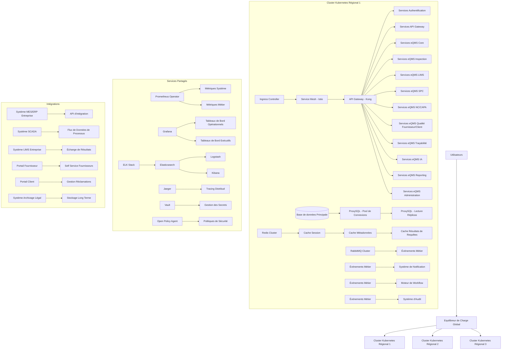
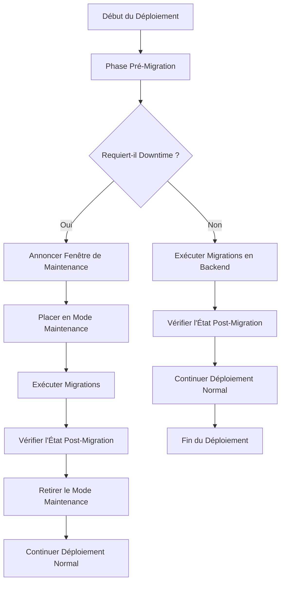
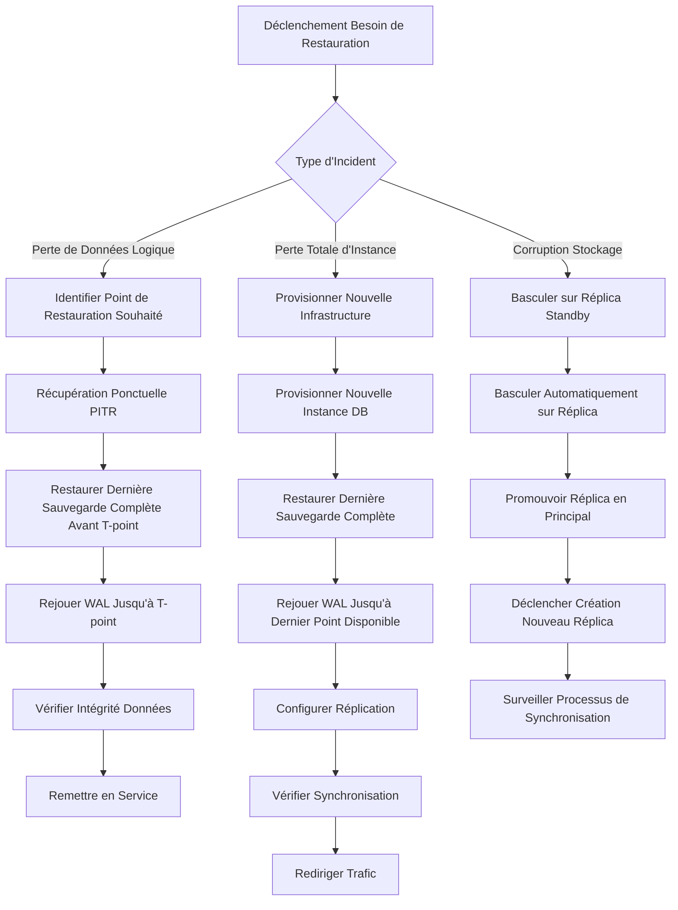
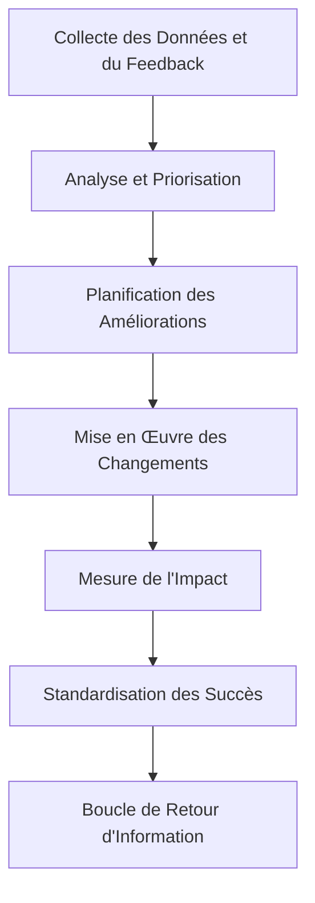

# 07-eqms-deployment.md

# Stratégie de Déploiement eQMS

Ce document définit la stratégie de déploiement complète pour le module eQMS du BrainERPOS, couvrant l'architecture de déploiement, les pipelines CI/CD, les manifestes Kubernetes, les stratégies de migration de base de données, la surveillance et l'observabilité, ainsi que les plans de contingence et de rollback.

## Vision des Déploiements

Notre approche de déploiement suit les principes du DevOps moderne avec une attention particulière à la fiabilité, à la sécurité et à la conformité réglementaire pour un système de gestion de qualité dans l'industrie manufacturière.

### Principes Directeurs
1. **Infrastructure as Code (IaC)** : Toute l'infrastructure est définie et versionnée dans le code
2. **Déploiements Immutables** : Les serveurs ne sont jamais modifiés après déploiement ; on crée de nouvelles instances
3. **Déploiements Progressifs** : Utilisation de stratégies de déploiement bleu/vert et canari pour minimiser les risques
4. **Surveillance Complète** : Observabilité de bout en bout avec métriques, logs et traces
5. **Rollback Automatique** : Capacité à revenir automatiquement à une version précédente en cas de détection d'anomalie
6. **Sécurité Intégrée** : Scans de sécurité intégrés dans le pipeline CI/CD
7. **Conformité Réglementaire** : Processus de validation et de qualification conformes aux normes industrielles
8. **Récupération Après Sinistre** : Plan de continuité d'activité avec RTO et RPO clairement définis

## Architecture de Déploiement

### Architecture Globale


### Stratégie de Régionalisation
Pour garantir une haute disponibilité et une faible latence, nous déployons dans une configuration multi-régions actifs-actifs:

- **Région Primaire** : Trafic de production principal (60%)
- **Région Seconde 1** : Trafic de secours géographique (20%)
- **Région Seconde 2** : Trafic de secours géographique + environnement de test (20%)

Chaque région contient:
- Cluster Kubernetes dédié (3 zones de disponibilité minimum)
- Base de données PostgreSQL avec réplication synchrone intra-région et asynchrone inter-région
- Services indépendants avec gestion de conflit basée sur les timestamps et les vecteurs d'horloge

## Pipeline CI/CD

### Vue d'Ensemble du Pipeline
```mermaid
flowchart TD
    A[Commit Code] --> B[Déclencheur GitHub Action]
    B --> C[Pipeline de Build]
    C --> D[Tests Unitaires]
    D --> E[Analyse de Code Statique]
    E --> F[Construction Images Docker]
    F --> G[Scan de Sécurité Images]
    G --> H[Push Images Registry Privé]
    H --> I[Déploiement Environnement de Développement]
    I --> J[Tests d'Intégration]
    J --> K[Tests de Contrat]
    K --> L[Déploiement Environnement de Staging]
    L --> M[Tests de Système]
    M --> N[Tests de Performance]
    N --> O[Tests de Sécurité Dynamique]
    O --> P[Approbation Manuelle (Staging)]
    P --> Q[Déploiement Production - Phase Canari]
    Q --> R[Surveillance Métriques Clés]
    R --> S{Seuils Acceptables ?}
    S -->|Oui| T[Déploiement Progressif 25%]
    T --> U[Surveillance 30min]
    U --> V{Seuils Acceptables ?}
    V -->|Oui| W[Déploiement Progressif 50%]
    W --> X[Surveillance 30min]
    X --> Y{Seuils Acceptables ?}
    Y -->|Oui| Z[Déploiement Complet 100%]
    Z --> AA[Monitoring Post-déploiement 24h]
    S -->|Non| AB[Rollback Automatique]
    V -->|Non| AB
    Y -->|Non| AB
```

### Étapes Détaillées du Pipeline

#### Phase 1: Pré-Validation (Pre-Merge)
1. **Checkout du Code** : Récupération du dernier commit
2. **Installation des Dépendances** : `npm ci` avec cache
3. **Tests Unitaires** : Exécution de la suite Jest avec couverture de code
4. **Analyse de Code Statique** : SonarQube ou ESLint avec règles personnalisées
5. **Validation de la Typage** : `tsc --noEmit` pour s'assurer de l'absence d'erreurs TypeScript
6. **Audit de Sécurité des Dépendances** : `npm audit` ou Snyk pour détecter les vulnérabilités connues

#### Phase 2: Construction et Sécurisation
7. **Construction de l'Image Docker** : Multi-stage build pour réduire la taille
   ```dockerfile
   # Étape de construction
   FROM node:20-slim AS builder
   WORKDIR /app
   COPY package*.json ./
   RUN npm ci
   COPY . .
   RUN npm run build
   
   # Étape de production
   FROM node:20-slim
   WORKDIR /app
   COPY --from=builder /app/dist ./dist
   COPY --from=builder /app/package*.json ./
   RUN npm ci --only=production
   USER node
   EXPOSE 3000
   CMD ["npm", "run", "start:prod"]
   ```
8. **Scan de Sécurité de l'Image** : Trivy ou Clair pour détecter les vulnérabilités dans l'image
9. **Signature de l'Image** : Cosign pour garantir l'intégrité et l'origine
10. **Push vers Registry Privé** : Harbor ou Amazon ECR avec politiques de rétention

#### Phase 3: Déploiement et Tests
11. **Déploiement en Environnement de Développement** : 
    - Namespace dédié par pull request (ex: `pr-123-feature-name`)
    - Variables d'environnement spécifiques
    - Base de données éphémère
    - Services externes mockés
12. **Tests d'Intégration** : 
    - Tests API avec SuperTest
    - Tests de base de données avec Testcontainers
    - Tests des intégrations externes avec mocker
13. **Tests de Contrat (Pact)** : Validation des interfaces entre services
14. **Promotion vers Staging** : 
    - Déploiement dans l'environnement de staging partagé
    - Données de test réalistes
    - Services externes en mode sandbox
15. **Tests de Système** : 
    - Scénarios End-to-End avec Playwright
    - Validation des workflows métier complets
16. **Tests de Performance** : 
    - Tests de charge légers avec k6
    - Validation des temps de réponse sous charge modérée
17. **Tests de Sécurité Dynamique** : 
    - Scan OWASP ZAP sur l'application déployée
    - Tests d'authentification et d'autorisation
18. **Approbation Manuelle** : Revue par l'équipe de release avant promotion en production

#### Phase 4: Déploiement en Production
19. **Déploiement Canari (5%)** : 
    - Routage du trafic via Istio (5% vers nouvelle version)
    - Surveillance étroite des métriques clés
    - Comparaison avec la version précédente (A/B testing implicite)
20. **Augmentation Progressive** : 
    - 25% → 50% → 75% → 100% avec paliers de surveillance
    - Seuils d'alerte configurables par métrique
21. **Déploiement Complet** : 
    - 100% du trafic dirigé vers la nouvelle version
    - Surveillance étendue pendant 24 heures
22. **Post-Déploiement** : 
    - Nettoyage des anciens réplicas après période de grâce
    - Mise à jour de la documentation de version
    - Notification aux parties prenantes

### Gestion des Configurations et des Secrets
- **ConfigMaps** : Pour les configurations non sensibles (fichiers de configuration, feature flags)
- **Secrets** : Pour les données sensibles (mots de passe, clés API, certificats)
- **HashiCorp Vault** : Comme source de vérité pour les secrets sensibles avec rotation automatique
- **Secret External Controller** : Pour synchroniser Vault avec les Secrets Kubernetes
- **Différenciation par Environnement** : 
  - Dev : Valeurs de test faibles, expiration courte
  - Staging : Valeurs proches de production, durée modérée
  - Prod : Valeurs de production, politiques de rotation strictes

## Déploiement Kubernetes

### Structure des Namespaces
```bash
# Namespaces par environnement
namespaces:
  - dev          # Développement individuel/PRs
  - test         # Tests d'intégration automatisés
  - staging      # Pré-production avec données réalistes
  - production   # Environnement de production
  - monitoring   # Stack d'observabilité (Prometheus, Grafana, ELK)
  - logging      # Agrégation centralisée des logs
  - ingress      # Contrôleurs d'entrée (NGINX, Istio)
  - cert-manager # Gestion des certificats TLS
  - vault        # Gestion des secrets (si déployé dans K8s)
  - backup       # Jobs de sauvegarde et restauration
```

### Ressources Kubernetes par Service

#### Exemple de Déploiement pour un Service eQMS
```yaml
apiVersion: apps/v1
kind: Deployment
metadata:
  name: eqms-inspection-service
  namespace: production
  labels:
    app: eqms-inspection
    version: v1.2.3
    component: backend
spec:
  replicas: 3
  selector:
    matchLabels:
      app: eqms-inspection
  template:
    metadata:
      labels:
        app: eqms-inspection
        version: v1.2.3
    spec:
      serviceAccountName: eqms-service-account
      affinity:
        podAntiAffinity:
          requiredDuringSchedulingIgnoredDuringExecution:
            - labelSelector:
                matchExpressions:
                  - key: app
                    operator: In
                    values:
                      - eqms-inspection
              topologyKey: "kubernetes.io/hostname"
      containers:
        - name: eqms-inspection
          image: harbor.brainos.com/eqms/inspection-service:v1.2.3
          imagePullPolicy: IfNotPresent
          ports:
            - containerPort: 3000
              name: http
          envFrom:
            - configMapRef:
                name: eqms-inspection-config
            - secretRef:
                name: eqms-inspection-secrets
          env:
            - name: POD_NAME
              valueFrom:
                fieldRef:
                  fieldPath: metadata.name
            - name: POD_NAMESPACE
              valueFrom:
                fieldRef:
                  fieldPath: metadata.namespace
          resources:
            requests:
              memory: "512Mi"
              cpu: "250m"
            limits:
              memory: "1Gi"
              CPU: "500m"
          livenessProbe:
            httpGet:
              path: /health/live
              port: 3000
            initialDelaySeconds: 30
            periodSeconds: 10
            timeoutSeconds: 5
            failureThreshold: 3
          readinessProbe:
            httpGet:
              path: /health/ready
              port: 3000
            initialDelaySeconds: 5
            periodSeconds: 5
            timeoutSeconds: 3
            failureThreshold: 3
          startupProbe:
            httpGet:
              path: /health/startup
              port: 3000
            failureThreshold: 30
            periodSeconds: 10
          volumeMounts:
            - name: tmp-volume
              mountPath: /tmp
            - name: logs-volume
              mountPath: /var/log/app
            - name: tmpfs-volume
              mountPath: /dev/shm
      volumes:
        - name: tmp-volume
          emptyDir: {}
        - name: logs-volume
          emptyDir:
            medium: Memory
        - name: tmpfs-volume
          emptyDir:
            medium: Memory
---
apiVersion: v1
kind: Service
metadata:
  name: eqms-inspection-service
  namespace: production
  labels:
    app: eqms-inspection
spec:
  selector:
    app: eqms-inspection
  ports:
    - protocol: TCP
      port: 80
      targetPort: 3000
  type: ClusterIP
---
apiVersion: networking.k8s.io/v1
kind: Ingress
metadata:
  name: eqms-inspection-ingress
  namespace: production
  annotations:
    nginx.ingress.kubernetes.io/rewrite-target: /$2
    nginx.ingress.kubernetes.io/use-regex: "true"
    cert-manager.io/cluster-issuer: letsencrypt-prod
spec:
  ingressClassName: nginx
  tls:
    - hosts:
        - eqms-inspection.brainos.com
      secretName: eqms-inspection-tls
  rules:
    - host: eqms-inspection.brainos.com
      http:
        paths:
          - path: /api/inspection(/|$)(.*)
            pathType: Prefix
            backend:
              service:
                name: eqms-inspection-service
                port:
                  number: 80
```

### Stratégies de Mise à l'Échelle (Autoscaling)

#### Horizontal Pod Autoscaler (HPA)
```yaml
apiVersion: autoscaling/v2
kind: HorizontalPodAutoscaler
metadata:
  name: eqms-inspection-hpa
  namespace: production
spec:
  scaleTargetRef:
    apiVersion: apps/v1
    kind: Deployment
    name: eqms-inspection-service
  minReplicas: 3
  maxReplicas: 20
  metrics:
    - type: Resource
      resource:
        name: cpu
        target:
          type: Utilization
          averageUtilization: 70
    - type: Resource
      resource:
        name: memory
        target:
          type: Utilization
          averageUtilization: 80
    - type: Pods
      pods:
        metric:
          name: queue_length
        target:
          type: AverageValue
          averageValue: "100"
    - type: Pods
      pods:
        metric:
          name: http_requests_per_second
        target:
          type: AverageValue
          averageValue: "1000"
```

#### Vertical Pod Autoscaler (VPA) - Optionnel
Pour les charges de travail avec des besoins mémoire/CPU variables et imprévisibles

### Stratégies de Déploiement Avancées

#### Déploiement Bleu/Vert (Blue/Green)
- Deux environnements de production identiques (bleu et vert)
- Seul un des deux reçoit le trafic de production à un moment donné
- Bascule instantanée via changement de configuration du service ou du load balancer
- Permet des tests de pré-production en conditions réelles sur l'environnement inactif
- Rollback immédiat en cas de problème (simple changement de routage)

#### Déploiement Canari
- Pourcentage petit du trafic dirigé vers la nouvelle version (ex: 1-5%)
- Augmentation graduelle basée sur l'observation des métriques
- Détection automatique des régressions via comparaison avec la version de référence
- Possibilité de cibler spécifiques segments d'utilisateurs (par région, par type d'appareil, etc.)

#### Déploiement en Rondes Roule (Rolling Update)
- Stratégie par défaut de Kubernetes Deployment
- Mise à jour graduelle des pods un par un (ou par petits lots)
- Moins de contrôle granulaire que Blue/Green ou Canari
- Adapté pour les changements à faible risque ou les environnements non critiques

#### Fonctionnalités de Toggles (Feature Flags)
- Déploiement du code avec fonctionnalité désactivée par défaut
- Activation contrôlée via configuration ou service dédié
- Permet les tests en production limitée sans exposer à tous les utilisateurs
- Facilite le rollback immédiat (simplement désactiver la feature)

## Stratégie de Migration de Base de Données

### Principe de Base
Toutes les modifications de schéma sont gérées via des migrations TypeORM versionnées et idempotentes, exécutées lors du déploiement.

### Structure des Migrations
```typescript
// src/migrations/1720801234567-CreateInspectionOrderTable.ts
import {MigrationInterface, QueryRunner} from "typeorm";

export class CreateInspectionOrderTable1720801234567 implements MigrationInterface {
    name = 'CreateInspectionOrderTable1720801234567'

    public async up(queryRunner: QueryRunner): Promise<void> {
        await queryRunner.query(`
            CREATE TABLE "inspection_orders" (
                "id" SERIAL NOT NULL,
                "inspection_order_number" character varying NOT NULL,
                "type" character varying NOT NULL,
                "planned_date" TIMESTAMP NOT NULL,
                "created_at" TIMESTAMP NOT NULL DEFAULT now(),
                "updated_at" TIMESTAMP NOT NULL DEFAULT now(),
                CONSTRAINT "PK_inspection_order_id" PRIMARY KEY ("id")
            )
        `);
        
        await queryRunner.query(`
            CREATE INDEX "IDX_inspection_order_number" ON "inspection_orders" ("inspection_order_number")
        `);
        
        await queryRunner.query(`
            CREATE INDEX "IDX_inspection_order_type" ON "inspection_orders" ("type")
        `);
        
        await queryRunner.query(`
            CREATE INDEX "IDX_inspection_order_planned_date" ON "inspection_orders" ("planned_date")
        `);
    }

    public async down(queryRunner: QueryRunner): Promise<void> {
        await queryRunner.query(`
            DROP INDEX "IDX_inspection_order_planned_date"
        `);
        await queryRunner.query(`
            DROP INDEX "IDX_inspection_order_type"
        `);
        await queryRunner.query(`
            DROP INDEX "IDX_inspection_order_number"
        `);
        await queryRunner.query(`
            DROP TABLE "inspection_orders"
        `);
    }
}
```

### Stratégie de Migration
#### Approches de Migration
1. **Migration Standards** : Changements de schéma compatibles avec version précédente (ajout de colonnes, tables, index)
2. **Migration Avancée avec Compatibilité Arrière** : Changements nécessitant une période de transition (renommage de colonnes, modification de types)
3. **Migration de Données** : Transformation ou migration de données existantes
4. **Migration à Impact Fort** : Changements nécessitant un downtime planifié (rare, seulement pour corrections critiques)

#### Processus de Déploiement avec Migration


#### Gestion des Conflits et de la Cohérence
- **Verrouillage de Migration** : Utilisation d'une table de verrouillage pour empêcher les exécutions parallèles
- **Idempotence** : Toutes les migrations doivent être sûres à exécuter plusieurs fois
- **Rollback** : Toutes les migrations doivent avoir une fonction `down` fonctionnelle (ou être marquées comme irréversibles avec justification)
- **Tests de Migration** : Exécution dans un environnement de staging avec copie des données de production
- **Monitoring** : Suivi détaillé du temps d'exécution et de l'impact sur les performances

#### Stratégies Spécifiques aux Schémas Compliqués
**Ajout de Colonnes avec Valeurs Par Défaut :**
```sql
-- Ajout sans blocage de table (PostgreSQL 11+)
ALTER TABLE inspection_orders 
ADD COLUMN IF NOT EXISTS inspection_priority VARCHAR(20) DEFAULT 'MEDIUM';

-- Ensuite, mettre à jour en arrière-plan si nécessaire
UPDATE inspection_orders 
SET inspection_priority = 'HIGH' 
WHERE some_condition AND inspection_priority = 'MEDIUM';
```

**Modification de Types de Colonnes :**
```sql
-- Approche en plusieurs étapes pour éviter le table lock
-- 1. Ajouter nouvelle colonne
ALTER TABLE inspection_results 
ADD COLUMN IF NOT EXISTS measurement_value_new DECIMAL(10,4);

-- 2. Copier les données en arrière-plan
UPDATE inspection_results 
SET measurement_value_new = CAST(measurement_value AS DECIMAL(10,4))
WHERE measurement_value IS NOT NULL;

-- 3. Vérifier l'intégrité
SELECT COUNT(*) FROM inspection_results 
WHERE measurement_value IS NOT NULL 
AND measurement_value_new <> CAST(measurement_value AS DECIMAL(10,4));

-- 4. Renommer les colonnes (nécessite un court verrou exclusif)
BEGIN;
ALTER TABLE inspection_results 
RENAME COLUMN measurement_value TO measurement_value_old;
ALTER TABLE inspection_results 
RENAME COLUMN measurement_value_new TO measurement_value;
COMMIT;

-- 5. Nettoyer plus tard
ALTER TABLE inspection_results 
DROP COLUMN IF EXISTS measurement_value_old;
```

#### Gestion des Données de Référence
- **Scripts de Peuplement** : Pour les données de référence (enums, états par défaut, configurations initiales)
- **Approche Idempotente** : Utiliser `INSERT ... ON CONFLICT DO NOTHING` ou equivalent
- **Versionnement** : Les scripts de données de référence sont versionnés comme les migrations de schéma
- **Exécution** : Fait partie du processus de déploiement, après les migrations de schéma mais avant le démarrage des applicatifs

### Sauvegarde et Restauration

#### Stratégie de Sauvegarde 3-2-1
- **3 copies** : Principale + 2 sauvegardes
- **2 types différents** : Disque local + stockage distant (ou cloud)
- **1 copie hors site** : Stockage dans une région géographique différente

#### Types de Sauvegardes
1. **Sauvegardes Complètes Hebdomadaires** : 
   - Dimanche à 02h00
   - Rétention : 4 semaines
   - Stockage : Bucket S3 avec classe Glacier pour ancienneté > 30 jours

2. **Sauvegardes Différentielles Quotidiennes** : 
   - Tous les jours sauf dimanche à 02h00
   - Rétention : 2 semaines
   - Stockage : Bucket S3 standard

3. **Journaux de Transactions (WAL) Archivage Continu** : 
   - Archivage toutes les 5 minutes
   - Rétention : 7 jours
   - Permet la récupération ponctuelle (Point-in-Time Recovery - PITR)

#### Procédure de Restauration


#### Tests de Restauration
- **Fréquence** : Tests mensuels de restauration complète
- **Scénarios** : 
  - Perte totale de site (DR test)
  - Corruption logique nécessitant PITR
  - Suppression accidentelle de données critiques
- **Validation** : 
  - Vérification de l'intégrité référentielle
  - Contrôles de comptage ligne par ligne contre rapports connus
  - Tests fonctionnels sur données restaurées
  - Documentation du RTO/RPO réel atteint

## Surveillance et Observabilité

### Stratégie d'Observabilité
Basée sur les trois piliers de l'observabilité : Métriques, Logs et Traces (M.L.T.)

#### Métriques (Monitoring)
**Métriques d'Infrastructure**
- Utilisation CPU, mémoire, disque, réseau par nœud
- État des pods (Ready, Restart Count, CrashLoopBackOff)
- Latence et débit du réseau inter-nœuds
- Utilisation et performance du stockage persistante
- État des équipements de réseau (switches, routeurs, load balancers)

**Métriques de Plateforme Kubernetes**
- État du contrôleur (API Server, etcd, controller manager, scheduler)
- Utilisation des ressources par namespace et par quota
- État des contrôleurs personnalisés (operators)
- Événements du cluster (scheduling échecs, evictions, nœuds non prêts)

**Métriques d'Application (RED Method)**
- **Rate** : Requêtes par seconde, débit par endpoint
- **Errors** : Taux d'erreur (4xx, 5xx), exceptions non gérées
- **Duration** : Latence (p50, p90, p95, p99) par endpoint et par type de requête
 
**Métriques Métier (USE Method pour les Ressources Critiques)**
- **Utilisation** : Pourcentage de capacité utilisée des ressources critiques (DB connection pool, thread pools, caches)
- **Saturation** : Temps d'attente en file pour les ressources saturées (DB queries, messages en attente)
- **Erreurs** : Taux d'échec des opérations métier (transactions échouées, événements non traités)

#### Exemple de Définition de Métriques Prometheus
```javascript
// Dans le service eQMS Inspection
import { Counter, Histogram, Gauge } from 'prom-client';

// Métriques de taux
export const inspectionRequestsTotal = new Counter({
  name: 'eqms_inspection_requests_total',
  help: 'Total number of inspection requests',
  labelNames: ['method', 'endpoint', 'status_code', 'inspection_type']
});

// Métriques de durée
export const inspectionRequestDuration = new Histogram({
  name: 'eqms_inspection_request_duration_seconds',
  help: 'Duration of HTTP requests in seconds',
  labelNames: ['method', 'endpoint', 'inspection_type'],
  buckets: [0.005, 0.01, 0.025, 0.05, 0.1, 0.25, 0.5, 1, 2.5, 5, 10]
});

// Métriques de taux d'erreur
export const inspectionErrorsTotal = new Counter({
  name: 'eqms_inspection_errors_total',
  help: 'Total number of errors in inspection service',
  labelNames: ['error_type', 'severity']
});

// Métriques de ressource (utilisation)
export const dbConnectionPoolUsage = new Gauge({
  name: 'eqms_db_connection_pool_usage',
  help: 'Current usage of database connection pool',
  labelNames: ['pool_name']
});

// Métriques de file d'attente (latence)
export const messageQueueDepth = new Gauge({
  name: 'eqms_message_queue_depth',
  help: 'Current depth of message queues',
  labelNames: ['queue_name', 'priority']
});

// Métriques métier spécifiques
export const nonConformitiesDetected = new Counter({
  name: 'eqms_nonconformities_detected_total',
  help: 'Total number of non-conformities detected',
  labelNames: ['type', 'severity', 'detection_method']
});

export const inspectionCycleTime = new Histogram({
  name: 'eqms_inspection_cycle_time_minutes',
  help: 'Time from inspection scheduling to completion in minutes',
  labelNames: ['inspection_type', 'priority'],
  buckets: [15, 30, 60, 120, 240, 480, 1440] // 15min to 24h
});
```

#### Tableaux de Bord Grafana Essentiels
1. **Tableau de Bord Opérationnel Temps Réel**
   - Débit global des requêtes par service
   - Taux d'erreur global et par service
   - Latence moyenne et p95/p99
   - Utilisation des ressources cluster (CPU, mémoire, disque, réseau)
   - État des pods (Running, Pending, Failed, Unknown)
   - File d'attente des messages par type et priorité

2. **Tableau de Bord Métier eQMS**
   - Nombre d'inspections par jour et par type
   - Taux de conformité global et par ligne de production
   - Nombre de NC ouvertes/fermées par jour
   - Temps moyen de résolution des NC
   - Nombre de CAPA en cours et taux d'achèvement
   - Efficacité moyenne des CAPA vérifiées
   - Nombre de notifications envoyées par type et par canal
   - Taux de livraison et de lecture des notifications

3. **Tableau de Bord de Base de Données**
   - Nombre de connexions actives vs. disponibles
   - Temps moyen de requête et répartition par type (SELECT, INSERT, UPDATE, DELETE)
   - Taux de lectures/écritures disque
   - Taille et croissance des tables principales
   - Utilisation du buffer cache et hit ratio
   - Réplication lag (si applicable)

4. **Tableau de Bord d'Expérience Utilisateur (Apdex)**
   - Score Apdex global et par application critique
   - Répartition des requêtes selon les seuils Apdex (Satisfait, Tolérant, Frustré)
   - Tendances des temps de réponse par heure/jour/semaine
   - Comparaison avec les objectifs de service (SLO)

**Logs (Journalisation)**
**Niveaux de Journalisation**
- **ERROR** : Événements indiquant une défaillance opérationnelle nécessitant une intervention immédiate
- **WARN** : Événements indiquantant une situation potentiellement problématique qui pourrait mener à une erreur si non adressée
- **INFO** : Événements informatifs sur le fonctionnement normal du système
- **DEBUG** : Informations détaillées utiles pour le dépannage (désactivé en production par défaut)
- **TRACE** : Niveau de détail le plus fin (jamais activé en production en volume)

**Structure des Logs (JSON Structuré)**
```json
{
  "timestamp": "2024-01-15T10:30:45.123Z",
  "level": "INFO",
  "logger": "eqms.inspection.service",
  "trace_id": "a1b2c3d4-e5f6-7890-g1h2-i3j4k5l6m7n8",
  "span_id": "e5f6-7890-g1h2",
  "message": "Inspection completed",
  "inspectionId": "INSP-2024-000123",
  "lotNumber": "LOT-AC-20240115-001",
  "inspectionType": "FINAL_INSPECTION",
  "result": "PASSED",
  "durationMs": 2450,
  "inspectorId": "EMP-456",
  "equipmentId": "EQ-789",
  "userId": "USER-789",
  "sessionId": "SESS-ABC123",
  "version": "1.2.3",
  "environment": "production"
}
```

**Sources de Logs**
- **Logs d'Application** : Sortie standard des conteneurs (stdout/stderr) capturées par le agent de logging
- **Logs de Sistema** : journaux du système d'exploitation (auth, syslog, kern)
- **Logs de Composants Kubernetes** : événements du kubelet, kube-proxy, CNI, CSI
- **Logs de Base de Données** : logs PostgreSQL (connexion, requêtes longues, points de contrôle, vacuum)
- **Logs de Message Queue** : logs RabbitMQ (connexions, acknowledgements, dead letter exchanges)
- **Logs de Réseau** : logs du load balancer, du service mesh, du pare-feu applicatif

**Stratégie de Collecte et de Stockage**
- **Agent de Collecte** : Fluent Bit ou Fluentd déployé comme DaemonSet sur chaque nœud
- **Filtrage et Routage** : Basé sur les nomspaces, labels et annotations
- **Stockage Temporaire** : Buffer local sur disque pour résister aux pannes réseau
- **Destination Finale** : Cluster Elasticsearch avec politiques de rétention
  - Index journaliers : logs-YYYY.MM.DD
  - Alias : logs-write (écriture), logs-read (lecture)
  - Politique de cycle de vie (ILM) : Hot → Warm → Cold → Delete
  - Rétention : 7 jours hot, 30 jours warm, 90 jours cold, puis suppression

**Requêtes et Analyse**
- **Langage de Requête** : ES|QL ou DSL Elasticsearch
- **Tableaux de Bord Kibana** : 
  - Recherche et exploration de logs en temps réel
  - Analyse de tendances et de patterns
  - Création d'alertes basées sur des patterns de logs
  - Tableaux de bord opérationnels par service et par incident type
- **Intégration avec APPS** : Correlation des logs avec les traces via les IDs de trace

**Traces Distribuées (Tracing)**
**Framework de Tracing** : OpenTelemetry avec Jaeger comme backend
**Propagation du Contexte** : Headers W3C TraceContext (traceparent, tracestate)
**Instrumentation Automatique**
- **Framework HTTP** : Instrumentation automatique des appels entrants et sortants
- **Client de Base de Données** : Capture des requêtes SQL avec paramètres et temps d'exécution
- **Client de Message Queue** : Trace de la publication et de la consommation de messages
- **Client HTTP Externe** : Trace des appels aux services externes (ERP, systèmes partenaires)
- **Fonctions Asynchrones** : Propagation correcte du contexte à travers les Promises et async/await

**Spans Attributs Essentiels**
- **Nom de l'Opération** : Méthode HTTP + chemin ou nom de la fonction
- **Statut** : OK, ERROR (avec message d'erreur)
- **Identifiants d'Entité** : IDs des objets métier concernés (inspectionId, lotNumber, ncId, etc.)
- **Contexte Utilisateur** : userId, sessionId, rôles, permissions
- **Données de Requête/Réponse** : Paramètres de requête, codes de statut, taille de la réponse (quand approprié et non PII)
- **Dépendances** : Nom et version des services appelés (base de données, cache, services externes)
- **Variables d'Environnement** : name, version, region, deploymentId

**Configuration d'Échantillonnage**
- **Échantillonnage Toujours actif pour les Erreurs** : 100% des spans avec statut ERROR
- **Échantillonnage Adaptatif** : Taux conservé basé sur le volume de trafic pour maintenir un overhead cible
- **Seuil Minimal** : Au moins 1 trace par seconde par service pour garantir la visibilité
- **Cible Overhead** : Moins de 5% d'overhead CPU et mémoire lié au tracing

**Intégration avec les Métriques et les Logs**
- **Corrélation Métriques-Traces** : Les métriques personnalisées exportent les mêmes labels que les tags de trace
- **Enrichissement des Logs** : Ajout des trace_id et span_id à chaque ligne de log via middleware
- **Tableaux de Bord Unifiés** : Tableaux de bord Grafana pouvant corréler métriques, logs et traces

**Définition d'Alerte et de notification**
**Principe d'Alerte** : 
- Signaler les symptômes, pas les causes (laisser l'enquête déterminer la raison)
- Être actionnable (clair sur ce qu'il faut faire)
- Minimiser le bruit (éviter les faux positifs)
- Être pertinent (lié à un impact réel sur les utilisateurs ou l'entreprise)
- Inclure un contexte suffisant pour commencer l'enquête immédiatement

**Canaux d'Alerte**
- **Critique** : PagerDuty, téléphone, SMS (escalade en cas d'absence d'acquittement)
- **Élevé** : Slack canal #alertes-critiques, email avec accusé de réception requis
- **Moyen** : Slack canal #alertes-importantes
- **Faible** : JIRA ticket automatique, tableau de bord dédié

**Types d'Alerte**
1. **Alertes de Seuil Statique** : Déclenchées quand une métrique dépasse un seuil prédéfini
   - Exemple : CPU > 85% pendant 5 minutes consécutives
   - Simple à mettre en place mais peut générer de faux positifs pendant les pics légitimes

2. **Alertes de Seuil Dynamique** : Basées sur l'historique et la saisonnalité
   - Utilisation de méthodes comme les écarts-types ou les quantiles mobiles
   - Meilleure adaptation aux variations normales de charge
   - Plus complexe à mettre en place et à maintenir

3. **Alertes de Détection d'Anomalies (ML-Based)** : 
   - Utilisation d'algorithmes d'apprentissage automatique pour apprendre le comportement normal
   - Détection des écarts significatifs par rapport au modèle appris
   - Très efficace pour détecter les problèmes inconnus ou les changements subtils
   - Nécessite une période d'apprentissage et un ré-entraînement périodique

4. **Alertes Basées sur les Logs** : 
   - Déclenchées par l'apparition de patterns spécifiques dans les logs
   - Utile pour détecter des erreurs spécifiques ou des séquences d'événements
   - Peut être combiné avec des taux (ex: plus de 5 erreurs du même type en 5 minutes)

5. **Alertes Basées sur les Traces** :
   - Déclenchées quand une trace dépasse un certain seuil de durée ou d'erreur
   - Utile pour détecter les goulots d'étranglement dans les flux de traitement
   - Fournit un contexte riche pour l'investigation immédiate

**Exemples d'Alerte Critiques pour eQMS**
- **Disponibilité du Service** : Taux de réussite des health checks < 99% sur 5 minutes
- **Latence Applicative** : p95 latence > 2s sur 5 minutes pour les endpoints critiques
- **Taux d'Erreur 5xx** : > 1% sur 5 minutes
- **Épuisement de Ressources** : 
  - Utilisation CPU > 90% sur 5 minutes
  - Utilisation mémoire > 85% sur 5 minutes
  - Nombre de connexions DB actif > 90% du max pendant 5 minutes
- **Backlog de Traitement** : 
  - Longueur moyenne de file d'attente > 100 messages pendant 10 minutes
  - Temps moyen de traitement en file > 5 minutes sur 10 minutes
- **Échecs de Tâches Critiques** : 
  - Échec de génération de rapport critique programmé
  - Échec d'envoi de notification critique
  - Échec de sauvegarde ou de réplication base de données
- **Anomalies Métier** : 
  - Taux soudain d'augmentation des NC (> 3 écarts-types au-dessus de la moyenne mobile)
  - Taux de chute soudain des prédictions de qualité (> 2 écarts-types en dessous)
  - Augmentation rapide du nombre de notifications non acquittées

**Gestion du Cycle de Vie des Alertes**
1. **Déclenchement** : Condition d'alerte rencontrée
2. **Notification** : Envoi immédiat selon la politique d'escalade
3. **Acquittement** : Quelqu'un reconnait la responsabilité de l'enquête
4. **Investigation** : Analyse des données disponibles (métriques, logs, traces)
5. **Résolution** : Action corrective prise ou détermination que c'est un faux positif
6. **Clôture** : Marquée comme résolue avec ajout d'un post-mortem si nécessaire
7. **Analyse Post-Incident** : Revue pour améliorer les règles d'alerte et empêcher la récurrence

## Gestion de Version et Politique de Release

### Stratégie de Branching (Git Flow Adapté)
```
main           ←- Référence de production toujours déployable
develop        ←- Branche d'intégration pour la prochaine release
release/*      ←- Branches de préparation de release
feature/*      ←- Nouvelles fonctionnalités
hotfix/*       ←- Corrections critiques pour production
```

### Politique de Versionnage (SemVer avec Préfixe)
```
Format : vMAJOR.MINOR.PATCH[-PRÉRELEASE][+MÉTADONNÉES]
MAJOR    : Changements incompatibles avec l'API précédente
MINOR    : Ajout de fonctionnalité compatible avec l'version précédente
PATCH    : Corrections de bogues compatibles avec l'version précédente
PRÉRELEASE : alpha, beta, rc (release candidate) pour les versions préliminaires
MÉTADONNÉES : Informations de build ou de commit (optionnel)
```

### Canal de Distribution
1. **Canal Stable** : Versions PATCH seulement, déploiement automatique après validation
2. **Canal Bêta** : Versions MINOR et PATCH, déploiement manuel après validation QA
3. **Canal Alpha** : Toutes les versions, réservée aux équipes internes pour test précoce
4. **Canal Legacy** : Versions de maintien pour les clients nécessitant une stabilité extrême

### Processus de Release
```mermaid
flowchart TD
    A[Feature Complete sur develop] --> B[Création branche release/x.y.z]
    B --> C[Phase de Gel des Fonctionnalités]
    C --> D[Tests d'Intégration Complétés]
    D --> E[Tests de Performance et de Charge]
    E --> F[Tests de Sécurité]
    F --> G[Tests d'Utilisabilité (si UI modifié)]
    G --> H[Revue de la Documentation]
    H --> I[Mise à Jour du Changelog]
    I --> J[Creation Tag Release vX.Y.Z]
    J --> K[Génération Artefacts de Déploiement]
    K --> L[Déploiement en Environnement de Staging]
    L --> M[Tests de Système Final]
    M --> N[Validation par l'Équipe de Release]
    N --> O{Approbation pour Production ?}
    O -->|Oui| P[Déploiement en Production via Pipeline CI/CD]
    P --> Q[Surveillance Post-déploiement 24h]
    Q --> R[Clôture de la Release]
    O -->|Non| S[Retour vers develop pour Corrections]
    S --> T[Cycle de Correction]
    T --> B
```

### Gestion des Dépendances Externes
- **Versions Fixées dans le Lockfile** : package.json et package-lock.json (ou équivalent)
- **Scans de Sécurité Réguliers** : Détection des vulnérabilités dans les dépendances
- **Mises à Jour Programmées** : Fenêtres définies pour les mises à jour de dépendances mineures et de correctifs
- **Mises à Jour de Sécurité Urgentes** : Processus accéléré pour les vulnérabilités critiques (CVSS > 9.0)
- **Isolation des Dépendances Critiques** : Mise en cache local ou miroirs privés pour éviter les attaques de la chaîne d'approvisionnement

## Plan de Continuité d'Activité (PCA) et de Reprise Après Sinistre (PRS)

### Objectifs de Rétablissement
- **RTO (Recovery Time Objective)** : 4 heures pour restauration complète des services critiques
- **RPO (Recovery Point Objective)** : 15 minutes pour perte de données maximale acceptable
- **WRT (Work Recovery Time)** : 2 heures pour retour au niveau de service nominal après rétablissement

### Stratégie de Réplication des Données
#### Base de Données Principale (PostgreSQL)
- **Réplication Synchrone Intra-Région** : 
  - 2 répliques synchrones dans la même région pour garantir zéro perte de données en cas de perte d'un noeud
  - Utilise le protocole de réplication synchrone de PostgreSQL
  - Impact sur la latence d'écriture acceptable (< 2ms additionnel)
- **Réplication Asynchrone Inter-Région** : 
  - 1 replica asynchrone dans chaque région secondaire
  - Permet la restauration rapide en cas de perte totale de région primaire
  - Lag typique : 1-3 secondes selon la distance géographique et la charge réseau

#### Stockage d'Objets (MinIO/S3 Équivalent)
- **Réplication Régionale Active-Active** : 
  - Écritures simultanées dans toutes les régions actives
  - Résolution de conflit basé sur le timestamp de dernière écriture (LWW - Last Write Wins)
  - Cohérence éventuelle garantie en moins de 1 seconde dans des conditions normales
- **Sauvegarde Glacier** : 
  - Transition automatique vers le stockage glacial pour les objets > 30 jours
  - Récupération possible mais avec délai (heures à jours selon le niveau de service choisi)

#### Services Sans État (Déploiements Kubernetes)
- **Re-Déploiement Rapide** : 
  - Les déploiements sont entièrement définis par des manifests versionnés
  - Recreation rapide (< 5 minutes) sur nouvelle infrastructure
  - État reconstitué à partir de la base de données et du stockage d'objets
- **Affinités et Anti-Affinités** : 
  - Répartition géographique des réplicas pour résister aux pannes zonales
  - Évitement du placement de tous les réplicas d'un même service sur le même noeud ou rack

### Plan de Réponse aux Incidents

#### Niveaux d'Incident
| Niveau | Définition | Exemples | Temps de Réponse Cible | Escalade |
|--------|------------|----------|------------------------|----------|
| **1 (Critique)** | Impact sévère sur les opérations commerciales critiques | Disponibilité < 95%, perte de données, corruption significative | 15 minutes | Niveau 3 + Direction |
| **2 (Élevé)** | Impact modéré sur les opérations ou expérience utilisateur significativement dégradée | Latence > 2x normale, taux d'erreur > 5%, fonctionnalité majeure indisponible | 30 minutes | Niveau 2 |
| **3 (Modéré)** | Impact mineur sur les opérations ou inconfort utilisateur noticeable | Dégradation de performance noticeable mais utilisable, fonctionnalité mineure indisponible | 1 heure | Niveau 1 |
| **4 (Faible)** | Impact minimal, principalement esthétique ou de confort | Fautes d'orthographe dans l'interface, fonctionnalité de convenance indisponible | 4 heures | Auto-résolution ou traitement lors de la fenêtre de maintenance normale |

#### Équipes de Réponse
- **Première Ligne (N1)** : Team Opérations - Surveillance 24/7, premiers diagnostics
- **Deuxième Ligne (N2)** : Team Ingénierie Spécialisée - Diagnostic approfondi, correctifs techniques
- **Troisième Ligne (N3)** : Team Architecture/Platform - Changements architecturaux, optimisations profondes
- **Experts Métier** : Consultation pour impact métier et priorisation des actions
- **Direction** : Notification pour les incidents de niveau 1, prises de décision stratégique

#### Phases de Gestion d'Incident
1. **Détection** : Identification automatique via monitoring ou signalement humain
2. **Validation** : Confirmation que c'est bien un incident nécessitant une intervention
3. **Classification** : Attribution du niveau de sévérité basé sur l'impact observé
4. **Notification** : Alerte des équipes appropriées selon la matrice d'escalade
5. **Diagnostic** : Collecte d'informations, reproduction si possible, identification de la cause racine présumée
6. **Containment** : Actions pour limiter l'impact et prévenir l'aggravation (ex: mise en mode dégradé, déroutage de trafic)
7. **Résolution** : Mise en place de la solution corrective ou de contournement
8. **Vérification** : Confirmation que le service est revenu à un état acceptable
9. **Clôture** : Documentation de l'incident, actions de suivi, communication aux parties prenantes
10. **Analyse Post-Incident (PIR)** : Réunion indenu 24-48h après résolution pour améliorer les processus

#### Communication pendant les Incidents
- **Canal Interne** : Canal dédié Slack/Teams pour chaque incident majeur
- **Mise à Jour Périodique** : Bulletins d'état toutes les 15-30 minutes selon la sévérité
- **Communication Externe** : Page statut publique pour informer les clients et partenaires
- **Communication Après Incident** : Rapport détaillé envoyé aux parties prenantes dans les 24h suivant la résolution

### Tests de Résilience

#### Tests de Chaos Engineering Programmés
- **Kill aléatoire de Pods** : Simuler des pannes de nœuds ou de conteneurs
- **Latence Réseau Injectée** : Simuler des problèmes de connectivité entre services
- **Perte de Paquets Réseau** : Tester la résilience aux problèmes de réseau
- **Épuisement de Ressources** : Simuler l'utilisation maximale de CPU, mémoire, disque, ou bande pass
- **Défaillance de Zone de Disponibilité** : Simuler la perte complète d'une zone AWS/Azure/GCP zone
- **Défaillance de Région Entière** : Simuler la perte d'une région cloud complète (test annuel coordonné)
- **Défaillance de Dépendance Externe** : Simuler l'indisponibilité d'un service tiers (API de paiement, service d'email, etc.)

#### Fréquence et Portée
- **Tests Hebdomadaires** : Petit sous-ensemble de scénarios sur environnement de staging
- **Tests Mensuels** : Scénarios complets sur environnement de staging copie de production
- **Tests Trimestriels** : Test de récupération après sinistre complet (simulation perte de site)
- **Tests Annuel** : Exercice complet de plan de continuité d'activité impliquant toutes les équipes

#### Métriques de Résilience Mesurées
- **Temps de Détection (MTTD)** : Temps moyen entre l'occurrence de l'incident et sa détection
- **Temps de Réponse (MTTR)** : Temps moyen entre la détection et le début des actions de correctif
- **Temps de Rétablissement (MTTI)** : Temps moyen entre le début de la réparation et le retour au service nominal
- **Pourcentage d'Incidences Résolus dans SLA** : Pourcentage d'incidents résolus dans les temps de réponse définis
- **Fréquence des Incidents Récurrents** : Nombre d'incidents ayant la même cause racine sur période donnée
- **Coût Moyen d'Incident** : Impact financier estimé (perte de productivité, pénalités SLA, etc.)

## Conformité et Qualification

### Cycle de Vie en V (V-Model) pour les Systèmes Critiques
```mermaid
flowchart TD
    A[Analyse des Besoins] --> B[Spécifications Fonctionnelles]
    B --> C[Spécifications Techniques]
    C --> D[Conception Architecture]
    D --> E[Développement]
    E --> F[Tests Unitaires]
    F --> G[Tests d'Intégration]
    G --> H[Tests de Système]
    H --> I[Tests d'Acceptation Utilisateur (UAT)]
    I --> J[Validation et Qualification]
    J --> K[Mise en Production]
    K --> L[Maintenance et Support]
    L --> M[Retrait du Service]
    M --> N[Archivage des Données]
```

### Phases de Qualification
1. **Qualification de la Conception (DQ)** : 
   - Vérification que la conception répond aux spécifications d'utilisation
   - Revue des spécifications fonctionnelles et techniques
   - Validation de l'architecture proposée

2. **Qualification de l'Installation (IQ)** : 
   - Vérification que l'installation est conforme aux spécifications
   - Contrôle de l'environnement matériel, logiciel et réseau
   - Validation des paramètres de configuration

3. **Qualification Opérationnelle (OQ)** : 
   - Vérification que l'équipement fonctionne conformément aux spécifications
   - Tests fonctionnels dans l'environnement opérationnel
   - Validation des plages de fonctionnement et des limites

4. **Qualification de Performance (PQ)** : 
   - Vérification que l'équipement performe conformément aux spécifications
   - Tests sous charge réelle ou simulée
   - Validation de la capacité de traitement et des temps de réponse

### Livrables de Qualification
- **Protocole de Qualification** : Document détaillé décrivant les tests à effectuer, les critères d'acceptation et les méthodes
- **Rapport d'Exécution** : Compte rendu détaillé de l'exécution des tests, incluant les données brutes
- **Rapport de Conclusion** : Synthèse indiquant si chaque critère d'acceptation est satisfait, non satisfait ou non applicable
- **Rapport de Usage Intentionnel** : Document expliquant comment le système sera utilisé dans son contexte opérationnel
- **Analyse d'Écart et Plan d'Action** : Pour tout critère non conforme, identification de l'écart et plan pour y remédier
- **Dossier de Qualité Final** : Rassemblement de tous les documents ci-dessus pour constituer la preuve de conformité

### Exigences Spécifiques 21 CFR Part 11 (si applicable)
- **Systèmes Fermés** : Contrôle d'accès authentifié, autorisation basée sur les rôles, verrouillage du système après inactivité
- **Signature Électronique** : 
  - Unicité : Chaque signature doit être unique à un individu
  - Non-répudiation : Impossible de nier avoir signé
  - Linkage au document : La signature doit être liée de manière inviolable au document signé
- **Contrôle des Ouvrages** : 
  - Limitation de l'accès au système aux personnes autorisées
  - Journalisation de toutes les entrées et modifications
  - Protection contre la modification non autorisée des enregistrements électroniques
- **Vérification du Système** : 
  - Tests du système dans son environnement opérationnel
  - Validation de l'exactitude, de la fiabilité et de la constance des résultats
  - Documentation de toutes les modifications du système

### Archivage et Conservation des Données
- **Durée de Conservation** : Selon les exigences réglementaires (souvent 10-30 ans pour les dispositifs médicaux)
- **Format d'Archivage** : Format lisible et non propriétaire (PDF/A, XML, CSV)
- **Intégrité des Données Archivées** : Vérification périodique via sommes de contrôle (checksums, hash)
- **Accessibilité** : Capacité à récupérer et à lire les données après des périodes prolongées
- **Confidentialité** : Mesures de protection appropriées selon la sensibilité des données
- **Indexation et Recherchabilité** : Capacité à rechercher dans les archives par métadonnées (date, type de document, numéro de lot, etc.)

## Plan de Formation et de Transfert aux Opérations

### Phases de Transfert
1. **Transfert aux Équipes d'Exploitation (Run Teams)** : 
   - Documentation des procédures d'exploitation courantes
   - Formation sur les outils de monitoring et d'alerte
   - Exercices de gestion d'incidents guidés
   - Période de supervision conjointe (shadowing)

2. **Transfert à l'Équipe de Maintenance** : 
   - Documentation des procédures de maintenance préventive et corrective
   - Formation sur les outils de diagnostic et de dépannage
   - Exercices de remplacement de composants et de mise à jour
   - Documentation des procédures de rollback et de récupération

3. **Transfert à l'Équipe de Support** : 
   - Documentation des procédures de gestion des incidents et des demandes de service
   - Formation sur les systèmes de ticketing et de gestion de la connaissance
   - Accès aux environnements de test pour reproduire les problèmes signalés
   - Période d'observation des appels en direct avec accompagnement

### Matériaux de Formation
- **Guides d'Exploitation** : Procédures étape par étape pour les opérations courantes
- **Manuels de Maintenance** : Procedures de diagnostic, de réparation et de prévention
- **Guides de Dépannage** : Arbres de décision pour les symptômes courants
- **Fiches de Référence Rapide** : Commandes fréquentes, raccourcis, points de contact
- **Vidéos de Formation** : Démos enregistrées des procédures critiques
- **Lab Exercices** : Environnements sandbox pour pratiquer sans risque
- **Quiz et Évaluations** : Validation de la compréhension et des acquis

### Métriques de Prêt à l'Exploitation
- **Taux de Réussite des Exercices de Sauvegarde/ Restauration** : Pourcentage de scénarios de restauration réussis lors des tests
- **Temps Moyen de Résolution des Incidents Simulés** : Efficacité des équipes de réponse face à des scénarios connus
- **Taux de Connaissance des Procédures Critiques** : Pourcentage d'opérateurs ayant réussi l'évaluation sur les procédures vitales
- **Nombre d'Incidents Évitables grâce à la Prévention** : Mesure de l'efficacité des activités de maintenance préventive
- **Score de Satisfaction des Équipes d'Exploitation** : Feedback périodique sur l'adéquation de la formation et des outils

## Amélioration Continue

### Boucles de Retour d'Information
1. **Retour des Utilisateurs Finaux** : 
   - Enquêtes de satisfaction périodiques
   - Analyse des tickets de support et des demandes d'amélioration
   - Sessions de feedback utilisateur structurées
   - Programme d'ambassadeurs utilisateurs pour collecte continue

2. **Retour des Opérations** : 
   - Revues rétrospectives périodiques (hebdomadaires/mensuelles)
   - Analyse des tendances d'incidents et des travaux de maintenance
   - Suggestions d'amélioration des procédures et des outils
   - Identification des goulots d'étranglement opérationnels

3. **Retour du Développement** : 
   - Feedback sur la testabilité et la débuggabilité du code
   - Suggestions d'amélioration de l'architecture et des patterns de conception
   - Identification des dette technique à adresser en priorité
   - Propositions d'évolutions basés sur les nouvelles technologies disponibles

4. **Retour de la Qualité et de la Conformité** : 
   - Résultats des audits internes et externes
   - Observations des auditeurs réglementaires
   - Résultats des revues de conformité périodique
   - Suggestions d'amélioration basées sur les meilleures pratiques de l'industrie

### Processus d'Amélioration Continue


### Domaines d'Amélioration Continue Prioritaires
1. **Performance et Efficacité** : 
   - Optimisation des requêtes de base de données les plus coûteuses
   - Réduction de la latence des chemins critiques
   - Optimisation de l'utilisation des ressources (CPU, mémoire, I/O)
   - Amélioration des algorithmes de traitement par lot

2. **Expérience Utilisateur** : 
   - Simplification des workflows fréquemment utilisés
   - Amélioration de la découverte des fonctionnalités
   - Réduction du nombre de clics pour les tâches courantes
   - Amélioration de la réactivité de l'interface utilisateur

3. **Fiabilité et Résilience** : 
   - Augmentation de la couverture des tests de chaos engineering
   - Amélioration des temps de détection et de rétablissement des incidents
   - Réduction de la fréquence des incidents récurrents
   - Augmentation de la capacité du système à gérer les charges imprévues

4. **Sécurité et Conformité** : 
   - Renforcement continu des contrôles de sécurité
   - Mise à jour régulière face aux nouvelles menaces
   - Amélioration de la traçabilité et de l'auditabilité
   - Optimisation des processus de vérification de conformité

5. **Capacité et Scalabilité** : 
   - Prévision précise de la croissance future des charges de travail
   - Optimisation de l'utilisation de l'infrastructure existante
   - Planification proactive des upgrades d'infrastructure
   - Amélioration de l'efficacité du scaling automatique

### Métriques d'Amélioration Continue
- **Vitesse de Livraison** : Tempo** : Temps moyen entre la validation du code et sa disponibilité en production
- **Taux de Défaillance de Changement** : Pourcentage de déploiements nécessitant un rollback ou causant un incident
- **Temps de Rétablissement de Service** : Temps moyen pour récupérer d'un incident en production
- **Qualité du Code** : Mesures de complexité, de duplication, de couverture de tests
- **Satisfaction des Parties Prenantes** : Scores NPS ou CSAT des utilisateurs, opérations, direction
- **Efficacité Coût** : Coût par transaction ou par unité de travail traitée